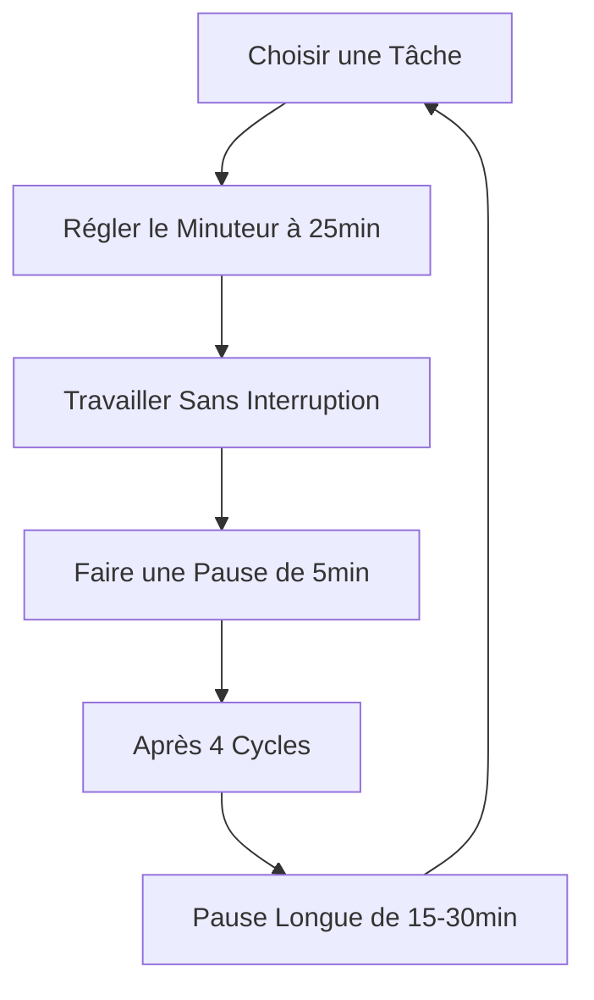
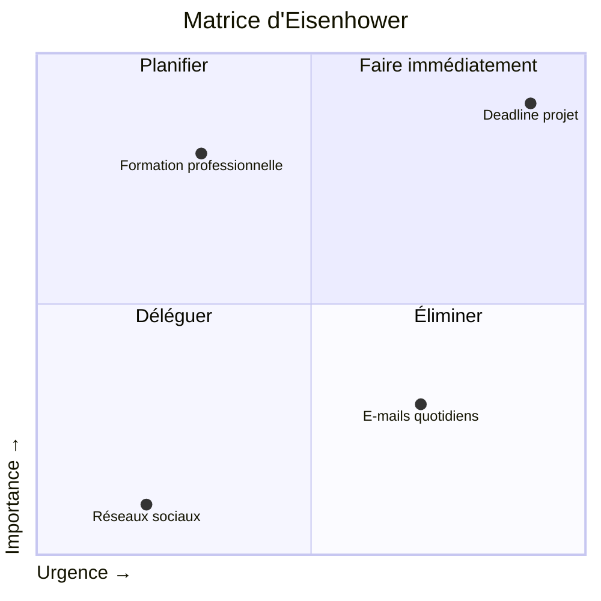
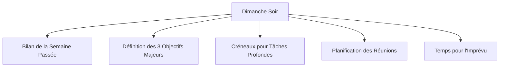
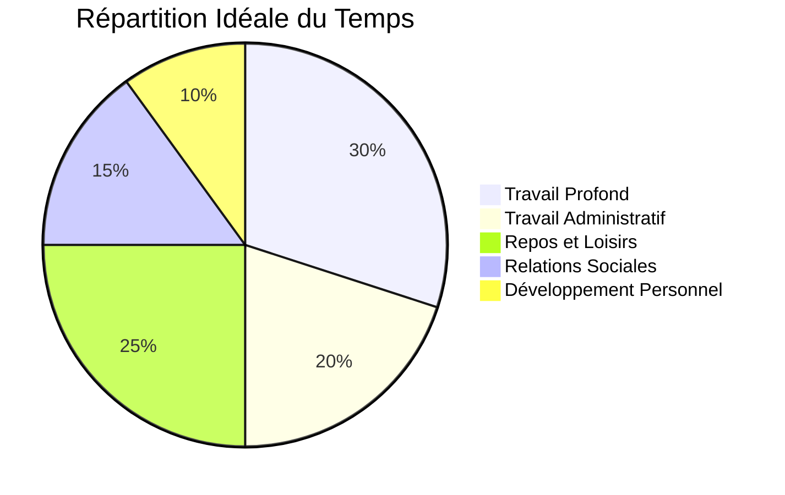
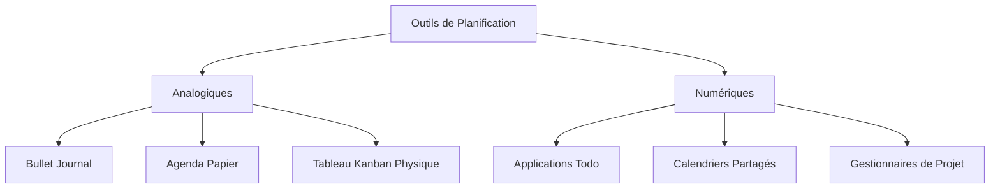
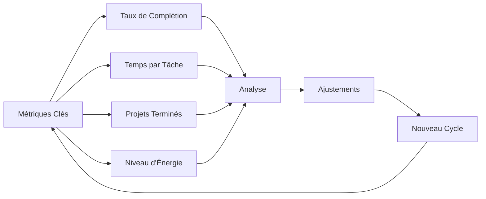

# Maîtrisez Votre Temps : Guide de Planification

Pour comprendre la planification du travail simplement, imaginons l'organisation d'un voyage. Chaque aspect de la planification correspond à un élément du voyage :

## 🎯 Principes Fondamentaux de la Planification

### 1. La Vision Globale

Comme la destination de votre voyage :

- Les **Objectifs à Long Terme** sont comme votre destination finale
- Les **Objectifs Trimestriels** sont comme les grandes étapes du voyage
- Les **Objectifs Mensuels** sont comme les villes que vous allez visiter
- Les **Objectifs Hebdomadaires** sont comme les activités planifiées

### 2. Les Méthodes de Planification

Comme les différents moyens de transport :

- **Méthode Pomodoro** : Comme voyager en train (intervalles réguliers)
- **Getting Things Done (GTD)** : Comme préparer un itinéraire détaillé
- **Matrice d'Eisenhower** : Comme choisir quels sites visiter en priorité
- **Kanban** : Comme un tableau de progression du voyage

### 3. Les Outils de Suivi

Comme les accessoires de voyage :

- **Applications de Gestion** : Votre GPS numérique
- **Journal de Bord** : Votre carnet de voyage
- **Tableaux Visuels** : Votre carte avec punaises

## 🔄 La Méthode Pomodoro Expliquée

La méthode Pomodoro est l'une des techniques de gestion du temps les plus simples et efficaces. Comme un métronome pour musicien, elle donne un rythme à votre journée et améliore votre concentration.

Cette technique consiste à travailler par intervalles de 25 minutes (appelés "pomodoros"), séparés par de courtes pauses. C'est comme courir un marathon : des sprints entrecoupés de récupération vous permettent d'aller plus loin.

### Cycle Pomodoro Complet



**Pourquoi ça fonctionne :**
Notre cerveau adore les sessions de travail structurées :

1. **Focus Intensif** : 25 minutes, c'est suffisamment court pour maintenir l'attention
2. **Pauses Régulières** : Elles évitent la fatigue mentale
3. **Mesure Tangible** : Vous voyez combien de "pomodoros" une tâche prend
4. **Gestion des Interruptions** : "Je te réponds après mon pomodoro"

La simplicité de cette méthode est son plus grand atout. Pas besoin d'applications complexes ou de formations coûteuses. Un simple minuteur suffit pour transformer votre productivité.

### Mise en Place Pratique

```markdown
Étape 1: Préparation
├── Liste de Tâches Quotidiennes
│ ├── Priorités Hautes
│ └── Tâches Secondaires
└── Minuteur Dédié
├── Application
└── Minuteur Physique

Étape 2: Exécution
├── Session de 25 minutes
│ ├── Focus Total
│ └── Noter les Distractions
└── Pause de 5 minutes
├── S'éloigner de l'Écran
└── Mouvement Physique

Étape 3: Suivi
├── Nombre de Pomodoros
└── Réflexion sur l'Efficacité
```

**Exemple Concret :**
Dans mon quotidien de développeur :

- **Matin** : 4 pomodoros sur le développement d'une nouvelle fonctionnalité
- **Après-midi** : 2 pomodoros pour les réunions, 2 pour la documentation
- **Chaque jour** : Je note combien de pomodoros chaque type de tâche requiert

## 📊 La Matrice d'Eisenhower

La matrice d'Eisenhower est un outil puissant pour prioriser vos tâches. Comme un capitaine qui doit décider quelles marchandises charger en premier sur son navire, cette méthode vous aide à distinguer l'essentiel de l'accessoire.

Cette approche divise vos tâches en quatre quadrants selon leur urgence et leur importance. C'est comme trier votre garde-robe : certains vêtements sont pour les occasions spéciales, d'autres pour le quotidien, certains à donner, et d'autres à jeter.

### Matrice Visualisée



**Comment l'Utiliser :**
Imaginez votre journée comme une valise à remplir :

1. **Important et Urgent** : Les choses à mettre en premier (comme vos médicaments)
2. **Important mais pas Urgent** : Ce qui a de la valeur (comme vos bons livres)
3. **Urgent mais pas Important** : Ce qui peut être délégué (comme des souvenirs pour d'autres)
4. **Ni Urgent ni Important** : Ce qui peut rester (comme des objets superflus)

La force de cette matrice est sa clarté visuelle. En un coup d'œil, vous savez où concentrer vos efforts. C'est comme un panneau indicateur qui vous oriente vers le bon chemin sans hésitation.

### Application Pratique

```markdown
Quadrant 1: Faire immédiatement
├── Crises Client
├── Deadlines Imminentes
└── Problèmes Techniques Critiques

Quadrant 2: Planifier
├── Développement de Compétences
├── Planification Stratégique
└── Amélioration de Processus

Quadrant 3: Déléguer
├── Certaines Réunions
├── Rapports Routiniers
└── Tâches Administratives

Quadrant 4: Éliminer
├── Distractions Numériques
├── Réunions Improductives
└── Perfectionnisme Excessif
```

**Exemple Personnel :**
Dans ma semaine type :

- **Quadrant 1** : Correction d'un bug critique signalé par un client
- **Quadrant 2** : Apprentissage d'un nouveau framework (3h chaque semaine)
- **Quadrant 3** : Mise à jour de la documentation (délégué à un junior)
- **Quadrant 4** : Limiter la consultation des réseaux sociaux à 15 min/jour

## 🚀 Techniques de Planification Hebdomadaire

La planification hebdomadaire est comme la préparation d'un menu pour la semaine. Elle vous permet d'avoir une vision claire de ce qui vous attend, tout en gardant suffisamment de flexibilité pour les imprévus.

Cette approche fonctionne comme un chef qui prépare sa mise en place avant un service. Tout est prêt, organisé, à portée de main, ce qui rend l'exécution fluide et sans stress.

### Structure de Planification Recommandée



**Pourquoi ça Marche :**
Planifier une semaine est comme préparer un voyage organisé :

1. **Vision Claire** : Vous savez exactement ce qui vous attend
2. **Réduction du Stress** : Plus de surprise de dernière minute
3. **Équilibre** : Travail profond et tâches administratives bien répartis
4. **Priorisation** : Focus sur ce qui fait vraiment avancer vos projets

Ce n'est pas seulement une question d'organisation, c'est aussi une question de psychologie. Savoir que votre semaine est bien structurée libère votre esprit pour se concentrer sur l'exécution plutôt que sur la planification constante.

### Template de Semaine Idéale

```markdown
Lundi
├── Matin: Deep Work (2h)
│ └── Projet Prioritaire
├── Midi: Revue Emails (30min)
└── Après-midi: Réunions (3h)

Mardi & Jeudi
├── Journées de Concentration
│ ├── 80% Deep Work
│ └── 20% Communication

Mercredi
├── Matin: Suivi Projets
├── Après-midi: Formation
│ └── Compétence Nouvelle

Vendredi
├── Matin: Finalisation Livrables
├── Après-midi: Bilan & Planification
│ ├── Rétrospective
│ └── Préparation Semaine Suivante
```

**Mon Expérience :**
La combinaison des méthodes a transformé ma productivité :

- J'utilise la **Matrice d'Eisenhower** le dimanche soir pour ma planification
- Les **Pomodoros** structurent mes journées de travail intensif
- Un **Template Hebdomadaire** me donne un cadre flexible mais stable
- Chaque vendredi, je fais une **Rétrospective** de 30 minutes pour m'améliorer

## 🧘 L'Équilibre Travail-Vie Personnelle

La planification parfaite ne se limite pas à l'optimisation du travail. Comme un jardinier qui sait que les plantes ont besoin de repos pour fleurir, vous devez intégrer des périodes de récupération dans votre système.

Cet équilibre n'est pas un luxe, c'est une nécessité. C'est comme l'alternance des saisons : les périodes d'intense productivité doivent être suivies de temps de repos pour que le cycle reste sain et durable.

### Cercle de l'Équilibre



**Principes Clés :**
L'équilibre est comme une nutrition saine :

1. **Variété** : Différents types d'activités nourrissent différentes parties de vous
2. **Modération** : Éviter les excès dans n'importe quelle catégorie
3. **Personnalisation** : Votre équilibre idéal est unique
4. **Ajustement Constant** : Comme les saisons, vos besoins changent

Trouver cet équilibre n'est pas une destination, c'est un voyage continu. Comme un funambule, vous ajustez constamment votre position pour maintenir votre stabilité face aux vents changeants de la vie.

### Pratiques Concrètes

```markdown
Limites Claires
├── Heures de Déconnexion
│ ├── Notifications Désactivées
│ └── Rituel de Fin de Journée
└── Espaces Dédiés
├── Zone de Travail
└── Zone de Détente

Rituels Régénérateurs
├── Activité Physique
├── Méditation/Pleine Conscience
└── Hobbies Déconnectés

Vacances Stratégiques
├── Mini-Breaks (1-2 jours)
│ └── Toutes les 6 semaines
└── Vraies Déconnexions
└── 1-2 semaines par trimestre
```

**Témoignage Personnel :**
Mon évolution vers l'équilibre :

- Avant : 60h de travail hebdomadaire, épuisement chronique
- Maintenant : 40h structurées, plus productives, énergie préservée
- Résultat : Meilleure créativité, moins d'erreurs, plus de satisfaction

## 🛠️ Les Outils Indispensables

Dans notre ère numérique, les bons outils peuvent transformer votre planification comme de bons ustensiles transforment la cuisine d'un chef. Sans remplacer la méthode, ils la rendent plus fluide et plus efficace.

Le choix des outils est personnel, comme le choix d'instruments pour un musicien. Certains préfèrent l'analogique pour sa tangibilité, d'autres le numérique pour sa synchronisation et son accessibilité.

### Catégories d'Outils



**Principes de Sélection :**
Choisir ses outils est comme équiper son atelier :

1. **Simplicité** : L'outil qui s'utilise est meilleur que l'outil parfait
2. **Intégration** : Il doit s'adapter à votre flux de travail existant
3. **Fiabilité** : Vous devez avoir une confiance absolue en lui
4. **Évolutivité** : Il doit pouvoir grandir avec vos besoins

L'outil idéal disparaît presque de votre conscience. Comme une bonne paire de lunettes, il améliore votre vision sans que vous pensiez constamment à sa présence.

### Recommandations Personnalisées

```markdown
Pour Débutants
├── Todoist
│ ├── Simple à Prendre en Main
│ └── Disponible sur Tous Appareils
└── Google Calendar
├── Intégration Universelle
└── Partage Facile

Pour Avancés
├── Notion
│ ├── Personnalisation Totale
│ └── Intégration Documents/Tâches
└── TickTick
├── Pomodoro Intégré
└── Visualisation Calendrier

Approche Hybride
├── Bullet Journal pour Planification
└── App Mobile pour Rappels
```

**Mon Écosystème :**
Après avoir testé des dizaines d'outils, j'ai trouvé mon équilibre :

- **Notion** pour la vue d'ensemble et les projets
- **Bullet Journal** pour la planification quotidienne (le contact du papier est irremplaçable)
- **Google Calendar** pour les rendez-vous et engagements temporels
- **Alarmes téléphone** pour les Pomodoros

## 📈 Mesurer et Améliorer

Comme un athlète qui suit ses performances pour progresser, mesurer l'efficacité de votre système de planification est essentiel pour l'amélioration continue.

Cette démarche n'est pas différente de l'analyse de données en business. Vous collectez des métriques, les analysez et ajustez votre approche en fonction des résultats.

### Métriques de Productivité



**Approche Scientifique :**
Mesurer sa productivité est comme tenir un journal alimentaire :

1. **Collecte de Données** : Noter ce que vous accomplissez réellement
2. **Analyse Régulière** : Identifier patterns et obstacles
3. **Expérimentation** : Tester de nouvelles approches
4. **Itération** : Conserver ce qui fonctionne, abandonner le reste

Ce n'est pas une question de perfection, mais de progression. Comme l'apprentissage d'une langue étrangère, chaque petit ajustement vous rapproche de la fluidité.

### Journal de Productivité

```markdown
Revue Quotidienne (5min)
├── Tâches Complétées
├── Surprises/Obstacles
└── Niveau d'Énergie (1-10)

Revue Hebdomadaire (30min)
├── Taux de Complétion
├── Répartition du Temps
└── Ajustements pour Semaine Suivante

Revue Mensuelle (1h)
├── Progrès sur Objectifs Clés
├── Patterns Identifiés
└── Expérimentations à Tester
```

**Témoignage :**
Mon évolution mesurée :

- Premier mois : 40% de taux de complétion des tâches planifiées
- Après ajustements : 85% de taux de complétion
- Découverte : Je sous-estimais de 30% le temps nécessaire pour les tâches créatives
- Adaptation : Maintenant je multiplie par 1.5 mon estimation initiale

## 🌟 Conclusion : Votre Système Personnel

La planification du travail n'est pas une science exacte, mais un art personnel qui évolue avec vous. Comme un chef qui affine ses recettes au fil des années, vous développerez votre propre système unique.

Ce voyage vers l'efficacité n'est pas linéaire. Comme l'apprentissage d'un instrument, il y aura des plateaux, des percées soudaines et des moments de doute.

L'important n'est pas la perfection, mais la progression. Chaque jour mieux planifié est une victoire qui s'ajoute aux précédentes pour créer une vie plus intentionnelle et épanouissante.

Rappelez-vous que la meilleure planification est celle qui vous permet non seulement d'être productif, mais aussi de profiter du voyage.

---

_"Le temps est la chose la plus précieuse qu'un homme puisse dépenser." — Théophraste_
