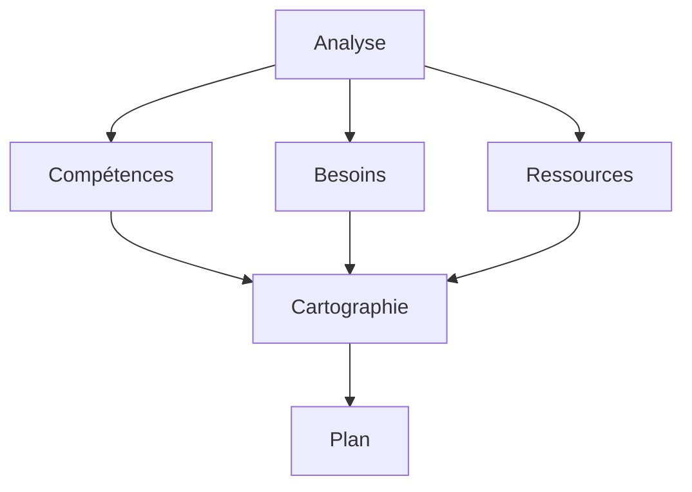

# Gestion et Développement des Compétences : Guide Stratégique

La gestion et le développement des compétences sont des enjeux stratégiques pour les organisations modernes. Ce guide complet vous accompagne dans l'optimisation de votre capital compétences.

## Fondamentaux de la Gestion des Compétences

### 1. Définition et Enjeux

#### A. Qu'est-ce que la Gestion des Compétences ?

- Identification des compétences
- Évaluation des besoins
- Développement
- Suivi

#### B. Enjeux Stratégiques

- Performance
- Innovation
- Compétitivité
- Adaptation

### 2. Éléments Clés

#### A. Compétences Techniques

- Métier
- Technologiques
- Méthodologiques
- Spécifiques

#### B. Soft Skills

- Communication
- Leadership
- Collaboration
- Adaptabilité

## Processus de Gestion

### 1. Identification

#### A. Cartographie

#### B. Évaluation

- Inventaire
- Niveaux
- Gaps
- Priorités

### 2. Développement

#### A. Formation

- Programmes
- Méthodes
- Supports
- Évaluation

#### B. Accompagnement

- Coaching
- Mentorat
- Feedback
- Suivi

## Stratégies de Développement

### 1. Formation

#### A. Programmes

- Présentiel
- E-learning
- Blended
- Micro-learning

#### B. Méthodes

- Théorie
- Pratique
- Cas d'études
- Projets

### 2. Apprentissage

#### A. Continu

- Auto-formation
- Partage
- Expérimentation
- Feedback

#### B. Collaboratif

- Communautés
- Mentorat
- Pair à pair
- Réseaux

## Mesure et Suivi

### 1. Évaluation

#### A. Indicateurs

- Niveaux
- Progression
- Impact
- ROI

#### B. Méthodes

- Tests
- Observations
- Feedback
- Projets

### 2. Amélioration

#### A. Analyse

- Données
- Tendances
- Insights
- Actions

#### B. Optimisation

- Programmes
- Méthodes
- Ressources
- Processus

## Aspects Organisationnels

### 1. Culture

#### A. Apprentissage

- Valeurs
- Pratiques
- Environnement
- Support

#### B. Innovation

- Créativité
- Expérimentation
- Partage
- Reconnaissance

### 2. Management

#### A. Leadership

- Vision
- Direction
- Support
- Exemple

#### B. Organisation

- Structure
- Processus
- Ressources
- Communication

## Outils et Technologies

### 1. LMS

#### A. Fonctionnalités

- Contenu
- Suivi
- Évaluation
- Reporting

#### B. Intégration

- HRIS
- ERP
- Outils métier
- Analytics

### 2. Analytics

#### A. Données

- Compétences
- Formation
- Performance
- Tendance

#### B. Insights

- Analyse
- Prédiction
- Recommandation
- Décision

## Défis et Solutions

### 1. Changement

#### A. Résistance

- Identification
- Communication
- Accompagnement
- Engagement

#### B. Adaptation

- Flexibilité
- Agilité
- Innovation
- Support

### 2. Ressources

#### A. Budget

- Planification
- Optimisation
- ROI
- Priorisation

#### B. Temps

- Organisation
- Efficacité
- Priorités
- Équilibre

## Bonnes Pratiques

### 1. Stratégie

#### A. Vision

- Objectifs
- Planification
- Ressources
- Mesure

#### B. Implémentation

- Phases
- Pilotes
- Déploiement
- Suivi

### 2. Management

#### A. Leadership

- Engagement
- Communication
- Support
- Exemple

#### B. Organisation

- Structure
- Processus
- Ressources
- Culture

## Conclusion

La gestion et le développement des compétences sont des processus stratégiques qui nécessitent une approche structurée et continue.

## Ressources Complémentaires

- Outils
- Formations
- Études de cas
- Communautés

## Prochaines Étapes

1. Évaluer vos besoins
2. Développer votre stratégie
3. Mettre en œuvre les actions
4. Mesurer et améliorer
