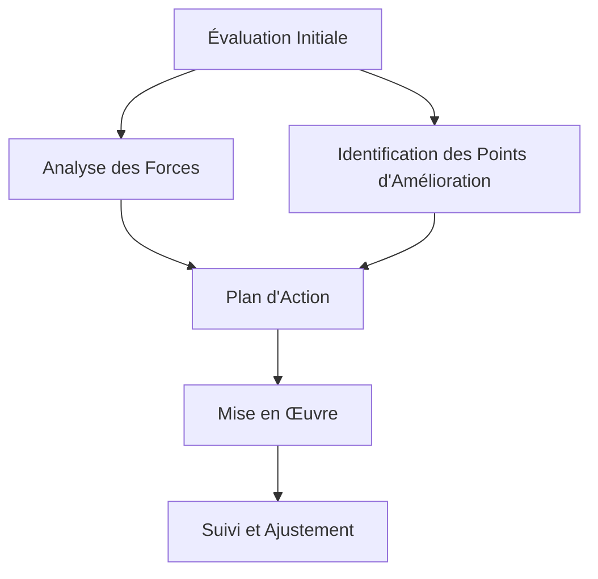

# Gestion de la Performance d'Équipe : Guide Complet pour l'Excellence Collective

La performance d'une équipe est le résultat d'une combinaison complexe de facteurs individuels et collectifs. Ce guide complet vous aidera à comprendre et à mettre en place les meilleures pratiques pour optimiser la performance de votre équipe.

## Les Fondamentaux de la Performance d'Équipe

### 1. Définition et Objectifs

La performance d'équipe se mesure à travers plusieurs dimensions :

- L'efficacité : atteindre les objectifs fixés
- L'efficience : optimiser les ressources utilisées
- La qualité : maintenir des standards élevés
- L'innovation : développer de nouvelles solutions

### 2. Les Facteurs Clés de Succès

Plusieurs éléments influencent directement la performance d'une équipe :

#### A. Leadership Efficace

- Vision claire et partagée
- Communication transparente
- Délégation appropriée
- Feedback constructif

#### B. Culture d'Équipe

- Confiance mutuelle
- Collaboration active
- Apprentissage continu
- Reconnaissance des contributions

#### C. Processus Optimisés

- Méthodologies adaptées
- Outils appropriés
- Flux de travail fluides
- Gestion des risques

## Stratégies d'Amélioration de la Performance

### 1. Évaluation et Mesure

### 2. Développement des Compétences

#### A. Formation Continue

- Programmes de développement
- Mentorat et coaching
- Partage de connaissances
- Apprentissage par la pratique

#### B. Renforcement des Soft Skills

- Communication
- Résolution de problèmes
- Gestion du stress
- Intelligence émotionnelle

### 3. Motivation et Engagement

#### A. Reconnaissance et Récompenses

- Système de reconnaissance
- Avantages compétitifs
- Opportunités de croissance
- Environnement de travail positif

#### B. Autonomie et Responsabilisation

- Délégation de responsabilités
- Prise de décision partagée
- Liberté d'initiative
- Confiance mutuelle

## Outils et Méthodologies

### 1. Méthodologies Agiles

- Scrum
- Kanban
- Scrumban
- Méthodes hybrides

### 2. Outils de Suivi

- Tableaux de bord
- Métriques de performance
- Systèmes de reporting
- Outils de collaboration

### 3. Techniques de Communication

- Réunions efficaces
- Feedback continu
- Communication asynchrone
- Documentation partagée

## Gestion des Défis

### 1. Résolution de Conflits

- Identification précoce
- Médiation
- Communication ouverte
- Solutions gagnant-gagnant

### 2. Gestion du Changement

- Communication du changement
- Formation et support
- Résistance au changement
- Adaptation continue

### 3. Stress et Bien-être

- Équilibre vie professionnelle/personnelle
- Gestion du stress
- Santé mentale
- Environnement de travail sain

## Mesure et Amélioration Continue

### 1. Indicateurs de Performance

- KPIs individuels
- KPIs d'équipe
- Métriques de projet
- Satisfaction client

### 2. Feedback et Ajustement

- Rétroaction régulière
- Ajustements continus
- Apprentissage organisationnel
- Innovation continue

## Conclusion

La performance d'équipe est un processus continu d'amélioration et d'adaptation. En mettant en place ces stratégies et en maintenant une approche proactive, vous pouvez créer une équipe performante et résiliente.

## Ressources Complémentaires

- Livres recommandés
- Formations disponibles
- Outils et templates
- Communautés de pratique

## Prochaines Étapes

1. Évaluer la situation actuelle de votre équipe
2. Identifier les domaines d'amélioration prioritaires
3. Développer un plan d'action personnalisé
4. Mettre en œuvre les changements progressivement
5. Mesurer et ajuster continuellement
