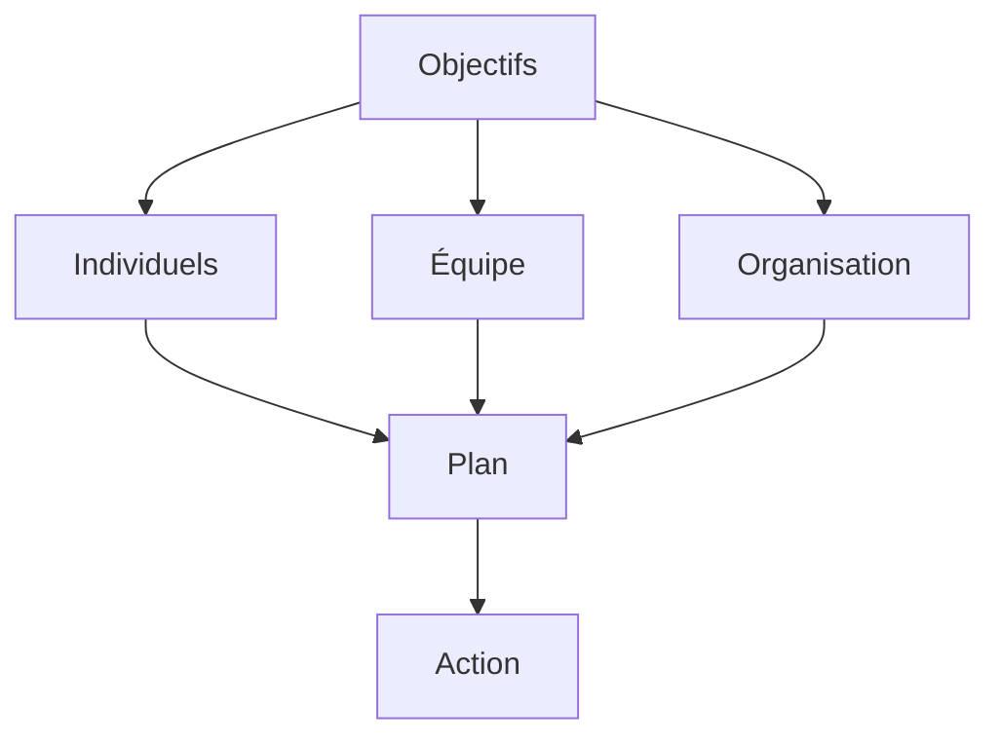

# Gestion de la Performance et Évaluation : Guide Pratique

La gestion de la performance et l'évaluation sont des processus essentiels pour le développement des organisations et des individus. Ce guide vous accompagne dans l'optimisation de ces processus stratégiques.

## Fondamentaux

### 1. Définition

#### A. Performance

- Objectifs
- Résultats
- Comportements
- Compétences

#### B. Évaluation

- Mesure
- Analyse
- Feedback
- Amélioration

### 2. Enjeux

#### A. Organisationnels

- Performance
- Développement
- Engagement
- Compétitivité

#### B. Individuels

- Motivation
- Progression
- Reconnaissance
- Développement

## Processus d'Évaluation

### 1. Planification

#### A. Objectifs

#### B. Critères

- KPIs
- Compétences
- Comportements
- Résultats

### 2. Implémentation

#### A. Méthodes

- Entretiens
- Observations
- Feedback
- Mesures

#### B. Outils

- Grilles
- Formulaires
- Systèmes
- Analytics

## Méthodes d'Évaluation

### 1. Approches

#### A. Traditionnelles

- Annuelle
- Semestrielle
- Trimestrielle
- Mensuelle

#### B. Modernes

- Continue
- Agile
- Feedback 360°
- OKRs

### 2. Techniques

#### A. Qualitatives

- Entretiens
- Observations
- Feedback
- Analyse

#### B. Quantitatives

- KPIs
- Métriques
- Scores
- Tendances

## Feedback et Développement

### 1. Communication

#### A. Principes

- Constructif
- Spécifique
- Actionnable
- Régulier

#### B. Méthodes

- Entretiens
- Écrit
- Oral
- Digital

### 2. Développement

#### A. Planification

- Objectifs
- Actions
- Ressources
- Suivi

#### B. Support

- Formation
- Coaching
- Mentorat
- Feedback

## Mesure et Analyse

### 1. Indicateurs

#### A. Performance

- Résultats
- Efficacité
- Qualité
- Impact

#### B. Développement

- Progression
- Compétences
- Engagement
- Satisfaction

### 2. Analyse

#### A. Données

- Collecte
- Traitement
- Analyse
- Insights

#### B. Actions

- Décisions
- Plans
- Implémentation
- Suivi

## Aspects Organisationnels

### 1. Culture

#### A. Performance

- Valeurs
- Attentes
- Standards
- Reconnaissance

#### B. Développement

- Apprentissage
- Innovation
- Collaboration
- Excellence

### 2. Management

#### A. Leadership

- Vision
- Direction
- Support
- Exemple

#### B. Organisation

- Structure
- Processus
- Ressources
- Communication

## Outils et Technologies

### 1. Solutions

#### A. Gestion

- SIRH
- Analytics
- Collaboration
- Reporting

#### B. Développement

- LMS
- Coaching
- Feedback
- Suivi

### 2. Innovation

#### A. Digital

- IA
- Analytics
- Mobile
- Cloud

#### B. Expérience

- UX
- Personnalisation
- Interactivité
- Gamification

## Défis et Solutions

### 1. Changement

#### A. Résistance

- Identification
- Communication
- Accompagnement
- Engagement

#### B. Adaptation

- Flexibilité
- Agilité
- Innovation
- Support

### 2. Ressources

#### A. Budget

- Planification
- Optimisation
- ROI
- Priorisation

#### B. Temps

- Organisation
- Efficacité
- Priorités
- Équilibre

## Bonnes Pratiques

### 1. Stratégie

#### A. Vision

- Objectifs
- Planification
- Ressources
- Mesure

#### B. Implémentation

- Phases
- Pilotes
- Déploiement
- Suivi

### 2. Management

#### A. Leadership

- Engagement
- Communication
- Support
- Exemple

#### B. Organisation

- Structure
- Processus
- Ressources
- Culture

## Conclusion

La gestion de la performance et l'évaluation sont des processus clés pour le développement des organisations et des individus.

## Ressources Complémentaires

- Outils
- Formations
- Études de cas
- Communautés

## Prochaines Étapes

1. Évaluer vos processus
2. Développer votre stratégie
3. Mettre en œuvre les actions
4. Mesurer et améliorer
