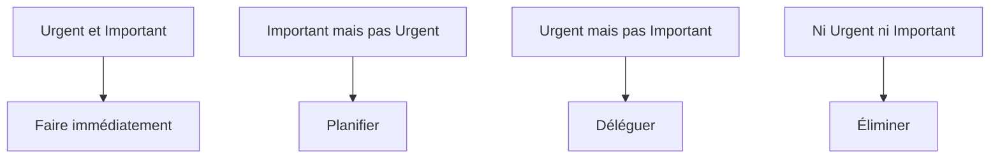

# Gestion des Priorités et Efficacité : Guide Complet pour Atteindre vos Objectifs

La gestion efficace des priorités est une compétence essentielle dans le monde professionnel d'aujourd'hui. Ce guide complet vous aidera à développer une approche structurée pour identifier, organiser et exécuter vos priorités de manière efficace.

## Les Fondamentaux de la Gestion des Priorités

### 1. Comprendre vos Objectifs

#### A. Définition des Objectifs

- Objectifs à court terme
- Objectifs à moyen terme
- Objectifs à long terme
- Alignement avec vos valeurs

#### B. Analyse des Enjeux

- Impact des décisions
- Urgence vs Importance
- Ressources nécessaires
- Contraintes existantes

### 2. Méthodes d'Évaluation

#### A. Matrice d'Eisenhower

#### B. Analyse SWOT

- Forces
- Faiblesses
- Opportunités
- Menaces

## Techniques de Gestion des Priorités

### 1. Planification Efficace

#### A. Méthode GTD (Getting Things Done)

- Capture
- Clarification
- Organisation
- Réflexion
- Engagement

#### B. Planification Quotidienne

- Liste de tâches
- Blocs de temps
- Gestion des interruptions
- Revues régulières

### 2. Outils et Méthodologies

#### A. Applications de Productivité

- Todoist
- Trello
- Notion
- Microsoft To Do

#### B. Techniques de Focus

- Méthode Pomodoro
- Deep Work
- Time Blocking
- Batch Processing

## Optimisation de l'Efficacité

### 1. Gestion de l'Énergie

#### A. Rythmes Biologiques

- Cycles de sommeil
- Périodes de productivité
- Pauses stratégiques
- Récupération

#### B. Équilibre Vie Pro/Personnelle

- Délimitation des frontières
- Temps de qualité
- Activités de bien-être
- Relations sociales

### 2. Réduction des Perturbations

#### A. Gestion des Interruptions

- Communication claire
- Blocs de focus
- Réponses différées
- Environnement de travail

#### B. Organisation de l'Espace

- Minimalisme
- Ergonomie
- Accessibilité
- Inspiration

## Développement des Compétences

### 1. Compétences Clés

#### A. Communication

- Assertivité
- Négociation
- Délégation
- Feedback

#### B. Prise de Décision

- Analyse rapide
- Intuition
- Gestion du risque
- Apprentissage

### 2. Amélioration Continue

#### A. Auto-évaluation

- Journal de productivité
- Métriques personnelles
- Feedback
- Ajustements

#### B. Développement Personnel

- Formation continue
- Lecture
- Mentorat
- Réseautage

## Gestion des Défis

### 1. Surmonter les Obstacles

#### A. Problèmes Courants

- Procrastination
- Perfectionnisme
- Surcharge d'information
- Stress

#### B. Solutions Pratiques

- Techniques anti-procrastination
- Gestion du stress
- Filtrage d'information
- Développement de la résilience

### 2. Adaptation au Changement

#### A. Flexibilité

- Adaptation rapide
- Gestion de l'incertitude
- Innovation
- Apprentissage continu

#### B. Résilience

- Gestion des échecs
- Apprentissage
- Motivation
- Persévérance

## Mesure et Amélioration

### 1. Indicateurs de Performance

#### A. Métriques Personnelles

- Taux de complétion
- Qualité du travail
- Satisfaction
- Équilibre

#### B. Suivi et Ajustement

- Revues régulières
- Ajustements
- Objectifs
- Plan d'action

### 2. Développement Durable

#### A. Habitudes Productives

- Routines matinales
- Rituels de fin de journée
- Pauses stratégiques
- Réflexion

#### B. Évolution Continue

- Apprentissage
- Adaptation
- Innovation
- Croissance

## Conclusion

La gestion efficace des priorités est un art qui se développe avec la pratique. En appliquant ces principes et techniques, vous pouvez transformer votre approche du travail et atteindre un niveau d'efficacité optimal.

## Ressources Complémentaires

- Livres recommandés
- Applications utiles
- Formations disponibles
- Communautés de pratique

## Prochaines Étapes

1. Évaluer votre situation actuelle
2. Identifier vos priorités principales
3. Mettre en place un système de gestion
4. Développer vos compétences
5. Mesurer et ajuster régulièrement
