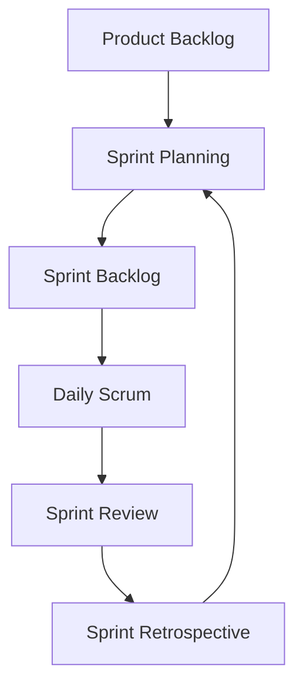
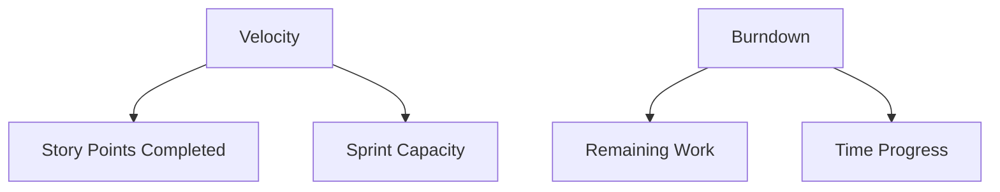
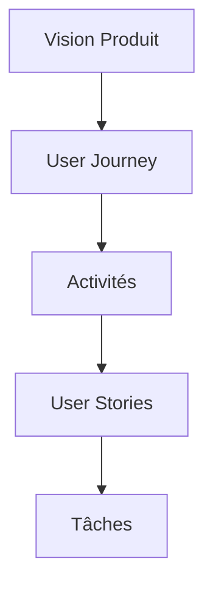
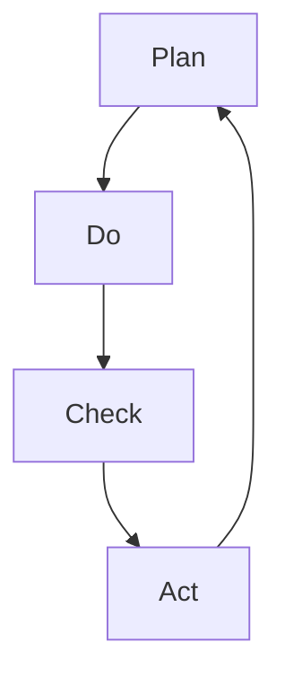

# Maîtrisez l'Agilité : Guide Pratique

Pour comprendre l'agilité simplement, imaginons la gestion d'un restaurant gastronomique. Chaque aspect de l'agilité correspond à un élément de la cuisine professionnelle :

## 🎯 Concepts Agiles Expliqués

### 1. Le Framework Scrum

Comme la préparation d'un service au restaurant :

- Le **Product Backlog** est comme le menu complet
- Le **Sprint** est comme un service de 2-4 heures
- Le **Daily Scrum** est comme le briefing avant le service
- La **Review** est comme la dégustation des plats
- La **Rétrospective** est comme le débriefing après le service

### 2. Les Rôles Clés

Comme l'organisation d'une cuisine :

- **Product Owner** : Le chef qui décide du menu
- **Scrum Master** : Le maître d'hôtel qui coordonne
- **Équipe** : Les cuisiniers qui réalisent les plats

### 3. La Vélocité et le Burndown

Comme le rythme de la cuisine :

- **Vélocité** : Nombre de plats servis par service
- **Burndown** : Suivi des commandes restantes
- **Capacité** : Ce que l'équipe peut gérer

## 🔄 Le Framework Scrum

Commençons notre voyage dans l'agilité par le framework le plus populaire et le plus éprouvé : Scrum. Ce framework n'est pas qu'un ensemble de règles à suivre - c'est une philosophie complète qui transforme la façon dont les équipes collaborent et délivrent de la valeur.

Scrum est comme une danse bien orchestrée où chaque membre de l'équipe connaît ses pas et son rôle. Cette méthodologie structure le travail en cycles courts et réguliers, permettant de maintenir un rythme soutenu tout en restant flexible face aux changements.

### Cycle Scrum Complet



**Comprendre le Cycle :**
Imaginez une équipe de cuisine préparant un grand repas :

1. **Product Backlog** : Le menu complet à préparer
2. **Sprint Planning** : Choix des plats pour le service du jour
3. **Sprint Backlog** : Liste des ingrédients et tâches pour ces plats
4. **Daily Scrum** : Point rapide sur l'avancement de chaque préparation
5. **Sprint Review** : Dégustation et retours des clients
6. **Retrospective** : Discussion sur comment améliorer le service

La beauté du cycle Scrum réside dans sa simplicité et sa répétition. Chaque itération nous permet d'apprendre de nos expériences et d'améliorer notre façon de travailler. C'est comme un musicien qui répète son morceau : à chaque fois, il devient plus fluide et plus précis.

### Rôles et Responsabilités

```markdown
Product Owner
├── Vision Produit
│ ├── Objectifs Business
│ └── Priorités
└── Backlog Management
├── User Stories
└── Acceptance Criteria

Scrum Master
├── Facilitateur
│ ├── Remove Blockers
│ └── Coach Équipe
└── Process Guardian
├── Cérémonies
└── Amélioration Continue

Development Team
├── Auto-organisation
│ ├── Estimation
│ └── Engagement
└── Livraison
├── Développement
└── Tests
```

**Exemple Concret :**
Dans une startup tech :

- **Product Owner** : Définit les fonctionnalités prioritaires de l'app
- **Scrum Master** : Aide l'équipe à résoudre les problèmes techniques
- **Dev Team** : Développe et teste les nouvelles fonctionnalités

La force de Scrum vient de la clarté des rôles de chacun. C'est comme une pièce de théâtre où chaque acteur connaît parfaitement son personnage et ses répliques. Cette clarté permet d'éviter les confusions et les chevauchements de responsabilités qui peuvent ralentir un projet.

## 📊 Métriques et KPIs Agiles

Maintenant que nous avons posé les bases de Scrum, intéressons-nous à la mesure de notre progression. Car comme le dit l'adage, "on ne peut améliorer que ce que l'on peut mesurer".

Les métriques en agilité ne sont pas de simples chiffres sur un tableau. Elles racontent l'histoire de votre projet et vous guident vers l'amélioration continue. Comme un tableau de bord dans une voiture, elles vous indiquent si vous êtes sur la bonne voie et à quelle vitesse vous avancez.

### Velocity et Burndown



**Comprendre les Métriques :**
Pensez à un voyage en voiture :

- **Velocity** : Votre vitesse moyenne sur les derniers trajets
- **Capacity** : L'autonomie de votre réservoir
- **Burndown** : La distance restante vs le temps écoulé
- **Remaining Work** : Les kilomètres encore à parcourir

La velocity n'est pas qu'une simple mesure de vitesse. C'est un indicateur de la capacité de votre équipe à transformer des idées en réalité. En la suivant régulièrement, vous apprenez à mieux prévoir et à optimiser votre façon de travailler.

### Tableau Kanban Avancé

```markdown
Backlog
├── Priorité Haute
└── Priorité Normale

En Cours
├── Analyse
├── Développement
└── Test

Review
├── Code Review
└── QA

Done
├── Documentation
└── Déployé
```

**Application Pratique :**
Visualisez le flux de travail comme une chaîne de production :

1. Les tâches entrent par le Backlog (matières premières)
2. Passent par différentes étapes de transformation
3. Sortent finies et documentées (produit fini)

Le tableau Kanban est comme une carte routière qui montre où se trouve chaque élément de travail. Cette visualisation permet à toute l'équipe de comprendre instantanément l'état du projet et d'identifier les goulots d'étranglement potentiels.

### Estimation et Planning Poker

```markdown
Échelle Fibonacci
├── 1 (Très simple)
├── 2 (Simple)
├── 3 (Modéré)
├── 5 (Complexe)
├── 8 (Très complexe)
└── 13 (À découper)

Critères d'Estimation
├── Complexité technique
├── Incertitudes
├── Dépendances
└── Effort requis
```

**Exemple d'Application :**
Comme estimer la préparation de plats :

- **1 point** : Faire un café
- **3 points** : Préparer une salade
- **8 points** : Cuisiner un repas gastronomique
- **13 points** : Organiser un banquet (à découper en plus petites tâches)

L'estimation en équipe est un art qui s'affine avec le temps. C'est comme apprendre à évaluer le temps de cuisson d'un plat : avec l'expérience, vos estimations deviennent de plus en plus précises.

### Qualité et Excellence Technique

```markdown
Definition of Done
├── Code Review
├── Tests
│ ├── Unitaires
│ ├── Integration
│ └── E2E
├── Documentation
└── Déploiement

Pratiques XP
├── Pair Programming
├── TDD
└── Refactoring
```

La qualité n'est pas négociable en agilité. C'est comme la sécurité alimentaire dans un restaurant : elle doit être intégrée à chaque étape du processus, pas ajoutée à la fin.

### Maturité Agile

```markdown
Niveau 1 : Initial
├── Processus ad hoc
└── Résultats imprévisibles

Niveau 2 : Répétable
├── Pratiques de base
└── Résultats cohérents

Niveau 3 : Défini
├── Processus standardisés
└── Amélioration active

Niveau 4 : Géré
├── Métriques utilisées
└── Optimisation continue

Niveau 5 : Optimisé
├── Innovation
└── Excellence
```

La maturité agile est comme l'apprentissage d'un instrument de musique : on commence par les bases, puis on progresse vers des techniques plus avancées, jusqu'à atteindre la maîtrise qui permet d'innover et de créer.

## 🎯 Planification Agile

La planification en mode agile est un art subtil qui demande de trouver le juste équilibre entre vision à long terme et adaptabilité au quotidien. Découvrons ensemble comment maîtriser cet exercice délicat.

### User Story Mapping



**Décryptage du Mapping :**
C'est comme organiser un voyage :

1. **Vision** : La destination finale
2. **Journey** : Les grandes étapes du voyage
3. **Activités** : Ce qu'on fera à chaque étape
4. **Stories** : Les besoins spécifiques
5. **Tâches** : Les actions concrètes

Le Story Mapping est plus qu'un simple outil de planification. C'est une façon de visualiser le voyage de vos utilisateurs et de s'assurer que chaque fonctionnalité contribue à une expérience cohérente et satisfaisante. Imaginez-le comme un itinéraire de voyage où chaque étape a un objectif précis et contribue à l'expérience globale.

## 🛠 Outils et Pratiques

Les outils sont essentiels pour soutenir nos pratiques agiles, mais ils ne sont efficaces que s'ils sont utilisés à bon escient. Explorons ensemble les instruments qui nous permettront d'orchestrer nos projets avec maestria.

### Rituels Efficaces

```markdown
Daily Stand-up
├── Hier
├── Aujourd'hui
└── Blocages

Sprint Planning
├── Objectifs
├── Capacité
└── Engagement

Retrospective
├── Keep
├── Stop
└── Start
```

**Guide Pratique :**
Le Daily Stand-up est comme un briefing d'équipe sportive :

1. Ce qu'on a accompli au dernier match
2. Notre stratégie pour aujourd'hui
3. Les obstacles à surmonter

Les rituels agiles ne sont pas de simples réunions. Ce sont des moments précieux d'alignement et de synchronisation qui permettent à l'équipe de rester focalisée et efficace. Comme une équipe sportive qui se réunit avant chaque match, ces moments renforcent la cohésion et préparent aux défis à venir.

## 📈 Amélioration Continue

L'amélioration continue est le cœur battant de l'agilité. C'est ce qui transforme une simple méthodologie en une culture d'excellence et d'innovation permanente. Voyons comment mettre en place ce cycle vertueux dans vos équipes.

### Cycle PDCA (Plan-Do-Check-Act)



**Comprendre le Cycle :**
Comme l'amélioration d'une recette :

1. **Plan** : Modifier les ingrédients
2. **Do** : Tester la nouvelle recette
3. **Check** : Goûter et évaluer
4. **Act** : Ajuster pour la prochaine fois

Le cycle PDCA nous rappelle que l'amélioration est un processus sans fin. Chaque itération nous rapproche de l'excellence, mais il y a toujours de nouvelles opportunités d'apprentissage et de progression à saisir.

## Conclusion : Vers une Agilité Mature

L'agilité est un voyage passionnant qui transforme non seulement notre façon de travailler, mais aussi notre façon de penser et de collaborer. Comme un jardin bien entretenu, elle demande de l'attention quotidienne, mais les fruits qu'elle porte en valent largement la peine.

Pour rendre ces concepts plus accessibles, visualisez votre projet agile comme un jardin :

- Le **Product Backlog** est votre plan de plantation
- Les **Sprints** sont les saisons de culture
- L'**Équipe** représente les jardiniers
- Les **Métriques** sont vos outils de mesure
- L'**Amélioration Continue** est comme l'entretien régulier

Cette métaphore du jardin nous rappelle que l'agilité est un processus vivant qui nécessite patience, attention et adaptation constante. Tout comme un jardinier doit s'adapter aux conditions météorologiques changeantes, une équipe agile doit s'adapter aux évolutions du marché et aux besoins des utilisateurs.

**Guide de Démarrage :**

1. Commencez petit avec une équipe pilote
2. Adoptez les rituels un par un
3. Mesurez les progrès
4. Adaptez les pratiques à votre contexte
5. Formez et accompagnez les équipes

Rappelez-vous que chaque équipe est unique et que l'agilité doit être adaptée à votre contexte spécifique. Il n'y a pas de recette miracle, mais plutôt des principes à comprendre et à faire évoluer selon vos besoins. C'est comme apprendre à cuisiner : vous commencez par suivre les recettes à la lettre, puis vous apprenez à les adapter à vos goûts et aux ingrédients disponibles.

N'oubliez pas : "L'agilité n'est pas une destination, c'est un voyage d'amélioration continue." Ce voyage est fait de petits pas quotidiens, d'apprentissages constants et de victoires progressives qui construisent une culture d'excellence et d'adaptation.

## 📚 Lexique de l'Agilité

Pour mieux comprendre les concepts agiles, voici un dictionnaire des termes essentiels expliqués simplement :

### A

- **Agilité** : La capacité à s'adapter rapidement, comme un danseur qui suit le rythme
- **Acceptance Criteria** : Les conditions pour qu'une tâche soit considérée comme terminée, comme la recette d'un plat réussi

### B

- **Backlog** : La liste de tout ce qu'il faut faire, comme une liste de courses bien organisée
- **Burndown Chart** : Graphique montrant le travail restant, comme un compte à rebours visuel

### D

- **Daily Scrum** : Réunion quotidienne rapide, comme le briefing d'une équipe de cuisine avant le service
- **Definition of Done** : Critères de qualité à respecter, comme les standards d'un restaurant étoilé

### E

- **Epic** : Grande fonctionnalité découpée en petites histoires, comme un menu complet divisé en plats
- **Estimation** : Évaluer la difficulté d'une tâche, comme estimer le temps de préparation d'un plat

### I

- **Incrément** : Petite amélioration livrée, comme ajouter un nouvel ingrédient à une recette
- **Itération** : Cycle de développement court, comme un service au restaurant

### K

- **Kanban** : Tableau visuel du flux de travail, comme le tableau des commandes en cuisine
- **KPI (Indicateur Clé)** : Mesures importantes, comme les critiques d'un restaurant

### M

- **Minimum Viable Product (MVP)** : Version minimale utilisable, comme un plat de base sans les garnitures
- **Méthodologie Agile** : Façon de travailler flexible, comme une cuisine qui s'adapte aux ingrédients disponibles

### P

- **Planning Poker** : Jeu d'estimation en équipe, comme des chefs qui évaluent ensemble la difficulté d'une recette
- **Product Owner** : Responsable de la vision produit, comme le chef qui décide du menu

### R

- **Rétrospective** : Réunion pour s'améliorer, comme le débriefing après le service
- **Release** : Livraison d'une version, comme servir un plat aux clients

### S

- **Scrum** : Framework agile populaire, comme une méthode éprouvée de gestion de restaurant
- **Sprint** : Période de travail fixe, comme un service au restaurant
- **Story Points** : Unité de mesure de l'effort, comme la difficulté d'une recette

### T

- **Task Board** : Tableau des tâches, comme le planning de la cuisine
- **Time-box** : Durée fixe pour une activité, comme le temps de cuisson d'un plat

### U

- **User Story** : Description d'une fonctionnalité du point de vue utilisateur, comme la description d'un plat sur le menu
- **User Story Mapping** : Organisation visuelle des fonctionnalités, comme le plan d'un menu

### V

- **Velocity** : Vitesse de l'équipe, comme le rythme de service d'un restaurant
- **Value Stream** : Flux de valeur, comme le parcours d'un plat de la cuisine à la table

Ce lexique évoluera avec les nouvelles pratiques agiles et votre expérience dans leur application.
