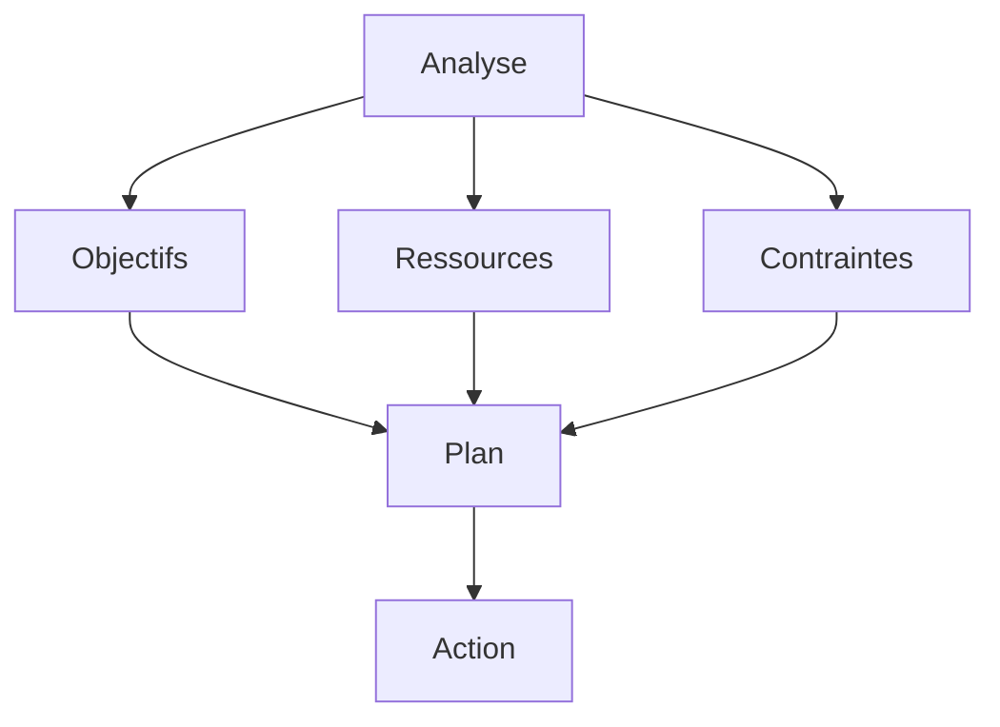

# Gestion de Projet et Performance : Guide Stratégique

La gestion de projet et la performance sont des enjeux stratégiques pour les organisations modernes. Ce guide complet vous accompagne dans l'optimisation de vos projets et de leur performance.

## Fondamentaux

### 1. Définition

#### A. Gestion de Projet

- Planification
- Organisation
- Exécution
- Contrôle

#### B. Performance

- Mesure
- Analyse
- Amélioration
- Suivi

### 2. Enjeux

#### A. Organisationnels

- Efficacité
- Efficience
- Qualité
- Innovation

#### B. Marché

- Concurrence
- Évolution
- Tendances
- Opportunités

## Processus de Gestion

### 1. Planification

#### A. Analyse

#### B. Stratégie

- Objectifs
- Méthodes
- Ressources
- Planning

### 2. Implémentation

#### A. Organisation

- Structure
- Rôles
- Responsabilités
- Communication

#### B. Exécution

- Actions
- Suivi
- Ajustements
- Résultats

## Méthodes de Gestion

### 1. Approches

#### A. Traditionnelles

- Cascade
- Agile
- Hybride
- Adaptative

#### B. Modernes

- Lean
- Six Sigma
- DevOps
- Design Thinking

### 2. Techniques

#### A. Planification

- WBS
- Gantt
- PERT
- Kanban

#### B. Suivi

- KPIs
- Tableaux de bord
- Rapports
- Analyses

## Performance et Mesure

### 1. Indicateurs

#### A. Projet

- Délais
- Coûts
- Qualité
- Satisfaction

#### B. Organisation

- Efficacité
- Efficience
- Innovation
- Croissance

### 2. Analyse

#### A. Données

- Collecte
- Traitement
- Analyse
- Insights

#### B. Actions

- Décisions
- Plans
- Implémentation
- Suivi

## Aspects Organisationnels

### 1. Culture

#### A. Performance

- Valeurs
- Objectifs
- Reconnaissance
- Amélioration

#### B. Innovation

- Créativité
- Expérimentation
- Apprentissage
- Adaptation

### 2. Management

#### A. Leadership

- Vision
- Direction
- Support
- Exemple

#### B. Organisation

- Structure
- Processus
- Ressources
- Communication

## Outils et Technologies

### 1. Solutions

#### A. Gestion

- PMO
- PPM
- Collaboration
- Analytics

#### B. Performance

- BI
- Analytics
- Reporting
- Suivi

### 2. Innovation

#### A. Digital

- IA
- Analytics
- Mobile
- Cloud

#### B. Expérience

- UX
- Personnalisation
- Interactivité
- Gamification

## Défis et Solutions

### 1. Changement

#### A. Résistance

- Identification
- Communication
- Accompagnement
- Engagement

#### B. Adaptation

- Flexibilité
- Agilité
- Innovation
- Support

### 2. Ressources

#### A. Budget

- Planification
- Optimisation
- ROI
- Priorisation

#### B. Temps

- Organisation
- Efficacité
- Priorités
- Équilibre

## Bonnes Pratiques

### 1. Stratégie

#### A. Vision

- Objectifs
- Planification
- Ressources
- Mesure

#### B. Implémentation

- Phases
- Pilotes
- Déploiement
- Suivi

### 2. Management

#### A. Leadership

- Engagement
- Communication
- Support
- Exemple

#### B. Organisation

- Structure
- Processus
- Ressources
- Culture

## Conclusion

La gestion de projet et la performance sont des processus stratégiques qui nécessitent une approche structurée et continue.

## Ressources Complémentaires

- Outils
- Formations
- Études de cas
- Communautés

## Prochaines Étapes

1. Évaluer vos processus
2. Développer votre stratégie
3. Mettre en œuvre les actions
4. Mesurer et améliorer
