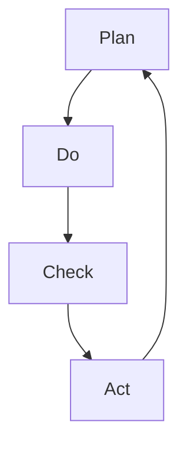

# Gestion de la Qualité et Amélioration Continue : Guide Pratique

L'amélioration continue est un pilier fondamental de la gestion de la qualité moderne. Ce guide complet vous aidera à comprendre et à mettre en place une culture d'amélioration continue dans votre organisation.

## Les Fondamentaux de l'Amélioration Continue

### 1. Principes de Base

#### A. Définition et Objectifs

- Amélioration continue (Kaizen)
- Gestion de la qualité totale (TQM)
- Standards et normes
- Objectifs de performance

#### B. Culture d'Excellence

- Engagement de la direction
- Implication des équipes
- Communication transparente
- Reconnaissance des efforts

### 2. Méthodologies Clés

#### A. PDCA (Plan-Do-Check-Act)

#### B. Six Sigma

- DMAIC (Define, Measure, Analyze, Improve, Control)
- Outils statistiques
- Réduction des variations
- Excellence opérationnelle

## Mise en Œuvre

### 1. Diagnostic Initial

#### A. Évaluation des Processus

- Cartographie des processus
- Identification des points critiques
- Analyse des flux
- Mesure des performances

#### B. Identification des Opportunités

- Gaps de performance
- Points d'amélioration
- Risques potentiels
- Opportunités d'innovation

### 2. Plan d'Action

#### A. Priorisation

- Matrice d'impact/effort
- Ressources disponibles
- Contraintes
- Planning

#### B. Déploiement

- Communication
- Formation
- Support
- Suivi

## Outils et Techniques

### 1. Outils d'Analyse

#### A. Diagrammes

- Diagramme de Pareto
- Diagramme d'Ishikawa
- Diagramme de flux
- Cartes de contrôle

#### B. Méthodes Statistiques

- Analyse de variance
- Tests d'hypothèses
- Corrélations
- Régression

### 2. Techniques d'Amélioration

#### A. Lean Management

- Élimination des gaspillages
- Flux tendu
- Standardisation
- Juste-à-temps

#### B. Kaizen

- Améliorations incrémentales
- Implication des équipes
- Résolution de problèmes
- Innovation continue

## Gestion du Changement

### 1. Communication

#### A. Stratégie de Communication

- Messages clés
- Canaux de communication
- Fréquence
- Feedback

#### B. Engagement des Parties Prenantes

- Identification des acteurs
- Niveau d'influence
- Stratégies d'engagement
- Suivi

### 2. Formation et Support

#### A. Programme de Formation

- Compétences requises
- Modules de formation
- Évaluation
- Support continu

#### B. Accompagnement

- Coaching
- Mentorat
- Documentation
- Ressources

## Mesure et Suivi

### 1. Indicateurs de Performance

#### A. KPIs Qualité

- Taux de non-conformité
- Coût de la non-qualité
- Satisfaction client
- Efficacité des processus

#### B. Tableaux de Bord

- Suivi en temps réel
- Alertes
- Rapports
- Analyses

### 2. Amélioration Continue

#### A. Revues Régulières

- Analyse des résultats
- Identification des tendances
- Ajustements
- Planification

#### B. Innovation

- Veille technologique
- Benchmarking
- Co-création
- Expérimentation

## Bonnes Pratiques

### 1. Leadership

- Vision claire
- Engagement
- Exemplarité
- Support

### 2. Organisation

- Structure adaptée
- Rôles et responsabilités
- Processus clairs
- Ressources

### 3. Culture

- Apprentissage continu
- Innovation
- Collaboration
- Reconnaissance

## Conclusion

L'amélioration continue est un voyage, pas une destination. En mettant en place ces pratiques et en maintenant une culture d'excellence, votre organisation peut atteindre des niveaux de performance exceptionnels.

## Ressources Complémentaires

- Livres recommandés
- Formations disponibles
- Outils et templates
- Communautés de pratique

## Prochaines Étapes

1. Évaluer la situation actuelle
2. Définir une stratégie d'amélioration
3. Mettre en place les outils
4. Former les équipes
5. Mesurer et ajuster
