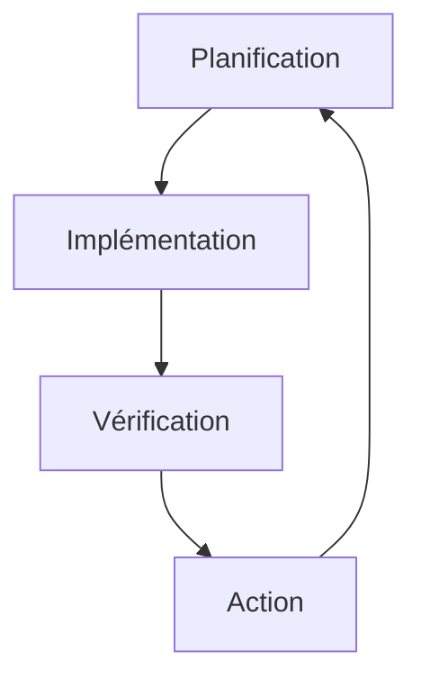

# Gestion de la Qualité en Entreprise : Guide Complet pour l'Excellence Opérationnelle

## Introduction

La gestion de la qualité constitue un pilier fondamental de la performance organisationnelle moderne. Dans cet article, nous explorerons en profondeur les méthodologies, outils et meilleures pratiques qui permettent d'établir et de maintenir un système de gestion de la qualité véritablement efficace.

## Fondamentaux de la Gestion de la Qualité

### Définition et Objectifs

La gestion de la qualité représente une démarche structurée visant à assurer la conformité des produits et services, améliorer la satisfaction client, optimiser les processus et réduire les coûts de non-qualité. Cette approche systématique permet d'atteindre l'excellence opérationnelle.

### Statistiques Clés

Les résultats des initiatives de gestion de la qualité sont éloquents : 85% des entreprises certifiées ISO 9001 rapportent une amélioration significative de leur performance, 70% des problèmes de qualité sont directement liés aux processus, et 60% des coûts de non-qualité sont évitables. Ces chiffres soulignent l'importance cruciale d'une gestion de la qualité rigoureuse.

## Méthodologies de Gestion de la Qualité

### ISO 9001:2015

La norme ISO 9001:2015 repose sur des principes fondamentaux qui guident la gestion de la qualité. L'orientation client, le leadership, l'implication du personnel et l'approche processus constituent les piliers de cette norme internationale. Ces principes s'articulent autour d'une structure claire comprenant le contexte de l'organisation, le leadership, la planification, le support, la réalisation, l'évaluation et l'amélioration.

### Six Sigma

La méthodologie Six Sigma offre un cadre structuré pour l'amélioration de la qualité, comme l'illustre le tableau suivant :

| Phase   | Objectif                 | Outils               |
| ------- | ------------------------ | -------------------- |
| Define  | Définir le problème      | SIPOC, CTQ           |
| Measure | Mesurer les performances | Capabilité, SPC      |
| Analyze | Analyser les causes      | Diagramme d'Ishikawa |
| Improve | Améliorer le processus   | DOE, FMEA            |
| Control | Contrôler les résultats  | Tableaux de bord     |

## Mise en Œuvre

### 1. Système de Management

Le système de management de la qualité suit un cycle continu d'amélioration, illustré par le diagramme suivant :

### 2. Documentation

La documentation du système qualité comprend deux éléments essentiels. Le manuel qualité définit la politique qualité, les objectifs, les processus et les responsabilités. Les procédures détaillent les instructions de travail, les formulaires, les enregistrements et les référentiels nécessaires au bon fonctionnement du système.

### 3. Formation

La formation constitue un élément crucial du système de management de la qualité. Elle comprend la sensibilisation à la qualité, la formation des auditeurs, le développement des compétences techniques et la formation continue. Cette approche permet d'assurer la compétence et l'engagement du personnel.

## Outils et Techniques

### Contrôle Qualité

Le contrôle qualité s'appuie sur deux piliers principaux. L'inspection comprend le contrôle visuel, les mesures, les tests et les vérifications systématiques. L'analyse comprend l'utilisation de méthodes statistiques, l'analyse des tendances, l'identification des causes racines et la mise en place d'actions correctives.

### Amélioration Continue

Les outils d'amélioration continue, présentés dans le tableau suivant, permettent d'optimiser les processus de manière systématique :

| Outil  | Objectif                 | Application              |
| ------ | ------------------------ | ------------------------ |
| PDCA   | Amélioration continue    | Tous les processus       |
| 5S     | Organisation             | Environnement de travail |
| Kaizen | Amélioration progressive | Tous les niveaux         |
| SMED   | Réduction des temps      | Production               |

## Mesure et Suivi

### Indicateurs de Performance

L'évaluation de la performance du système qualité s'appuie sur trois catégories d'indicateurs clés. Les métriques de qualité produit, comme le taux de défauts et la conformité, mesurent la qualité des résultats. Les indicateurs de processus, incluant l'efficacité et l'efficience, évaluent la performance opérationnelle. Enfin, les métriques du système, telles que les résultats d'audit et la performance globale, mesurent l'efficacité du système de management.

## Gestion des Risques

### Identification

L'identification des risques qualité comprend deux catégories principales. Les risques produit concernent la conception, la production, la distribution et l'utilisation des produits. Les risques processus incluent les aspects opérationnels, humains, techniques et environnementaux. Cette approche systématique permet d'anticiper et de prévenir les problèmes potentiels.

### Prévention

La prévention des risques qualité repose sur une analyse approfondie des risques, la mise en place d'actions préventives, une surveillance continue et une amélioration constante. Cette approche proactive permet de minimiser les impacts négatifs sur la qualité.

## Innovation et Amélioration

### Tendances Émergentes

La digitalisation transforme profondément la gestion de la qualité. L'Internet des Objets (IoT), le Big Data, l'intelligence artificielle et l'automatisation permettent d'améliorer significativement la surveillance et le contrôle de la qualité.

La durabilité représente une autre tendance majeure, avec une attention particulière portée à l'écoconception, l'économie circulaire, la responsabilité sociale et la performance environnementale. Cette approche intégrée permet de concilier qualité et développement durable.

L'agilité constitue la troisième tendance émergente, avec une adaptation rapide aux changements, une innovation continue, une résilience accrue et un apprentissage permanent. Cette approche dynamique permet de maintenir la compétitivité dans un environnement en constante évolution.

## Conclusion

La gestion de la qualité représente un voyage continu vers l'excellence qui nécessite une vision claire, un engagement fort, des outils appropriés et une culture d'amélioration continue. Cette démarche structurée permet aux entreprises de maintenir leur compétitivité dans un environnement en constante évolution.

### Prochaines Étapes

Pour réussir dans cette transformation, les entreprises doivent d'abord évaluer leur système actuel, identifier les priorités d'amélioration, développer un plan d'action détaillé, former leurs équipes et implémenter progressivement les solutions choisies.

## Ressources Complémentaires

Pour approfondir vos connaissances sur la gestion de la qualité, nous vous recommandons de consulter les ressources suivantes :

- [ISO](https://www.iso.org)
- [American Society for Quality](https://asq.org)
- [European Organization for Quality](https://www.eoq.org)

## FAQ

**Q: Combien de temps faut-il pour mettre en place un système qualité ?**
R: La mise en place d'un système de management de la qualité nécessite généralement entre 6 et 12 mois, selon la taille et la complexité de l'organisation. Cette période inclut la planification, l'implémentation, la formation et la stabilisation du système.

**Q: Quel est le coût de la certification ISO 9001 ?**
R: Les coûts de certification ISO 9001 varient considérablement selon la taille de l'organisation et la complexité des processus. Pour une première certification, les entreprises doivent généralement prévoir un budget entre 10 000€ et 50 000€, incluant la préparation, l'audit et les frais de certification.

**Q: Comment mesurer le ROI de la qualité ?**
R: Le retour sur investissement de la qualité se mesure à travers plusieurs indicateurs clés, notamment les coûts de non-qualité, la satisfaction client et l'efficacité des processus. Cette approche multidimensionnelle permet d'évaluer l'impact réel des initiatives qualité sur la performance globale de l'organisation.
