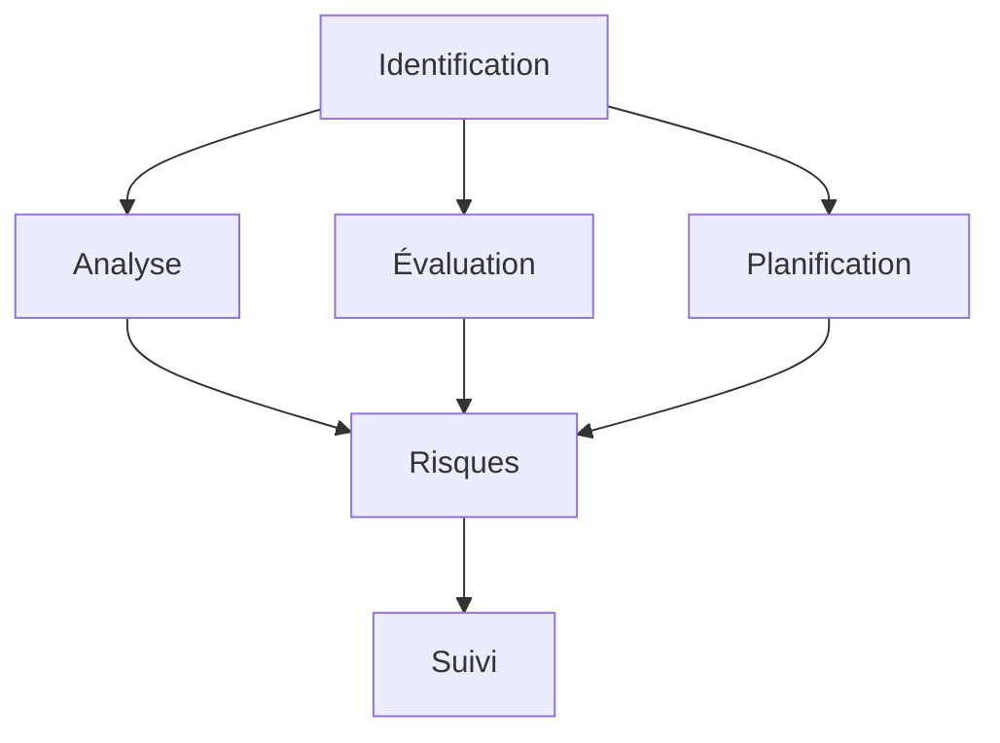

# Gestion des Risques en Projet : Guide Stratégique

La gestion des risques est un aspect crucial du management de projet. Ce guide complet vous accompagne dans l'identification, l'analyse et la gestion des risques.

## Fondamentaux de la Gestion des Risques

### 1. Définition et Enjeux

#### A. Qu'est-ce qu'un Risque Projet ?

- Événement incertain
- Impact potentiel
- Probabilité
- Contrôlabilité

#### B. Enjeux

- Objectifs projet
- Ressources
- Délais
- Qualité

### 2. Types de Risques

#### A. Catégories

- Techniques
- Organisationnels
- Externes
- Humains

#### B. Niveaux

- Stratégiques
- Tactiques
- Opérationnels
- Contextuels

## Processus de Gestion

### 1. Identification

#### A. Méthodes

#### B. Sources

- Expérience
- Documentation
- Expertise
- Analyse

### 2. Analyse

#### A. Évaluation

- Probabilité
- Impact
- Criticité
- Urgence

#### B. Priorisation

- Matrice
- Scoring
- Décision
- Action

## Stratégies de Gestion

### 1. Prévention

#### A. Actions

- Anticipation
- Préparation
- Formation
- Documentation

#### B. Contrôles

- Processus
- Procédures
- Vérifications
- Suivi

### 2. Mitigation

#### A. Plans

- Préventifs
- Correctifs
- Contingence
- Communication

#### B. Ressources

- Budget
- Temps
- Personnel
- Matériel

## Suivi et Contrôle

### 1. Monitoring

#### A. Indicateurs

- KPIs
- Métriques
- Alertes
- Rapports

#### B. Révision

- Fréquence
- Méthodes
- Participants
- Actions

### 2. Adaptation

#### A. Ajustements

- Plans
- Ressources
- Stratégies
- Actions

#### B. Communication

- Stakeholders
- Équipe
- Direction
- Clients

## Outils et Méthodes

### 1. Analyse

#### A. Techniques

- SWOT
- PESTEL
- FMEA
- Monte Carlo

#### B. Matrices

- Probabilité/Impact
- Criticité
- Décision
- Action

### 2. Documentation

#### A. Registre

- Identification
- Évaluation
- Actions
- Suivi

#### B. Reporting

- Formats
- Fréquence
- Contenu
- Diffusion

## Aspects Organisationnels

### 1. Rôles

#### A. Responsabilités

- Chef de projet
- Équipe
- Direction
- Stakeholders

#### B. Communication

- Canaux
- Fréquence
- Contenu
- Feedback

### 2. Culture

#### A. Organisation

- Structure
- Processus
- Ressources
- Support

#### B. Comportements

- Proactivité
- Transparence
- Collaboration
- Apprentissage

## Défis et Solutions

### 1. Complexité

#### A. Identification

- Sources
- Interactions
- Impacts
- Solutions

#### B. Gestion

- Simplification
- Priorisation
- Délégation
- Support

### 2. Changement

#### A. Adaptation

- Flexibilité
- Agilité
- Innovation
- Résilience

#### B. Communication

- Clarté
- Transparence
- Engagement
- Support

## Bonnes Pratiques

### 1. Processus

#### A. Structure

- Méthodologie
- Outils
- Documentation
- Suivi

#### B. Amélioration

- Feedback
- Apprentissage
- Optimisation
- Innovation

### 2. Management

#### A. Leadership

- Vision
- Direction
- Support
- Engagement

#### B. Organisation

- Structure
- Processus
- Ressources
- Culture

## Conclusion

La gestion des risques est un processus continu qui nécessite une approche structurée et proactive pour assurer le succès du projet.

## Ressources Complémentaires

- Outils
- Templates
- Formations
- Communautés

## Prochaines Étapes

1. Évaluer vos processus
2. Identifier les risques
3. Mettre en place les actions
4. Suivre et améliorer
