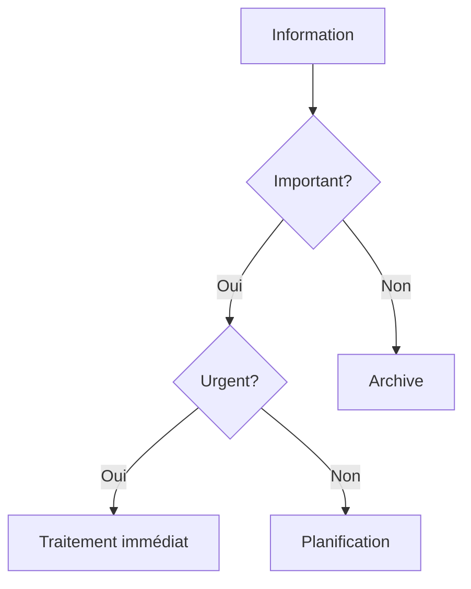

# Gestion de la Surcharge Informationnelle : Guide Pratique

La surcharge informationnelle est un défi majeur dans notre monde connecté. Ce guide vous aide à gérer efficacement le flux d'informations pour optimiser votre productivité.

## Fondamentaux de la Surcharge Informationnelle

### 1. Définition et Impact

#### A. Qu'est-ce que la Surcharge Informationnelle ?

- Volume d'informations
- Multiplicité des sources
- Vitesse de diffusion
- Complexité

#### B. Impacts

- Stress
- Productivité
- Décision
- Bien-être

### 2. Sources d'Information

#### A. Canaux

- Email
- Réseaux sociaux
- Messagerie
- Actualités

#### B. Types

- Textes
- Images
- Vidéos
- Données

## Stratégies de Gestion

### 1. Organisation

#### A. Système de Filtrage

#### B. Priorisation

- Urgence
- Importance
- Pertinence
- Valeur

### 2. Outils

#### A. Gestion

- Email
- Notes
- Documents
- Tâches

#### B. Automatisation

- Filtres
- Règles
- Templates
- Workflows

## Méthodes de Traitement

### 1. Email

#### A. Organisation

- Dossiers
- Labels
- Filtres
- Archive

#### B. Réponse

- Templates
- Délais
- Priorités
- Format

### 2. Documents

#### A. Structure

- Hiérarchie
- Nommage
- Versioning
- Partage

#### B. Accès

- Stockage
- Synchronisation
- Collaboration
- Sécurité

## Bien-être Numérique

### 1. Équilibre

#### A. Temps

- Connexion
- Déconnexion
- Pauses
- Rythme

#### B. Espace

- Environnement
- Ergonomie
- Confort
- Concentration

### 2. Pratiques

#### A. Mindfulness

- Présence
- Attention
- Respiration
- Méditation

#### B. Hygiène

- Sommeil
- Alimentation
- Exercice
- Repos

## Outils et Technologies

### 1. Applications

#### A. Productivité

- Gestion de tâches
- Notes
- Calendrier
- Communication

#### B. Bien-être

- Méditation
- Exercice
- Sommeil
- Nutrition

### 2. Intégration

#### A. Workflow

- Automatisation
- Synchronisation
- Collaboration
- Partage

#### B. Sécurité

- Protection
- Confidentialité
- Sauvegarde
- Récupération

## Défis et Solutions

### 1. Distractions

#### A. Identification

- Sources
- Patterns
- Impacts
- Solutions

#### B. Gestion

- Focus
- Concentration
- Discipline
- Routine

### 2. Stress

#### A. Causes

- Volume
- Urgence
- Complexité
- Attentes

#### B. Gestion

- Relaxation
- Organisation
- Communication
- Support

## Bonnes Pratiques

### 1. Organisation

#### A. Système

- Structure
- Processus
- Routines
- Révision

#### B. Maintenance

- Nettoyage
- Mise à jour
- Optimisation
- Adaptation

### 2. Communication

#### A. Clarté

- Messages
- Attentes
- Délais
- Feedback

#### B. Efficacité

- Concision
- Pertinence
- Timing
- Format

## Conclusion

La gestion de la surcharge informationnelle est un équilibre entre efficacité et bien-être, nécessitant une approche structurée et consciente.

## Ressources Complémentaires

- Outils
- Applications
- Formations
- Communautés

## Prochaines Étapes

1. Évaluer votre situation
2. Mettre en place votre système
3. Adopter les bonnes pratiques
4. Maintenir et améliorer
