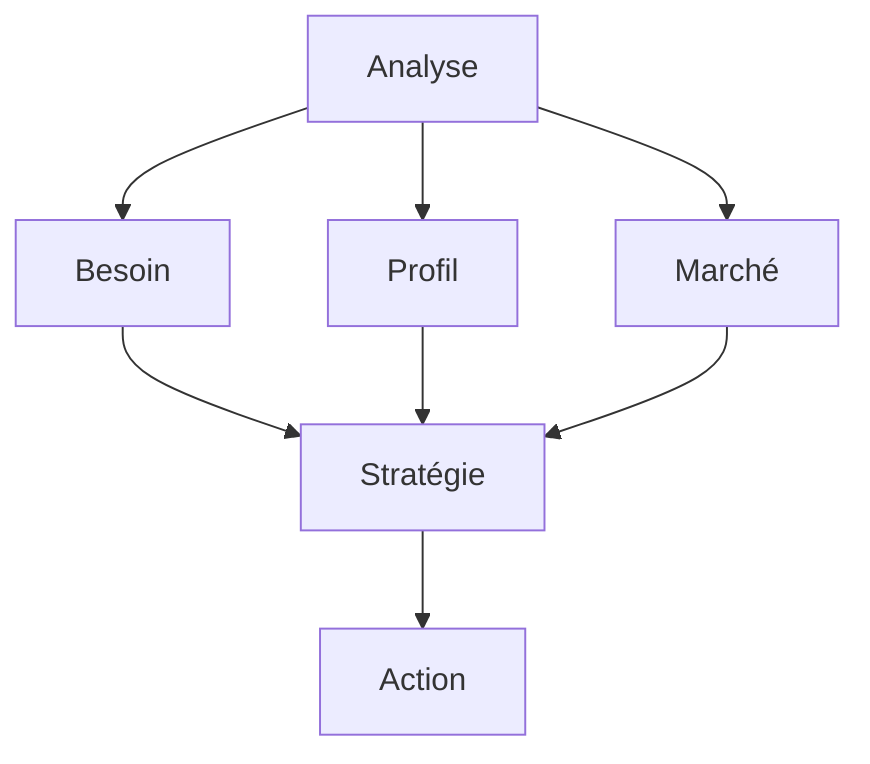

# Gestion des Talents et Recrutement : Guide Stratégique

La gestion des talents et le recrutement sont des enjeux stratégiques pour les organisations modernes. Ce guide complet vous accompagne dans l'optimisation de vos processus d'acquisition et de développement des talents.

## Fondamentaux

### 1. Définition

#### A. Gestion des Talents

- Identification
- Développement
- Rétention
- Évolution

#### B. Recrutement

- Attraction
- Sélection
- Intégration
- Suivi

### 2. Enjeux

#### A. Organisationnels

- Compétitivité
- Innovation
- Performance
- Croissance

#### B. Marché

- Concurrence
- Évolution
- Tendances
- Opportunités

## Processus de Recrutement

### 1. Planification

#### A. Analyse

#### B. Stratégie

- Objectifs
- Méthodes
- Ressources
- Planning

### 2. Implémentation

#### A. Sourcing

- Canaux
- Méthodes
- Outils
- Réseaux

#### B. Sélection

- Critères
- Processus
- Évaluation
- Décision

## Méthodes de Recrutement

### 1. Approches

#### A. Traditionnelles

- Annonces
- Réseaux
- Chasse
- Références

#### B. Modernes

- Digital
- Social
- IA
- Analytics

### 2. Techniques

#### A. Évaluation

- Entretiens
- Tests
- Mises en situation
- Références

#### B. Décision

- Critères
- Processus
- Validation
- Communication

## Intégration et Développement

### 1. Onboarding

#### A. Processus

- Accueil
- Formation
- Accompagnement
- Suivi

#### B. Support

- Ressources
- Mentorat
- Feedback
- Adaptation

### 2. Développement

#### A. Planification

- Objectifs
- Compétences
- Parcours
- Ressources

#### B. Implémentation

- Formation
- Coaching
- Projets
- Évaluation

## Mesure et Analyse

### 1. Indicateurs

#### A. Recrutement

- Coût
- Délai
- Qualité
- Satisfaction

#### B. Intégration

- Performance
- Adaptation
- Engagement
- Rétention

### 2. Analyse

#### A. Données

- Collecte
- Traitement
- Analyse
- Insights

#### B. Actions

- Décisions
- Plans
- Implémentation
- Suivi

## Aspects Organisationnels

### 1. Culture

#### A. Attraction

- Valeurs
- Environnement
- Opportunités
- Reconnaissance

#### B. Développement

- Apprentissage
- Innovation
- Collaboration
- Excellence

### 2. Management

#### A. Leadership

- Vision
- Direction
- Support
- Exemple

#### B. Organisation

- Structure
- Processus
- Ressources
- Communication

## Outils et Technologies

### 1. Solutions

#### A. Recrutement

- ATS
- Sourcing
- Évaluation
- Analytics

#### B. Développement

- LMS
- Coaching
- Feedback
- Suivi

### 2. Innovation

#### A. Digital

- IA
- Analytics
- Mobile
- Cloud

#### B. Expérience

- UX
- Personnalisation
- Interactivité
- Gamification

## Défis et Solutions

### 1. Changement

#### A. Résistance

- Identification
- Communication
- Accompagnement
- Engagement

#### B. Adaptation

- Flexibilité
- Agilité
- Innovation
- Support

### 2. Ressources

#### A. Budget

- Planification
- Optimisation
- ROI
- Priorisation

#### B. Temps

- Organisation
- Efficacité
- Priorités
- Équilibre

## Bonnes Pratiques

### 1. Stratégie

#### A. Vision

- Objectifs
- Planification
- Ressources
- Mesure

#### B. Implémentation

- Phases
- Pilotes
- Déploiement
- Suivi

### 2. Management

#### A. Leadership

- Engagement
- Communication
- Support
- Exemple

#### B. Organisation

- Structure
- Processus
- Ressources
- Culture

## Conclusion

La gestion des talents et le recrutement sont des processus stratégiques qui nécessitent une approche structurée et continue.

## Ressources Complémentaires

- Outils
- Formations
- Études de cas
- Communautés

## Prochaines Étapes

1. Évaluer vos processus
2. Développer votre stratégie
3. Mettre en œuvre les actions
4. Mesurer et améliorer
