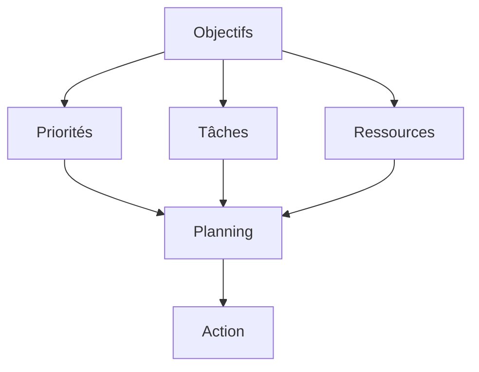

# Gestion du Temps et Productivité : Guide Pratique

La gestion du temps est un enjeu crucial pour la productivité personnelle et professionnelle. Ce guide complet vous accompagne dans l'optimisation de votre temps.

## Fondamentaux de la Gestion du Temps

### 1. Définition et Enjeux

#### A. Qu'est-ce que la Gestion du Temps ?

- Organisation
- Priorisation
- Efficacité
- Équilibre

#### B. Enjeux

- Performance
- Stress
- Bien-être
- Satisfaction

### 2. Éléments Clés

#### A. Temps

- Planification
- Organisation
- Priorisation
- Suivi

#### B. Énergie

- Cycles
- Rythme
- Repos
- Concentration

## Méthodes et Techniques

### 1. Organisation

#### A. Planification

#### B. Priorisation

- Urgence
- Importance
- Valeur
- Délais

### 2. Techniques

#### A. Pomodoro

- Cycles
- Pauses
- Focus
- Productivité

#### B. Timeboxing

- Délais
- Objectifs
- Focus
- Efficacité

## Outils et Applications

### 1. Gestion

#### A. Planning

- Calendrier
- To-do lists
- Rappels
- Suivi

#### B. Suivi

- Temps
- Progression
- Analyse
- Amélioration

### 2. Productivité

#### A. Focus

- Blocage
- Concentration
- Distractions
- Environnement

#### B. Collaboration

- Partage
- Communication
- Coordination
- Efficacité

## Aspects Personnels

### 1. Bien-être

#### A. Équilibre

- Travail
- Vie personnelle
- Repos
- Activités

#### B. Santé

- Sommeil
- Alimentation
- Exercice
- Stress

### 2. Développement

#### A. Compétences

- Formation
- Pratique
- Feedback
- Amélioration

#### B. Habitudes

- Routines
- Discipline
- Persévérance
- Adaptation

## Optimisation

### 1. Analyse

#### A. Temps

- Utilisation
- Pertes
- Opportunités
- Amélioration

#### B. Performance

- Métriques
- Objectifs
- Progression
- Ajustements

### 2. Amélioration

#### A. Processus

- Identification
- Optimisation
- Implémentation
- Suivi

#### B. Habitudes

- Développement
- Maintien
- Adaptation
- Évolution

## Défis et Solutions

### 1. Distractions

#### A. Identification

- Sources
- Patterns
- Impacts
- Solutions

#### B. Gestion

- Environnement
- Discipline
- Outils
- Support

### 2. Stress

#### A. Causes

- Charge
- Délais
- Complexité
- Attentes

#### B. Gestion

- Organisation
- Communication
- Relaxation
- Support

## Bonnes Pratiques

### 1. Organisation

#### A. Structure

- Système
- Processus
- Routines
- Révision

#### B. Maintenance

- Nettoyage
- Mise à jour
- Optimisation
- Adaptation

### 2. Communication

#### A. Clarté

- Messages
- Attentes
- Délais
- Feedback

#### B. Efficacité

- Concision
- Pertinence
- Timing
- Format

## Conclusion

La gestion du temps est un équilibre entre efficacité et bien-être, nécessitant une approche structurée et consciente.

## Ressources Complémentaires

- Outils
- Applications
- Formations
- Communautés

## Prochaines Étapes

1. Évaluer votre situation
2. Mettre en place votre système
3. Adopter les bonnes pratiques
4. Maintenir et améliorer
