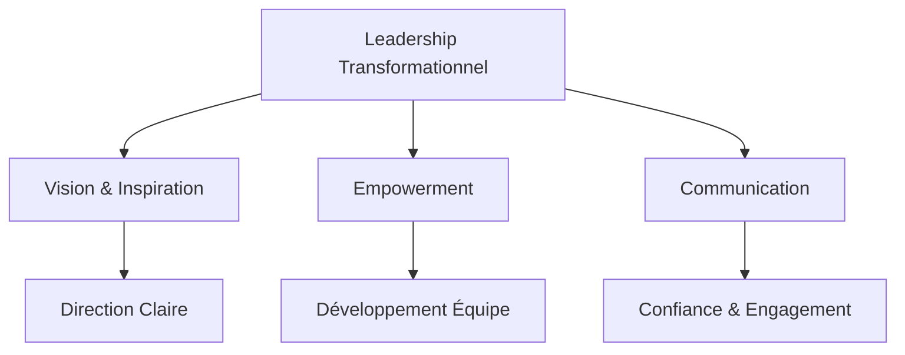
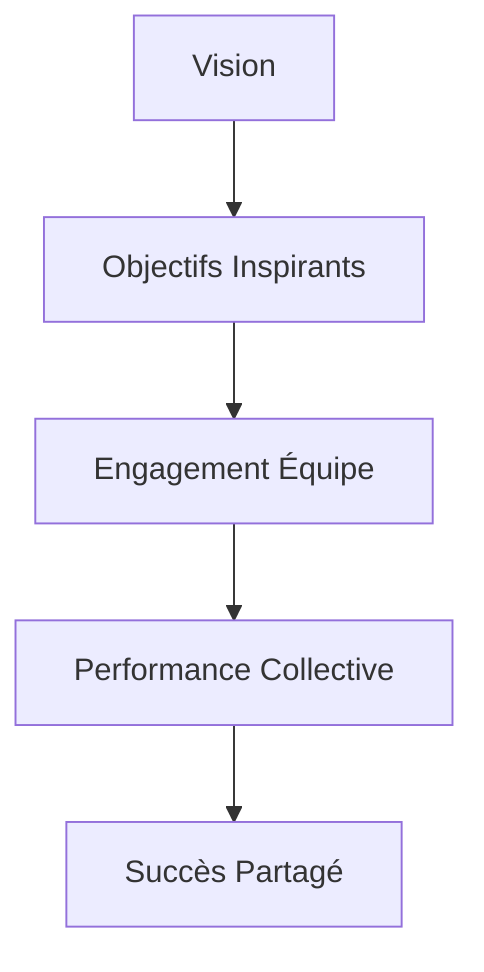
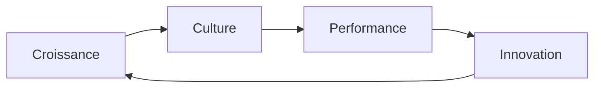
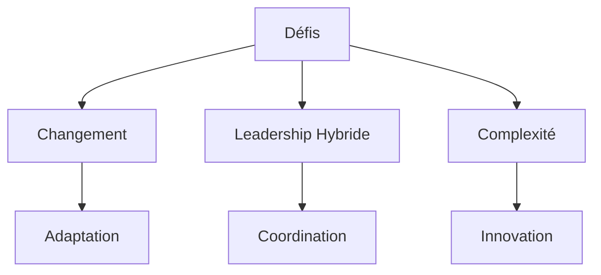
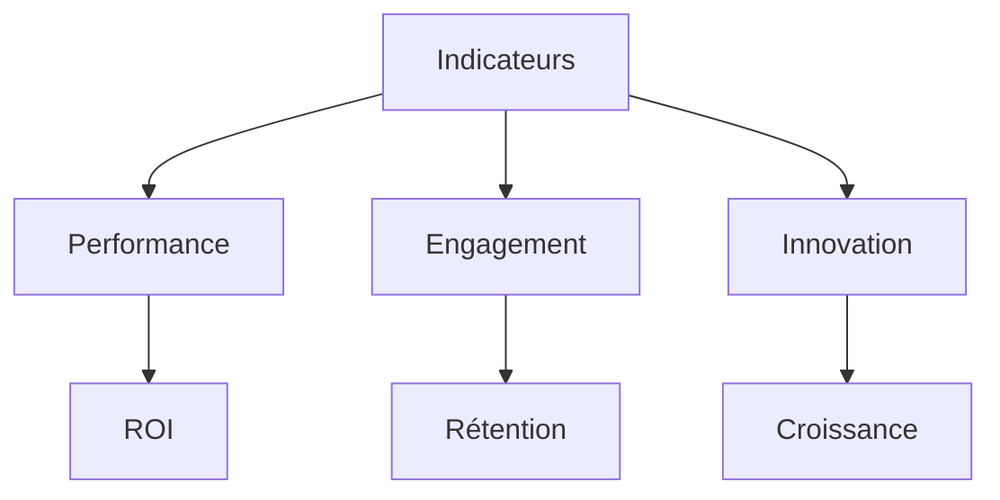
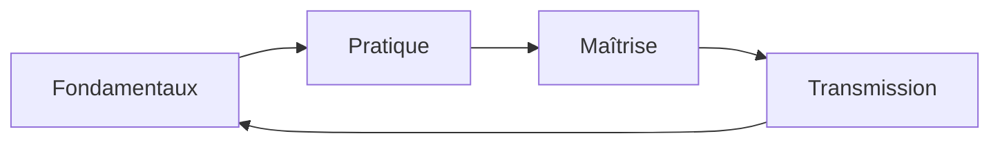

# Le Leadership Transformationnel : Guide Pratique

Pour comprendre le leadership moderne, imaginons-le comme la direction d'un orchestre symphonique. Chaque aspect du leadership correspond à un élément de l'orchestre :

## 🎯 Concepts de Leadership Expliqués

Le leadership moderne peut être comparé à la direction d'un orchestre symphonique, où chaque membre joue un rôle crucial dans la création d'une harmonie parfaite.

### 1. Le Leadership Transformationnel

Comme un chef d'orchestre qui :

- Inspire chaque musicien à donner le meilleur de lui-même
- Coordonne les différentes sections pour créer une harmonie parfaite
- Adapte l'interprétation tout en respectant la partition

### 2. L'Empowerment

Tel un jardinier expert qui :

- Crée l'environnement propice à la croissance de chaque plante
- Nourrit le potentiel unique de chaque membre de l'équipe
- Laisse l'espace nécessaire pour s'épanouir naturellement

### 3. La Communication Efficace

À l'image d'un pont solide qui :

- Relie les différentes rives (équipes, départements)
- Supporte le trafic bidirectionnel (feedback constant)
- Maintient une structure solide (confiance mutuelle)

## 🌟 Les Piliers du Leadership Moderne

Le leadership moderne repose sur des fondations solides, comme une maison bien construite. Chaque pilier joue un rôle essentiel dans la stabilité et la réussite de l'ensemble.

### Vision et Inspiration

Imaginez un phare qui guide les navires dans la nuit :

- La **vision** est le faisceau lumineux qui montre la direction à suivre
- Les **objectifs** sont les points de repère qui jalonnent le parcours
- L'**engagement** est le moteur qui fait avancer l'équipe
- La **performance** est la vitesse de progression vers la destination
- Le **succès** est l'arrivée à bon port, célébré collectivement

### Communication Stratégique

Tel un système d'irrigation bien conçu :

- Les **canaux principaux** portent la vision et la stratégie
- Les **canaux secondaires** distribuent les informations tactiques
- Les **ramifications** assurent que chaque membre reçoit ce dont il a besoin
- Le **feedback** permet d'ajuster le flux comme des vannes de régulation

### Développement des Talents

Comme un maître jardinier qui :

- Identifie le potentiel unique de chaque plante
- Crée les conditions optimales de croissance
- Accompagne avec patience et expertise
- Célèbre l'épanouissement de chacun

## 💡 Développement des Équipes

Le développement d'une équipe performante est comparable à la création d'un jardin extraordinaire, où chaque élément contribue à la beauté et à la productivité de l'ensemble.

### Croissance Collective

Comme un écosystème florissant :

- Chaque membre est une plante unique avec ses besoins spécifiques
- Les interactions créent une synergie naturelle
- L'environnement favorise la croissance de tous
- Les défis sont des opportunités d'adaptation et de renforcement

### Culture d'Excellence

Tel un terreau fertile qui nourrit :

- L'innovation et la créativité
- L'apprentissage continu
- La collaboration authentique
- La résilience face aux défis

### Gestion de la Performance

À l'image d'un jardinier attentif qui :

- Observe les signes de croissance
- Apporte le soutien nécessaire au bon moment
- Célèbre les réussites
- Ajuste les conditions pour optimiser les résultats

## 🎯 Défis du Leadership Moderne

Dans le monde actuel, le leadership fait face à des défis uniques, comparables à la navigation d'un navire dans des eaux en constante évolution.

### Navigation du Changement

Tel un capitaine expérimenté qui :

- Anticipe les tempêtes (changements du marché)
- Ajuste les voiles (stratégies) selon le vent
- Maintient le cap tout en s'adaptant
- Guide l'équipage à travers les turbulences

### Leadership Hybride

Comme un chef d'orchestre dirigeant simultanément :

- Des musiciens sur scène (équipe locale)
- Des musiciens à distance (équipe remote)
- Créant une harmonie parfaite malgré la distance
- Maintenant le rythme et la coordination

### Gestion de la Complexité

À l'image d'un tisserand expert qui :

- Entrelace différents fils (compétences, cultures)
- Crée des motifs complexes mais harmonieux
- Répare les accrocs avec précision
- Renforce la structure tout en préservant la souplesse

## 📊 Mesure de l'Impact

La mesure de l'impact du leadership est comparable à l'évaluation de la santé d'un écosystème : chaque indicateur raconte une partie de l'histoire.

### Indicateurs de Performance

Tel un tableau de bord sophistiqué qui mesure :

- La satisfaction de l'équipe (comme la température)
- L'engagement (comme le niveau d'énergie)
- La productivité (comme la vitesse de croissance)
- L'innovation (comme la diversité des espèces)

### Mesures Qualitatives

À l'image d'un jardinier observant son jardin :

- La qualité des interactions (comme la santé des plantes)
- Le bien-être de l'équipe (comme la vitalité du sol)
- La culture d'entreprise (comme l'écosystème global)
- Le développement des talents (comme la croissance des jeunes pousses)

### Feedback Continu

Comme un système d'irrigation intelligent qui :

- Collecte des données en temps réel
- Ajuste les ressources selon les besoins
- Prévient les problèmes avant qu'ils ne surviennent
- Optimise continuellement les conditions de croissance

## 🎓 Développement du Leadership

Le développement du leadership est semblable à l'apprentissage d'un art martial : un voyage continu qui demande patience, pratique et persévérance.

### Parcours d'Excellence

Tel un apprenti artisan qui maîtrise son art :

- Commence par les fondamentaux (techniques de base)
- Pratique régulièrement (expérimentation)
- Apprend de ses erreurs (réflexion)
- Perfectionne son style (personnalisation)

### Croissance Continue

À l'image d'un arbre qui grandit :

- S'enracine profondément (valeurs solides)
- Étend ses branches (développe ses compétences)
- S'adapte aux saisons (flexibilité)
- Nourrit son écosystème (impact positif)

### Transmission du Savoir

Comme un maître qui forme ses disciples :

- Partage son expérience avec bienveillance
- Guide sans imposer
- Inspire par l'exemple
- Célèbre les progrès de chacun

## 📚 Lexique du Leadership

Pour faciliter la compréhension des concepts de leadership, voici un dictionnaire des termes essentiels :

### A

- **Agilité** : Capacité à s'adapter rapidement aux changements, comme un danseur qui suit le rythme
- **Autonomie** : Capacité à travailler de manière indépendante, comme un artisan maîtrisant son art

### C

- **Coaching** : Accompagnement personnalisé pour développer le potentiel, comme un entraîneur sportif
- **Communication** : Art de transmettre des messages clairs et inspirants, comme un conteur captivant

### E

- **Empowerment** : Donner les moyens d'agir, comme un jardinier qui crée les conditions de croissance
- **Engagement** : Implication profonde dans le travail, comme un artiste passionné par son œuvre

### F

- **Feedback** : Retour d'information constructif, comme un miroir qui reflète avec bienveillance
- **Formation** : Développement continu des compétences, comme l'affûtage régulier d'un outil

### I

- **Innovation** : Capacité à créer du nouveau, comme un chef qui invente de nouvelles recettes
- **Intelligence Émotionnelle** : Comprendre et gérer les émotions, comme un capitaine dans la tempête

### L

- **Leadership Situationnel** : Adapter son style selon le contexte, comme un caméléon
- **Leadership Transformationnel** : Inspirer le changement positif, comme un catalyseur

### M

- **Mentorat** : Transmission d'expérience, comme un maître qui guide son apprenti
- **Motivation** : Force qui pousse à l'action, comme le vent dans les voiles

### P

- **Performance** : Atteinte des objectifs, comme un athlète qui bat des records
- **Potentiel** : Capacités à développer, comme une graine qui peut devenir un arbre majestueux

### R

- **Résilience** : Capacité à rebondir face aux difficultés, comme un roseau qui plie mais ne rompt pas
- **Responsabilisation** : Confier des responsabilités, comme un parent qui fait confiance

### S

- **Stratégie** : Plan d'action pour atteindre les objectifs, comme une carte pour un voyage
- **Synergie** : Collaboration efficace, comme les musiciens d'un orchestre

### V

- **Vision** : Image claire du futur souhaité, comme un architecte qui visualise le bâtiment final
- **Valeurs** : Principes qui guident les actions, comme une boussole morale

Ce lexique évoluera avec les nouvelles pratiques de leadership et votre expérience dans leur application.

## Conclusion : L'Art du Leadership

Le leadership moderne est comme un jardin zen : il requiert attention constante, patience et vision à long terme. Chaque jour apporte son lot d'apprentissages et d'opportunités de croissance.

**Actions Quotidiennes :**

1. Cultivez votre conscience de soi (comme la méditation quotidienne)
2. Pratiquez l'écoute active (comme l'observation attentive)
3. Donnez du feedback constructif (comme l'entretien du jardin)
4. Célébrez les succès (comme la récolte des fruits)

> N'oubliez pas : "Le véritable leader est celui qui crée d'autres leaders."

