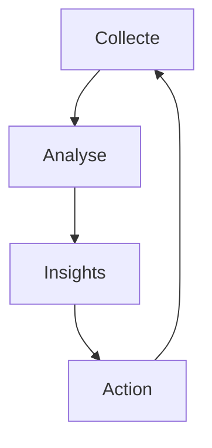

# Intelligence Artificielle et Transformation du Marketing : Guide Complet pour l'Innovation

## Introduction

L'intelligence artificielle (IA) révolutionne profondément le marketing moderne en offrant des capacités sans précédent d'analyse, de personnalisation et d'automatisation. Dans cet article, nous explorerons en profondeur comment l'IA transforme les stratégies marketing et comment les entreprises peuvent en tirer parti pour maintenir leur compétitivité dans un environnement digital en constante évolution.

## Vue d'Ensemble de l'IA dans le Marketing

### Définition et Impact

L'intelligence artificielle dans le marketing représente l'utilisation sophistiquée d'algorithmes avancés et de machine learning pour transformer la façon dont les entreprises interagissent avec leurs clients. Cette technologie permet d'analyser des volumes massifs de données comportementales, de personnaliser les expériences client à grande échelle, d'optimiser les campagnes marketing en temps réel et d'automatiser les processus décisionnels complexes.

### Statistiques Clés

Les chiffres parlent d'eux-mêmes : 80% des marketeurs intègrent déjà l'IA dans leurs stratégies, 63% des entreprises ont constaté une augmentation significative de leurs revenus grâce à l'IA, et 72% des consommateurs expriment une préférence marquée pour les expériences personnalisées. Ces statistiques soulignent l'importance croissante de l'IA dans le paysage marketing contemporain.

## Applications de l'IA dans le Marketing

### Personnalisation Avancée

L'analyse comportementale constitue la pierre angulaire de la personnalisation marketing moderne. En suivant méticuleusement les parcours clients, en identifiant les patterns d'achat et en prédisant les besoins futurs, l'IA permet de créer des expériences sur mesure qui résonnent profondément avec chaque individu.

Les recommandations intelligentes représentent une autre dimension cruciale de la personnalisation. Grâce à l'IA, les entreprises peuvent suggérer des produits similaires pertinents, proposer du contenu personnalisé et offrir des promotions ciblées qui correspondent exactement aux attentes de chaque client.

L'optimisation des messages constitue le troisième pilier de la personnalisation. L'IA détermine le timing optimal pour chaque communication, sélectionne le canal le plus approprié et adapte le format du message pour maximiser son impact.

### Automatisation Marketing

L'automatisation marketing, propulsée par l'IA, transforme radicalement l'efficacité des opérations marketing. Le tableau suivant illustre les principales applications et leurs bénéfices :

| Fonction          | Application IA          | Bénéfices           |
| ----------------- | ----------------------- | ------------------- |
| Segmentation      | Analyse prédictive      | Précision accrue    |
| Content Marketing | Génération de contenu   | Efficacité accrue   |
| Email Marketing   | Optimisation des envois | Engagement amélioré |
| Social Media      | Analyse des sentiments  | Réactivité accrue   |

## Stratégies d'Implémentation

### Étapes Clés

La mise en œuvre réussie de l'IA dans le marketing nécessite une approche structurée. La phase de préparation comprend un audit approfondi des données disponibles, la définition d'objectifs clairs et mesurables, ainsi que la sélection des outils les plus adaptés aux besoins spécifiques de l'entreprise.

La phase de mise en œuvre implique l'intégration harmonieuse des solutions choisies, la formation des équipes aux nouvelles technologies et la réalisation de tests rigoureux pour ajuster les paramètres. Cette étape cruciale détermine le succès futur de l'initiative.

L'optimisation continue représente la dernière phase, où l'analyse des résultats permet d'ajuster les stratégies et d'améliorer constamment les performances. Cette approche itérative garantit l'évolution constante du système.

### Gestion des Données

Le cycle de gestion des données, illustré ci-dessous, constitue le fondement de toute stratégie marketing basée sur l'IA :

## Cas d'Usage Concrets

### Exemples de Succès

Les leaders du e-commerce ont révolutionné l'expérience client grâce à l'IA. Amazon a transformé les recommandations personnalisées en un art, Netflix a perfectionné la suggestion de contenu, et Spotify a créé des playlists intelligentes qui anticipent les goûts des utilisateurs.

Le service client a également bénéficié de l'IA, avec l'émergence de chatbots disponibles 24/7, de systèmes de support prédictif et de solutions de résolution automatique qui améliorent significativement l'efficacité opérationnelle.

Le content marketing a été transformé par l'IA, qui permet maintenant la génération de contenu pertinent, l'optimisation SEO en temps réel et la distribution intelligente des contenus sur les canaux les plus appropriés.

## Défis et Solutions

### Obstacles Courants

Les défis techniques constituent souvent le premier obstacle à l'adoption de l'IA. La qualité des données, l'intégration des systèmes existants et le besoin d'expertise technique représentent des défis majeurs que les entreprises doivent surmonter.

Les défis organisationnels, quant à eux, incluent la résistance naturelle au changement, la nécessité de former les équipes et les contraintes budgétaires. Ces obstacles nécessitent une approche holistique pour être surmontés efficacement.

### Solutions Pratiques

La réussite de l'implémentation de l'IA repose sur plusieurs principes clés : un investissement progressif et mesuré, une formation continue des équipes, le développement de partenariats stratégiques et un pilotage rigoureux par phases.

## Mesure et ROI

### Indicateurs de Performance

L'évaluation de la performance des initiatives marketing basées sur l'IA s'appuie sur trois catégories d'indicateurs clés. Les métriques d'engagement, comme le taux de conversion et le temps passé, mesurent l'efficacité des interactions avec les clients.

Les indicateurs de satisfaction, incluant le NPS et le taux de rétention, évaluent la qualité de l'expérience client. Enfin, les métriques d'efficacité, telles que le coût par acquisition et le ROI des campagnes, mesurent la performance financière des initiatives.

## Technologies Émergentes

### Innovations Futures

Le machine learning avancé, avec ses applications en deep learning, réseaux neuronaux et apprentissage par renforcement, promet de révolutionner encore davantage le marketing. Ces technologies permettront une personnalisation encore plus fine et des prédictions plus précises.

Le traitement du langage naturel (NLP) et la vision par ordinateur ouvrent de nouvelles perspectives pour l'analyse de sentiment, la reconnaissance d'images et la génération de contenu. Ces technologies enrichiront considérablement les capacités d'analyse et de création.

L'Internet des Objets (IoT) et le marketing connecté permettront d'accéder à des données en temps réel, de créer des expériences connectées et d'offrir une personnalisation contextuelle sans précédent.

## Conclusion

L'intelligence artificielle transforme fondamentalement le marketing en offrant des opportunités sans précédent pour personnaliser les expériences client, optimiser les campagnes, automatiser les processus et augmenter le ROI. Cette transformation nécessite une approche stratégique et une adaptation continue.

### Prochaines Étapes

Pour réussir dans cette transformation, les entreprises doivent d'abord évaluer leur maturité en matière d'IA, identifier les opportunités prioritaires, développer une feuille de route claire, former leurs équipes et implémenter progressivement les solutions choisies.

## Ressources Complémentaires

Pour approfondir vos connaissances sur l'IA en marketing, nous vous recommandons de consulter les ressources suivantes :

- [Google AI Marketing](https://ai.google/)
- [IBM Watson Marketing](https://www.ibm.com/watson/marketing)
- [Microsoft AI for Marketing](https://www.microsoft.com/ai)

## FAQ

**Q: Quel est le coût moyen d'implémentation de l'IA en marketing ?**
R: Les coûts varient considérablement selon la taille de l'entreprise et la complexité des besoins. Pour une implémentation complète, les entreprises doivent généralement prévoir un budget entre 50 000€ et 200 000€, incluant les licences logicielles, l'intégration et la formation.

**Q: Combien de temps faut-il pour voir les résultats ?**
R: Les premiers résultats tangibles sont généralement observables après 3 à 6 mois d'implémentation. Cependant, l'optimisation continue s'étend sur une période de 12 à 18 mois pour atteindre une maturité complète.

**Q: Quelles compétences sont nécessaires ?**
R: La réussite d'un projet d'IA en marketing nécessite une combinaison équilibrée de compétences techniques (data science, machine learning) et marketing. La formation continue des équipes est essentielle pour maintenir et développer ces compétences dans un domaine en constante évolution.
