# Exemples Pratiques avec Mermaid

Ce guide présente une collection d'exemples pratiques pour vous aider à maîtriser Mermaid dans vos projets de documentation technique.

## Diagrammes de Flux

### 1. Processus de Développement

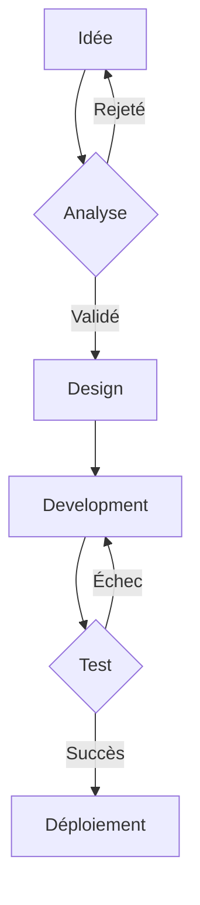

### 2. Workflow Git

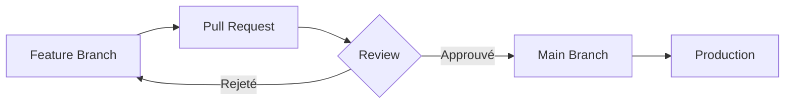

## Diagrammes de Séquence

### 1. Authentification

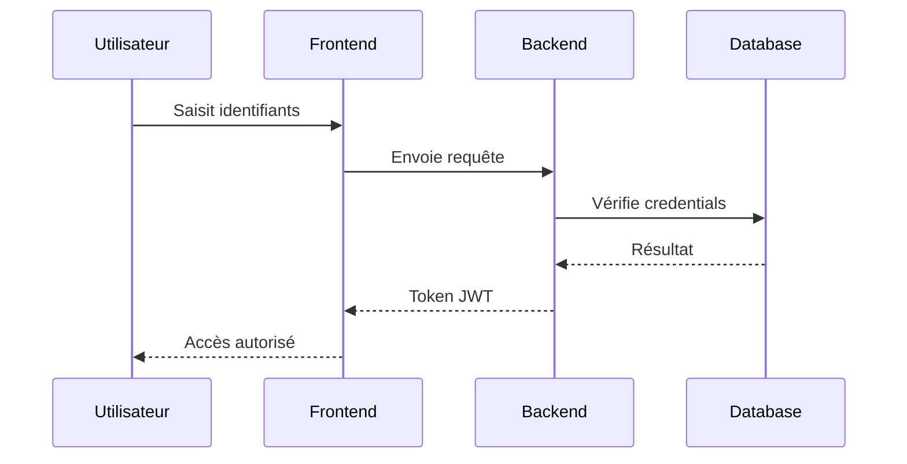

### 2. Processus de Paiement

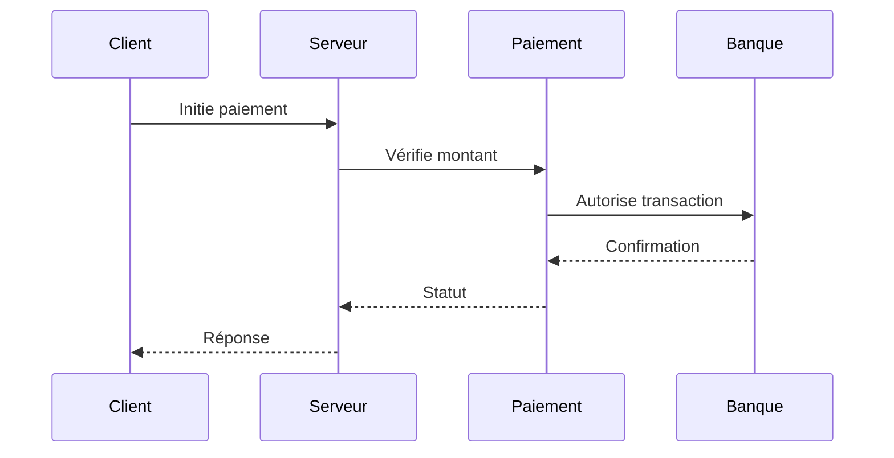

## Diagrammes de Classes

### 1. Système E-commerce

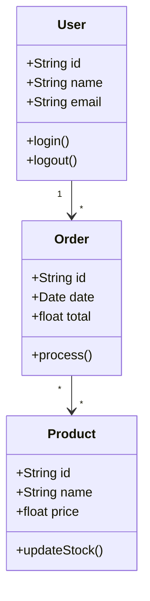

### 2. API REST

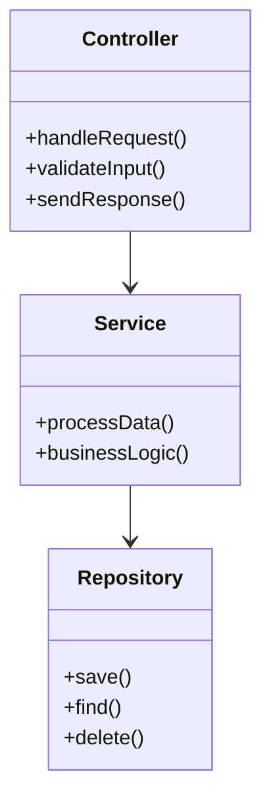

## Diagrammes d'États

### 1. Machine à États

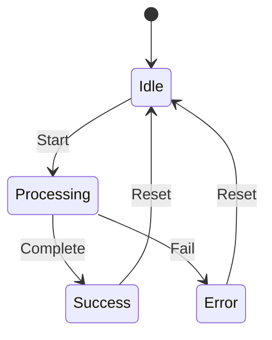

### 2. Workflow de Publication

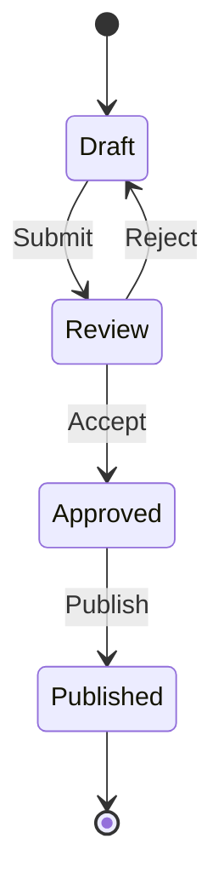

## Diagrammes Gantt

### 1. Planning de Projet

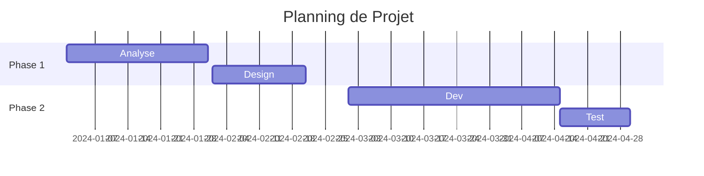

### 2. Sprint Agile

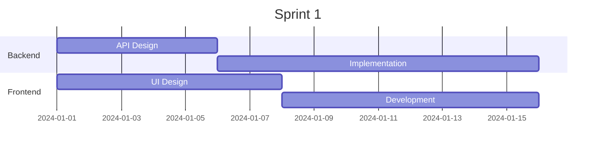

## Diagrammes de Pie

### 1. Répartition des Tâches

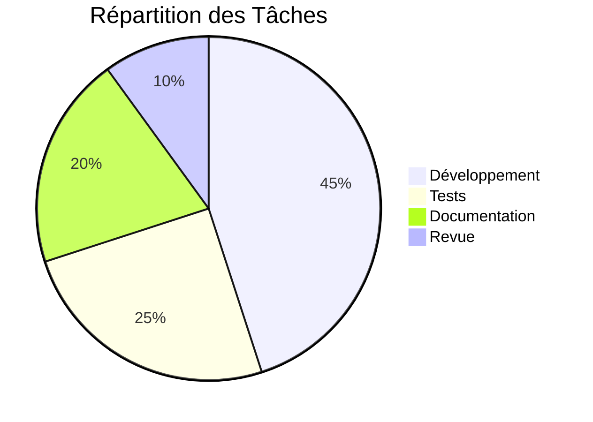

### 2. Budget Projet

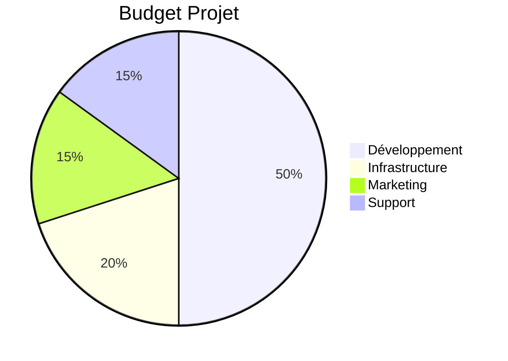

## Bonnes Pratiques

### 1. Organisation

- Gardez les diagrammes simples et clairs
- Utilisez des noms explicites
- Ajoutez des commentaires si nécessaire
- Maintenez une cohérence visuelle

### 2. Maintenance

- Versionnez vos diagrammes
- Documentez les changements
- Testez la lisibilité
- Optimisez la complexité

## Conclusion

Ces exemples illustrent la flexibilité et la puissance de Mermaid pour la documentation technique. Adaptez-les à vos besoins spécifiques et créez vos propres visualisations.

## Ressources Complémentaires

- Documentation Mermaid
- Exemples communautaires
- Outils de prévisualisation
- Templates

## Prochaines Étapes

1. Expérimentez avec différents types de diagrammes
2. Créez vos propres exemples
3. Partagez vos créations
4. Contribuez à la communauté
