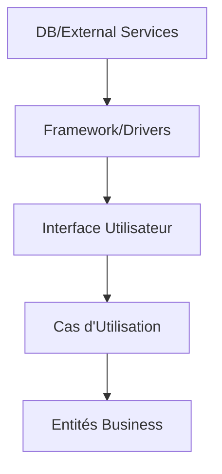
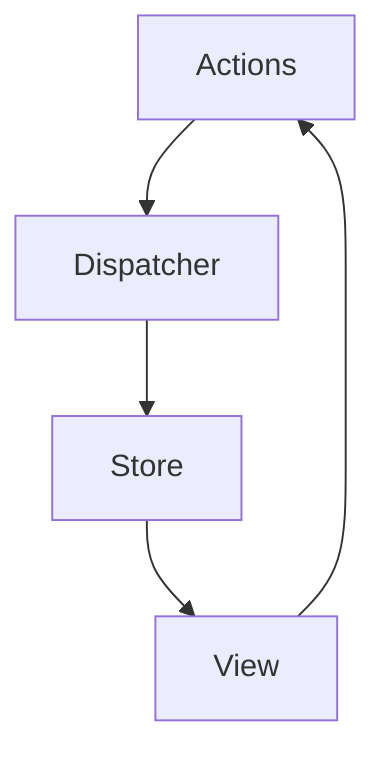
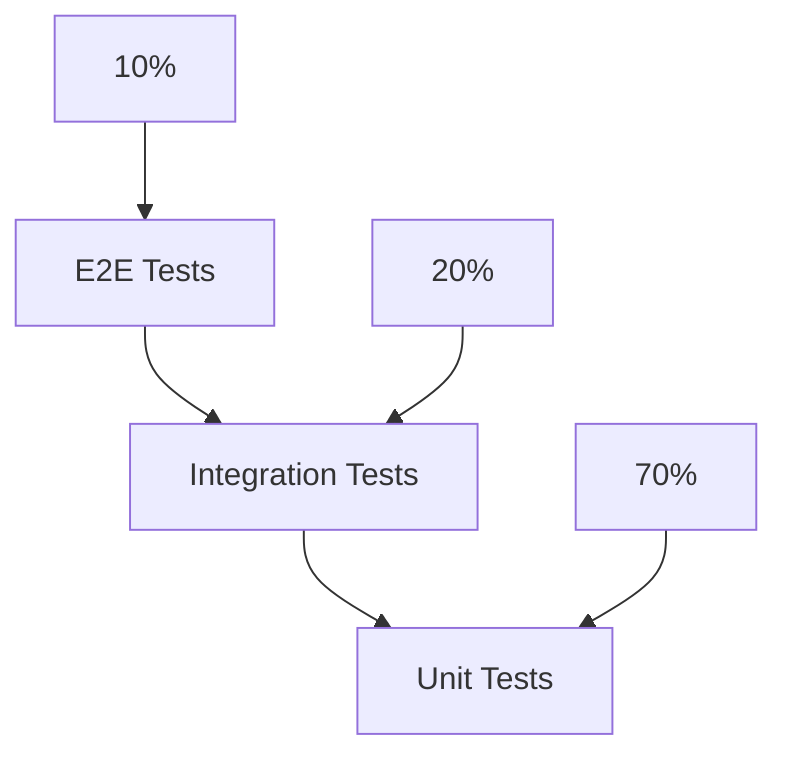

# Maîtrisez les Technologies Web de Demain

Pour mieux comprendre l'évolution du développement web, imaginons une ville en pleine croissance. Chaque nouveau framework est comme un nouveau quartier qui se développe, chaque mise à jour est comme une rénovation d'immeuble, et l'architecture globale est comme le plan d'urbanisme qui assure que tout fonctionne harmonieusement ensemble.

## 🏗 Architecture Web Moderne

Commençons par la fondation de tout projet web réussi : l'architecture. Imaginez l'architecture web comme la construction d'un gratte-ciel moderne :

- La **structure** (Clean Architecture) est comme la charpente en acier qui soutient tout l'édifice
- Les **patterns** sont comme les plans d'architecte éprouvés qui garantissent la solidité
- Les **principes SOLID** sont comme les normes de construction qui assurent la qualité
- Le **code propre** est comme la finition impeccable qui facilite l'entretien

Explorons ensemble comment ces éléments s'assemblent pour créer des applications web robustes et évolutives.

### Clean Architecture pour le Web



**Comprendre l'Architecture :**
Imaginez votre application web comme un oignon avec plusieurs couches, ou comme une ville bien planifiée :

1. Au centre, les **Entités Business** sont comme le code civil de votre ville : les règles fondamentales qui ne changent pas souvent
2. Les **Cas d'Utilisation** sont comme les services municipaux : ils orchestrent les interactions entre les citoyens et l'administration
3. L'**Interface Utilisateur** est comme la façade des bâtiments : ce que les utilisateurs voient et avec quoi ils interagissent
4. Les **Framework/Drivers** sont comme les réseaux routiers : ils connectent les différentes parties de la ville
5. Les **Services Externes** sont comme les villes voisines avec lesquelles vous échangez des ressources

**Exemple Concret :**
Dans une application e-commerce moderne :

- **Entité** : La classe `Product`

  ```typescript
  class Product {
    private price: number;

    setPrice(newPrice: number) {
      if (newPrice < 0) throw new Error("Prix invalide");
      this.price = newPrice;
    }

    applyDiscount(percentage: number) {
      if (percentage < 0 || percentage > 100)
        throw new Error("Pourcentage invalide");
      this.price = this.price * (1 - percentage / 100);
    }
  }
  ```

- **Cas d'Utilisation** : Le processus de commande

  ```typescript
  class OrderProcessor {
    async processOrder(cart: Cart, user: User): Promise<Order> {
      await this.validateStock(cart);
      const order = await this.createOrder(cart, user);
      await this.processPayment(order);
      await this.updateInventory(cart);
      return order;
    }
  }
  ```

- **Interface** : Le composant panier
  ```typescript
  function ShoppingCart({ items, onCheckout }) {
    return (
      <div className="cart">
        <ItemList items={items} />
        <TotalPrice items={items} />
        <CheckoutButton onClick={onCheckout} />
      </div>
    );
  }
  ```

**Avantages de Cette Architecture :**

1. **Maintenabilité** : Comme une ville bien planifiée, chaque zone a sa fonction
2. **Testabilité** : Les composants isolés sont faciles à tester
3. **Évolutivité** : Nouveaux services facilement intégrables
4. **Indépendance** : Les changements d'UI n'affectent pas la logique métier

### Principes SOLID Appliqués au Web

```markdown
S - Single Responsibility
├── Un composant = Une responsabilité
└── Exemple: AuthService pour l'authentification

O - Open/Closed
├── Extensions sans modification
└── Exemple: Plugins système

L - Liskov Substitution
├── Sous-types compatibles
└── Exemple: Interfaces API

I - Interface Segregation
├── Interfaces spécifiques
└── Exemple: Hooks React

D - Dependency Inversion
├── Dépendances abstraites
└── Exemple: Injection de dépendances
```

**Application Pratique :**
Prenons l'exemple d'un système d'authentification :

- **S** : Un service uniquement pour la gestion des tokens
- **O** : Un système de plugins pour ajouter de nouvelles méthodes d'auth
- **L** : Des providers d'auth interchangeables (Google, Facebook)
- **I** : Des hooks React séparés pour login/logout
- **D** : Une interface abstraite pour l'authentification

## 💡 Clean Code en JavaScript (You Don't Know JS)

Maintenant que nous avons posé les bases architecturales, intéressons-nous à la qualité du code lui-même. Le Clean Code n'est pas qu'une question d'esthétique - c'est un investissement dans la maintenabilité et la lisibilité de votre application. Pensez-y comme à l'organisation d'une bibliothèque : plus les livres sont bien rangés et étiquetés, plus il est facile de trouver ce que l'on cherche.

### 1. Patterns de Nommage

```javascript
// Mauvais
const d = new Date();
const x = calculateTotal(y);

// Bon
const currentDate = new Date();
const totalPrice = calculateOrderTotal(orderItems);
```

### 2. Gestion des Promesses

```javascript
// Pattern moderne avec async/await
async function fetchUserData() {
  try {
    const response = await api.get("/user");
    return response.data;
  } catch (error) {
    handleError(error);
    throw error;
  }
}

// Utilisation de Promise.all pour le parallélisme
async function fetchDashboardData() {
  const [users, posts, analytics] = await Promise.all([
    fetchUsers(),
    fetchPosts(),
    fetchAnalytics(),
  ]);
  return { users, posts, analytics };
}
```

### 3. Gestion d'État Moderne

```javascript
// Utilisation des Hooks React
function UserProfile() {
  const [user, setUser] = useState(null);
  const [loading, setLoading] = useState(true);
  const [error, setError] = useState(null);

  useEffect(() => {
    async function loadUser() {
      try {
        const data = await fetchUser();
        setUser(data);
      } catch (err) {
        setError(err);
      } finally {
        setLoading(false);
      }
    }
    loadUser();
  }, []);

  if (loading) return <Loader />;
  if (error) return <ErrorMessage error={error} />;
  return <UserView user={user} />;
}
```

**Décryptage des Patterns :**
Le code propre, c'est comme une recette de cuisine bien organisée :

1. **Nommage** : Des ingrédients clairement étiquetés
2. **Promesses** : Des étapes de préparation bien séquencées
3. **Gestion d'État** : Un suivi précis de la cuisson

## 🎨 Design Patterns Essentiels

Les design patterns sont comme des recettes de cuisine éprouvées par des générations de chefs. Chaque pattern résout un problème spécifique, tout comme chaque recette répond à un besoin culinaire particulier :

- Les **patterns créationnels** sont comme les techniques de base (pâte à pain, sauce mère)
- Les **patterns structurels** sont comme l'assemblage des ingrédients
- Les **patterns comportementaux** sont comme les méthodes de cuisson

### 1. Patterns Créationnels

```mermaid
graph TD
    A[Créationnels] --> B[Factory]
    A --> C[Singleton]
    A --> D[Builder]
    B --> E[createAPI()]
    C --> F[Store]
    D --> G[FormBuilder]
```

**Comprendre les Patterns Créationnels :**
Pensez à ces patterns comme à différentes façons de fabriquer des objets :

- **Factory** : Une usine qui produit des objets standardisés
- **Singleton** : Un objet unique comme une configuration globale
- **Builder** : Construction étape par étape, comme un meuble en kit

**Exemple Pratique :**

```typescript
// Factory pour créer des connexions API
class APIFactory {
  static createConnection(type: "rest" | "graphql") {
    return type === "rest" ? new RestAPI() : new GraphQLAPI();
  }
}
```

### 2. Patterns Structurels

```typescript
// Pattern Adapter
interface LegacyAPI {
  fetchData(): Promise<any[]>;
}

interface ModernAPI {
  getData(): Promise<Record<string, any>>;
}

class APIAdapter implements ModernAPI {
  constructor(private legacyAPI: LegacyAPI) {}

  async getData(): Promise<Record<string, any>> {
    const data = await this.legacyAPI.fetchData();
    return this.transformData(data);
  }
}
```

### 3. Patterns Comportementaux

```typescript
// Pattern Observer
class EventBus {
  private listeners: Map<string, Function[]> = new Map();

  subscribe(event: string, callback: Function) {
    if (!this.listeners.has(event)) {
      this.listeners.set(event, []);
    }
    this.listeners.get(event)?.push(callback);
  }

  emit(event: string, data: any) {
    this.listeners.get(event)?.forEach((callback) => callback(data));
  }
}
```

## 🔧 Architecture Frontend Moderne

L'architecture frontend est la partie visible de l'iceberg - celle avec laquelle vos utilisateurs interagissent directement. C'est pourquoi il est crucial de la structurer de manière à la fois élégante et efficace. Voyons comment les concepts modernes nous permettent d'y parvenir.

### 1. Atomic Design

```markdown
Atoms
├── Buttons
├── Inputs
└── Icons

Molecules
├── SearchBar
├── FormField
└── Card

Organisms
├── Header
├── Sidebar
└── ProductList

Templates
├── Dashboard
├── Profile
└── Settings

Pages
├── Home
├── Products
└── Checkout
```

### 2. State Management



## 🎯 Pratiques DevOps

Le DevOps est comme la gestion d'un restaurant gastronomique moderne :

- Le **développement** est comme la cuisine où les chefs créent de nouveaux plats
- Les **opérations** sont comme le service en salle qui livre l'expérience aux clients
- Le **pipeline CI/CD** est comme la chaîne de production qui assure qualité et efficacité
- Le **monitoring** est comme les capteurs qui surveillent la température des fours

Cette approche garantit que chaque "plat" (fonctionnalité) est préparé, testé et servi avec la plus haute qualité.

### 1. Pipeline CI/CD Moderne

```yaml
# GitHub Actions workflow
name: CI/CD Pipeline
on:
  push:
    branches: [main]
jobs:
  build-test-deploy:
    runs-on: ubuntu-latest
    steps:
      - uses: actions/checkout@v2
      - name: Install
        run: npm ci
      - name: Lint
        run: npm run lint
      - name: Test
        run: npm run test
      - name: Build
        run: npm run build
      - name: Deploy
        if: success()
        run: npm run deploy
```

**Comprendre le Pipeline :**
Imaginez une chaîne de montage automobile :

1. **Install** : Préparation des pièces (dépendances)
2. **Lint** : Contrôle qualité initial
3. **Test** : Tests approfondis
4. **Build** : Assemblage final
5. **Deploy** : Livraison au client

### 2. Monitoring et Analytics

```markdown
Performance Metrics
├── Core Web Vitals
│ ├── LCP (Largest Contentful Paint)
│ ├── FID (First Input Delay)
│ └── CLS (Cumulative Layout Shift)
├── Custom Metrics
│ ├── Time to Interactive
│ ├── First Meaningful Paint
│ └── Error Rate
└── Business Metrics
├── Conversion Rate
├── Bounce Rate
└── User Engagement
```

**Métriques Expliquées Simplement :**

- **LCP** : Temps d'affichage du contenu principal (comme l'attente du plat principal)
- **FID** : Réactivité aux clics (comme le temps de réponse d'un serveur)
- **CLS** : Stabilité visuelle (comme une table qui ne bouge pas pendant le repas)

## 📊 Tests et Qualité

La qualité n'est pas un accident - c'est le résultat d'une intention délibérée et d'efforts constants. Les tests sont vos filets de sécurité qui vous permettent d'avancer avec confiance dans le développement de votre application.

### 1. Pyramide de Tests



### 2. Framework de Test Moderne

```typescript
describe("UserService", () => {
  it("should authenticate user", async () => {
    // Arrange
    const service = new UserService();
    const credentials = {
      email: "test@example.com",
      password: "password123",
    };

    // Act
    const result = await service.authenticate(credentials);

    // Assert
    expect(result).toHaveProperty("token");
    expect(result.user).toBeDefined();
  });
});
```

## 🎯 Plan d'Implémentation

### Phase 1 : Foundation

```markdown
Semaine 1
├── Setup Clean Architecture
├── Configuration ESLint
└── Mise en place Tests

Semaine 2
├── Implémentation Design Patterns
├── State Management
└── CI/CD Pipeline
```

### Phase 2 : Optimisation

```markdown
Mois 2
├── Performance Optimization
├── Security Hardening
└── Monitoring Setup

Mois 3
├── Scale Infrastructure
├── Analytics Integration
└── Documentation
```

## Conclusion : L'Excellence Web

Pour rendre ces concepts plus accessibles, visualisez votre application web comme une ville moderne :

- L'**Architecture** représente le plan d'urbanisme
- Le **Clean Code** correspond aux règles de construction
- Les **Design Patterns** sont les solutions éprouvées
- Le **DevOps** assure la maintenance et l'évolution

**Guide de Démarrage :**

1. Commencez par une architecture simple mais évolutive
2. Adoptez progressivement les bonnes pratiques
3. Testez régulièrement
4. Mesurez les performances
5. Itérez et améliorez continuellement

N'oubliez pas : "La simplicité est la sophistication ultime" - Leonardo da Vinci

## 📚 Lexique du Développement Web Moderne

Pour mieux comprendre les concepts abordés dans cet article, voici un petit dictionnaire des termes techniques expliqués simplement :

### A

- **API (Interface de Programmation d'Application)** : Comme un menu de restaurant, elle liste tous les services disponibles et comment les utiliser
- **Async/Await** : Comme attendre son tour à la boulangerie tout en faisant autre chose en attendant

### C

- **Clean Code** : Code bien rangé, comme une cuisine professionnelle où chaque ustensile a sa place
- **CI/CD** : Comme une chaîne de production automatisée qui vérifie, emballe et livre votre produit

### D

- **DevOps** : L'art de faire travailler ensemble les équipes de développement et d'exploitation, comme l'harmonie entre la cuisine et la salle dans un restaurant
- **Design Pattern** : Recettes éprouvées pour résoudre des problèmes courants en programmation

### F

- **Framework** : Comme une boîte à outils complète avec tout le nécessaire pour construire une application
- **Frontend** : La partie visible de votre site, comme la devanture d'un magasin

### H

- **Hooks (React)** : Petits assistants qui aident à gérer l'état et le cycle de vie des composants
- **HTTP** : Le protocole de communication du web, comme les règles de la route pour Internet

### I

- **Interface** : Contrat qui définit comment utiliser quelque chose, comme le mode d'emploi d'un appareil
- **Injection de Dépendances** : Comme recevoir tous les ingrédients nécessaires avant de commencer à cuisiner

### M

- **Middleware** : Comme un serveur dans un restaurant qui fait le lien entre la cuisine et les clients
- **Microservices** : Petites applications indépendantes qui travaillent ensemble, comme les différents stands d'un food court

### R

- **REST** : Style d'architecture pour les API web, comme un système de commande standardisé
- **React** : Bibliothèque pour construire des interfaces utilisateur, comme un jeu de Lego sophistiqué

### S

- **State Management** : Gestion de l'état de l'application, comme tenir l'inventaire d'un magasin
- **SOLID** : Principes de programmation, comme les règles d'or de la construction

### T

- **TypeScript** : JavaScript avec des règles plus strictes, comme des recettes plus précises
- **Testing** : Vérification de la qualité du code, comme goûter un plat avant de le servir

### U

- **UI (Interface Utilisateur)** : Ce que l'utilisateur voit et avec quoi il interagit
- **UX (Expérience Utilisateur)** : Comment l'utilisateur se sent en utilisant votre application

### W

- **Webpack** : Outil qui rassemble tout votre code, comme un chef qui assemble les ingrédients d'un plat
- **Web Components** : Briques de construction réutilisables pour le web

Ce lexique sera régulièrement mis à jour avec les nouveaux termes et concepts émergents du développement web.
