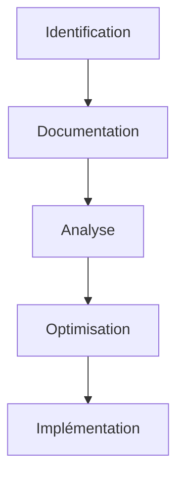

# Optimisation des Processus d'Entreprise : Guide Complet pour l'Efficacité Opérationnelle

## Introduction

L'optimisation des processus est devenue une nécessité stratégique incontournable pour les entreprises modernes. Dans cet article, nous explorerons en profondeur les méthodologies, outils et meilleures pratiques qui permettent de transformer efficacement vos processus et d'atteindre l'excellence opérationnelle.

## Fondamentaux de l'Optimisation des Processus

### Définition et Objectifs

L'optimisation des processus représente une démarche structurée visant à améliorer significativement les performances organisationnelles. Cette approche méthodique permet de réduire les coûts opérationnels, d'améliorer la qualité des produits et services, d'accélérer les délais d'exécution et d'augmenter la satisfaction client.

### Statistiques Clés

Les résultats des initiatives d'optimisation parlent d'eux-mêmes : 60% des entreprises ont réussi à réduire leurs coûts de 20% grâce à l'optimisation, 75% des projets d'optimisation ont amélioré la satisfaction client, et 80% des processus contiennent des gaspillages évitables. Ces chiffres soulignent l'importance cruciale d'une approche systématique de l'optimisation.

## Méthodologies d'Optimisation

### Lean Management

Le Lean Management repose sur des principes fondamentaux qui guident l'optimisation des processus. L'élimination des gaspillages, l'amélioration continue, le respect des personnes et le flux tendu constituent les piliers de cette approche. Ces principes s'appuient sur des outils concrets comme les 5S, le Value Stream Mapping, le Kaizen et le Kanban.

### Six Sigma

La méthodologie Six Sigma offre un cadre structuré pour l'amélioration des processus, comme l'illustre le tableau suivant :

| Phase   | Objectif                 | Outils               |
| ------- | ------------------------ | -------------------- |
| Define  | Définir le problème      | SIPOC, CTQ           |
| Measure | Mesurer les performances | Capabilité, SPC      |
| Analyze | Analyser les causes      | Diagramme d'Ishikawa |
| Improve | Améliorer le processus   | DOE, FMEA            |
| Control | Contrôler les résultats  | Tableaux de bord     |

## Étapes d'Implémentation

### 1. Cartographie des Processus

La cartographie des processus constitue une étape fondamentale dans toute démarche d'optimisation. Le diagramme suivant illustre le cycle complet :

### 2. Identification des Opportunités

L'identification des opportunités d'amélioration nécessite une analyse approfondie des processus existants. Cette phase comprend l'analyse des goulots d'étranglement, la détection des gaspillages, l'évaluation des risques et la mesure des performances actuelles.

### 3. Plan d'Action

Le plan d'action doit être structuré en trois horizons temporels distincts. À court terme, l'accent est mis sur les corrections rapides, la formation des équipes et la mise en place des indicateurs de performance. Le moyen terme se concentre sur l'automatisation partielle, l'amélioration des systèmes et l'optimisation des flux. Enfin, le long terme vise la transformation digitale, l'innovation continue et l'établissement d'une culture d'excellence.

## Technologies et Outils

### Solutions Logicielles

Les solutions logicielles modernes jouent un rôle crucial dans l'optimisation des processus. Les systèmes de Business Process Management (BPM) offrent des capacités avancées de modélisation, d'automatisation, de monitoring et d'analyse. La Robotic Process Automation (RPA) permet d'automatiser les tâches répétitives, d'intégrer les systèmes et de réduire les erreurs. L'IA et le Machine Learning apportent des capacités de prédiction des performances, d'optimisation automatique et de détection des anomalies.

## Mesure et Suivi

### Indicateurs de Performance (KPI)

L'évaluation de la performance des processus optimisés s'appuie sur trois catégories d'indicateurs clés. Les métriques d'efficacité, comme le temps de cycle et le taux de rendement, mesurent la performance opérationnelle. Les indicateurs de qualité, incluant le taux de défauts et la satisfaction client, évaluent la qualité des résultats. Enfin, les métriques de productivité, telles que l'output par heure et l'utilisation des ressources, mesurent l'efficience globale.

## Défis et Solutions

### Obstacles Courants

Les entreprises rencontrent souvent trois types d'obstacles majeurs dans leur démarche d'optimisation. La résistance au changement, qui se manifeste à travers la communication, la formation et l'implication des équipes, constitue le premier défi. La complexité technique, liée à l'expertise, aux ressources et au support, représente le second obstacle. Enfin, les contraintes de ressources financières, incluant le budget, le ROI et la priorisation, constituent le troisième défi.

### Solutions Pratiques

La réussite de l'optimisation des processus repose sur plusieurs principes clés : une approche progressive, un pilotage rigoureux par phases, une formation continue et une communication transparente. Ces éléments permettent de surmonter les obstacles et d'assurer la réussite des initiatives d'optimisation.

## Cas d'Usage

### Exemples de Succès

Les succès de l'optimisation des processus se manifestent dans différents secteurs. Dans le manufacturing, les entreprises ont réalisé des réductions significatives des stocks, des améliorations de la qualité et des augmentations de la productivité. Le secteur des services a bénéficié de réductions des délais, d'améliorations de la satisfaction client et d'optimisations des coûts. Enfin, l'administration a vu ses processus transformés par l'automatisation des tâches, la réduction des erreurs et l'amélioration de l'efficacité.

## Conclusion

L'optimisation des processus représente un voyage continu vers l'excellence opérationnelle qui nécessite une vision claire, une approche méthodique, des outils appropriés et une culture d'amélioration continue. Cette démarche structurée permet aux entreprises de maintenir leur compétitivité dans un environnement en constante évolution.

### Prochaines Étapes

Pour réussir dans cette transformation, les entreprises doivent d'abord évaluer leur maturité, identifier les priorités, développer un plan d'action détaillé, former leurs équipes et implémenter progressivement les solutions choisies.

## Ressources Complémentaires

Pour approfondir vos connaissances sur l'optimisation des processus, nous vous recommandons de consulter les ressources suivantes :

- [APQC](https://www.apqc.org)
- [BPM Institute](https://www.bpminstitute.org)
- [Lean Enterprise Institute](https://www.lean.org)

## FAQ

**Q: Combien de temps faut-il pour optimiser un processus ?**
R: La durée moyenne d'un projet d'optimisation varie entre 3 et 6 mois, selon la complexité du processus et l'ampleur des changements nécessaires. Cette période inclut l'analyse, la conception, l'implémentation et la stabilisation.

**Q: Quel est le ROI typique d'un projet d'optimisation ?**
R: Les projets d'optimisation génèrent généralement un retour sur investissement de 200 à 300% sur une période de 12 à 18 mois. Ce ROI varie selon le secteur d'activité, la nature des processus et l'ampleur des améliorations réalisées.

**Q: Comment mesurer le succès d'une optimisation ?**
R: Le succès d'une optimisation se mesure à travers des indicateurs clés de performance (KPI) bien définis, des retours clients réguliers et des mesures de performance opérationnelle continues. Cette approche multidimensionnelle permet d'évaluer l'impact réel des améliorations.
