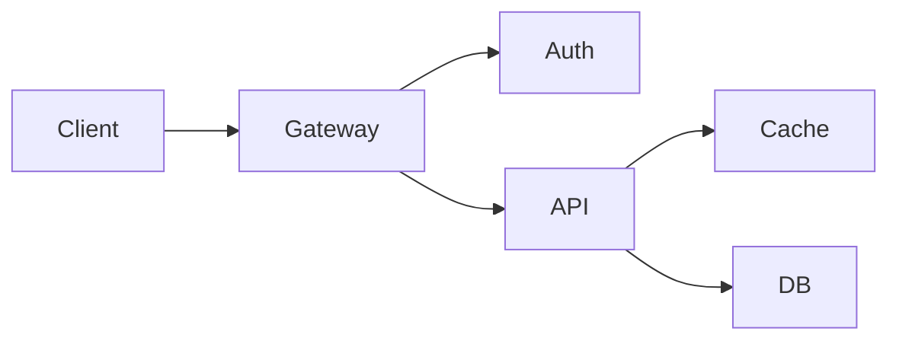

## Mermaid en situation réelle : trois cas qui ont changé ma façon de travailler

J'utilise Mermaid depuis environ deux ans sur des projets variés — architecture technique chez ACTIV PARTNERS, coordination de projets chez KEOS TELECOM. Ce qui m'a convaincu définitivement, c'est la première fois qu'un développeur junior a modifié un diagramme d'architecture directement dans une pull request, au lieu de demander à quelqu'un de "mettre à jour le fichier Draw.io".

La documentation vivait enfin là où elle devait vivre : dans le code, sous contrôle de version, accessible à tout moment sans logiciel externe.

Voici les trois cas d'usage qui valent vraiment le détour, les bonnes pratiques que j'ai identifiées, et les limites à ne pas ignorer.

<svg xmlns="http://www.w3.org/2000/svg" viewBox="0 0 700 360" style="max-width:100%;height:auto">
  <rect width="700" height="360" fill="#0a0f2e"/>
  <text x="350" y="22" fill="#fff" font-family="monospace" font-size="13" text-anchor="middle" font-weight="bold">Comparatif outils diagramme — 4 critères</text>
  <!-- Legend -->
  <rect x="60" y="38" width="14" height="12" fill="#00cffd"/>
  <text x="78" y="49" fill="#00cffd" font-family="monospace" font-size="10">Mermaid</text>
  <rect x="165" y="38" width="14" height="12" fill="#915EFF"/>
  <text x="183" y="49" fill="#915EFF" font-family="monospace" font-size="10">Draw.io</text>
  <rect x="260" y="38" width="14" height="12" fill="#fbbf24"/>
  <text x="278" y="49" fill="#fbbf24" font-family="monospace" font-size="10">Lucidchart</text>
  <rect x="375" y="38" width="14" height="12" fill="#86efac"/>
  <text x="393" y="49" fill="#86efac" font-family="monospace" font-size="10">Excalidraw</text>
  <!-- Y axis -->
  <line x1="100" y1="60" x2="100" y2="290" stroke="#915EFF" stroke-width="1.5"/>
  <!-- X axis -->
  <line x1="100" y1="290" x2="660" y2="290" stroke="#915EFF" stroke-width="1.5"/>
  <!-- Y axis labels -->
  <text x="95" y="64" fill="#86efac" font-family="monospace" font-size="9" text-anchor="end">100%</text>
  <text x="95" y="121" fill="#86efac" font-family="monospace" font-size="9" text-anchor="end">75%</text>
  <text x="95" y="178" fill="#86efac" font-family="monospace" font-size="9" text-anchor="end">50%</text>
  <text x="95" y="235" fill="#86efac" font-family="monospace" font-size="9" text-anchor="end">25%</text>
  <!-- Grid lines -->
  <line x1="100" y1="63" x2="660" y2="63" stroke="#915EFF" stroke-width="0.5" opacity="0.3"/>
  <line x1="100" y1="120" x2="660" y2="120" stroke="#915EFF" stroke-width="0.5" opacity="0.3"/>
  <line x1="100" y1="177" x2="660" y2="177" stroke="#915EFF" stroke-width="0.5" opacity="0.3"/>
  <line x1="100" y1="234" x2="660" y2="234" stroke="#915EFF" stroke-width="0.5" opacity="0.3"/>
  <!-- Group: Collaboratif -->
  <text x="192" y="308" fill="#fff" font-family="monospace" font-size="10" text-anchor="middle">Collaboratif</text>
  <!-- Mermaid: 55% => height=124, y=290-124=166 -->
  <rect x="115" y="166" width="28" height="124" fill="#00cffd"/>
  <!-- Draw.io: 70% => height=158, y=290-158=132 -->
  <rect x="147" y="132" width="28" height="158" fill="#915EFF"/>
  <!-- Lucidchart: 90% => height=203, y=290-203=87 -->
  <rect x="179" y="87" width="28" height="203" fill="#fbbf24"/>
  <!-- Excalidraw: 80% => height=180, y=290-180=110 -->
  <rect x="211" y="110" width="28" height="180" fill="#86efac"/>
  <!-- Group: Versionnable -->
  <text x="328" y="308" fill="#fff" font-family="monospace" font-size="10" text-anchor="middle">Versionnable</text>
  <!-- Mermaid: 95% => height=214 -->
  <rect x="251" y="76" width="28" height="214" fill="#00cffd"/>
  <!-- Draw.io: 40% => height=90 -->
  <rect x="283" y="200" width="28" height="90" fill="#915EFF"/>
  <!-- Lucidchart: 60% => height=135 -->
  <rect x="315" y="155" width="28" height="135" fill="#fbbf24"/>
  <!-- Excalidraw: 70% => height=158 -->
  <rect x="347" y="132" width="28" height="158" fill="#86efac"/>
  <!-- Group: Facilité apprentissage (inversée: haute barre = facile) -->
  <text x="464" y="308" fill="#fff" font-family="monospace" font-size="10" text-anchor="middle">Facilité apprent.</text>
  <!-- Mermaid: 50% -->
  <rect x="387" y="177" width="28" height="113" fill="#00cffd"/>
  <!-- Draw.io: 85% -->
  <rect x="419" y="99" width="28" height="191" fill="#915EFF"/>
  <!-- Lucidchart: 80% -->
  <rect x="451" y="110" width="28" height="180" fill="#fbbf24"/>
  <!-- Excalidraw: 95% -->
  <rect x="483" y="76" width="28" height="214" fill="#86efac"/>
  <!-- Group: Intégrations -->
  <text x="600" y="308" fill="#fff" font-family="monospace" font-size="10" text-anchor="middle">Intégrations</text>
  <!-- Mermaid: 90% -->
  <rect x="523" y="87" width="28" height="203" fill="#00cffd"/>
  <!-- Draw.io: 80% -->
  <rect x="555" y="110" width="28" height="180" fill="#915EFF"/>
  <!-- Lucidchart: 85% -->
  <rect x="587" y="99" width="28" height="191" fill="#fbbf24"/>
  <!-- Excalidraw: 55% -->
  <rect x="619" y="166" width="28" height="124" fill="#86efac"/>
</svg>

## Trois cas concrets qui fonctionnent bien

**Architecture système** : le flowchart Mermaid est parfait pour décrire comment les composants d'une application communiquent entre eux. Sur un projet de refactorisation chez ACTIV PARTNERS, j'ai créé un diagramme "avant/après" directement dans la PR de migration. L'équipe pouvait voir l'architecture actuelle et la cible en ouvrant le fichier README — sans télécharger quoi que ce soit.

```mermaid
graph LR
    Client --> Gateway
    Gateway --> Auth
    Gateway --> API
    API --> Cache
    API --> DB
```

Ce niveau de simplicité suffit pour 80% des discussions d'architecture. On rajoute des détails uniquement quand ils résolvent une ambiguïté réelle.

**Parcours utilisateur** : le flowchart avec des losanges de décision est idéal pour cartographier un tunnel d'onboarding ou un processus d'achat. J'utilise cette approche pour aligner product et dev avant de commencer le développement — on voit immédiatement les cas d'erreur oubliés et les bifurcations non documentées.

**Workflow d'approbation** : chez KEOS TELECOM, les processus de validation de devis ou de commande impliquent plusieurs acteurs avec des droits différents. Le state diagram Mermaid documente ces états de façon lisible par les équipes métier, pas seulement les tech.

## Bonnes pratiques de lisibilité

<svg xmlns="http://www.w3.org/2000/svg" viewBox="0 0 700 360" style="max-width:100%;height:auto">
  <rect width="700" height="360" fill="#0a0f2e"/>
  <text x="350" y="22" fill="#fff" font-family="monospace" font-size="13" text-anchor="middle" font-weight="bold">Anatomie d'un diagramme Mermaid — syntaxe annotée</text>
  <!-- Flowchart nodes -->
  <!-- Node A: rectangle action -->
  <rect x="280" y="50" width="140" height="44" fill="#00cffd" fill-opacity="0.2" stroke="#00cffd" stroke-width="2" rx="4"/>
  <text x="350" y="72" fill="#fff" font-family="monospace" font-size="12" text-anchor="middle" font-weight="bold">Demande reçue</text>
  <text x="350" y="87" fill="#86efac" font-family="monospace" font-size="9" text-anchor="middle">A[Demande reçue]</text>
  <!-- Arrow A -> B -->
  <line x1="350" y1="94" x2="350" y2="126" stroke="#00cffd" stroke-width="2"/>
  <polygon points="345,126 355,126 350,136" fill="#00cffd"/>
  <!-- Node B: diamond decision -->
  <polygon points="350,140 420,175 350,210 280,175" fill="#fbbf24" fill-opacity="0.2" stroke="#fbbf24" stroke-width="2"/>
  <text x="350" y="179" fill="#fff" font-family="monospace" font-size="11" text-anchor="middle">Valide ?</text>
  <text x="350" y="193" fill="#86efac" font-family="monospace" font-size="9" text-anchor="middle">B{Valide ?}</text>
  <!-- Arrow B -> C: oui -->
  <line x1="420" y1="175" x2="490" y2="175" stroke="#22c55e" stroke-width="2"/>
  <polygon points="490,170 500,175 490,180" fill="#22c55e"/>
  <text x="455" y="165" fill="#22c55e" font-family="monospace" font-size="10">Oui</text>
  <!-- Node C: rectangle succès -->
  <rect x="500" y="153" width="120" height="44" fill="#22c55e" fill-opacity="0.25" stroke="#22c55e" stroke-width="2" rx="4"/>
  <text x="560" y="174" fill="#fff" font-family="monospace" font-size="11" text-anchor="middle" font-weight="bold">Approuvé</text>
  <text x="560" y="188" fill="#86efac" font-family="monospace" font-size="9" text-anchor="middle">C[Approuvé]</text>
  <!-- Arrow B -> D: non -->
  <line x1="280" y1="175" x2="210" y2="175" stroke="#ef4444" stroke-width="2"/>
  <polygon points="210,170 200,175 210,180" fill="#ef4444"/>
  <text x="245" y="165" fill="#ef4444" font-family="monospace" font-size="10">Non</text>
  <!-- Node D: rectangle rejet -->
  <rect x="80" y="153" width="120" height="44" fill="#ef4444" fill-opacity="0.25" stroke="#ef4444" stroke-width="2" rx="4"/>
  <text x="140" y="174" fill="#fff" font-family="monospace" font-size="11" text-anchor="middle" font-weight="bold">Rejeté</text>
  <text x="140" y="188" fill="#86efac" font-family="monospace" font-size="9" text-anchor="middle">D[Rejeté]</text>
  <!-- Callout annotations -->
  <!-- Annotation rectangle -->
  <line x1="350" y1="50" x2="350" y2="38" stroke="#fff" stroke-width="1" stroke-dasharray="3,2"/>
  <rect x="240" y="20" width="220" height="20" fill="none"/>
  <text x="350" y="35" fill="#fbbf24" font-family="monospace" font-size="10" text-anchor="middle">Forme rectangulaire = action</text>
  <!-- Annotation diamond -->
  <line x1="420" y1="175" x2="445" y2="235" stroke="#fff" stroke-width="1" stroke-dasharray="3,2"/>
  <text x="450" y="250" fill="#fbbf24" font-family="monospace" font-size="10">Losange = décision</text>
  <!-- Annotation arrow -->
  <line x1="455" y1="175" x2="455" y2="255" stroke="#fff" stroke-width="1" stroke-dasharray="3,2"/>
  <text x="400" y="270" fill="#fbbf24" font-family="monospace" font-size="10">Flèche = flux de données</text>
  <!-- Annotation color -->
  <line x1="560" y1="197" x2="560" y2="255" stroke="#fff" stroke-width="1" stroke-dasharray="3,2"/>
  <text x="480" y="270" fill="#fbbf24" font-family="monospace" font-size="10">Couleur = état (style:::)</text>
  <!-- Syntax block -->
  <rect x="20" y="295" width="660" height="55" fill="#1a1f3e" stroke="#915EFF" stroke-width="1" rx="4"/>
  <text x="30" y="313" fill="#00cffd" font-family="monospace" font-size="10">graph LR</text>
  <text x="30" y="329" fill="#86efac" font-family="monospace" font-size="10">    A[Demande reçue] --> B{Valide ?}</text>
  <text x="30" y="345" fill="#86efac" font-family="monospace" font-size="10">    B -->|Oui| C[Approuvé]   B -->|Non| D[Rejeté]</text>
</svg>

**Limiter les nœuds à 12 maximum par diagramme** : au-delà, la lisibilité chute. Si votre processus a 20 étapes, découpez en deux sous-diagrammes avec un lien entre eux.

**Nommer les flèches sur les décisions** : un losange sans labels sur ses branches force le lecteur à deviner. `|Oui|` et `|Non|`, ou `|Succès|` et `|Erreur|`, rendent le diagramme lisible sans explication.

**Un diagramme = une question** : avant de commencer, écrivez la question à laquelle le diagramme répond. "Quelles sont les étapes de validation d'une commande ?" ou "Comment les services communiquent-ils lors d'une authentification ?". Si la réponse couvre plusieurs questions, faites plusieurs diagrammes.

**Ajouter des commentaires dans le code Mermaid** : `%% ceci est un commentaire` permet d'annoter la logique sans surcharger le rendu visuel. Je les utilise pour documenter les décisions d'architecture directement dans le diagramme.

## Les limites de Mermaid

Mermaid n'est pas la bonne réponse à tous les problèmes de documentation visuelle.

**Positionnement manuel impossible** : Mermaid positionne automatiquement les nœuds. Sur des architectures complexes avec des relations croisées, le résultat peut être difficile à lire et vous n'avez pas de contrôle sur la mise en page. Draw.io ou Excalidraw sont meilleurs dans ce cas.

**Diagrammes très denses** : au-delà d'un certain niveau de complexité, même un diagramme bien structuré devient illisible en texte. Un schéma d'infrastructure réseau complet avec 50 composants sera toujours plus clair dans un outil de dessin libre.

**Présentation client** : quand le visuel doit être "beau" pour une présentation direction ou client, Mermaid montre ses limites. Les couleurs par défaut sont fonctionnelles mais pas élégantes. Lucidchart ou même une image exportée depuis Draw.io sera plus adaptée.

**Rendu incohérent selon les plateformes** : GitHub, Notion et Confluence ne rendent pas exactement les mêmes sous-ensembles de la syntaxe Mermaid. J'ai eu des diagrammes qui s'affichaient correctement sur GitHub et qui échouaient silencieusement dans Confluence. Tester sur la plateforme cible avant de diffuser.

## Quand choisir une alternative

La question n'est pas "Mermaid ou Draw.io" — c'est "quel outil répond à ce besoin précis ?".

**Mermaid** quand : la documentation doit vivre avec le code, évoluer fréquemment, être révisable par des développeurs dans des PR, et s'afficher automatiquement dans GitHub ou Notion.

**Draw.io** quand : le diagramme est complexe visuellement, positionné manuellement, partagé avec des non-développeurs via un fichier exporté, ou quand le rendu esthétique compte.

**Excalidraw** quand : on veut esquisse rapide, style "whiteboard", collaboration en temps réel informelle. Idéal pour les ateliers de conception et les sessions de brainstorming architecture.

**Lucidchart** quand : l'équipe a besoin de collaboration en temps réel avec commentaires, révisions et approbations — et qu'un budget outil est disponible.

Mon usage personnel : Mermaid pour 70% des cas (documentation technique courante), Excalidraw pour les sessions de conception collaborative, Draw.io pour les diagrammes "officiels" qui vivent dans des docs de référence longuement stables.

> **Ce que ça change en pratique** — Mermaid est l'outil le plus efficace pour documenter des processus qui évoluent avec le code : architecture système, parcours utilisateur, workflows d'approbation. Les bonnes pratiques clés sont de limiter à 12 nœuds, de nommer les branches de décision et de cibler une question par diagramme. Les limites réelles sont le positionnement manuel, les diagrammes très denses et les présentations clients. Pour ces cas, Draw.io, Excalidraw ou Lucidchart restent des alternatives pertinentes selon le contexte.
