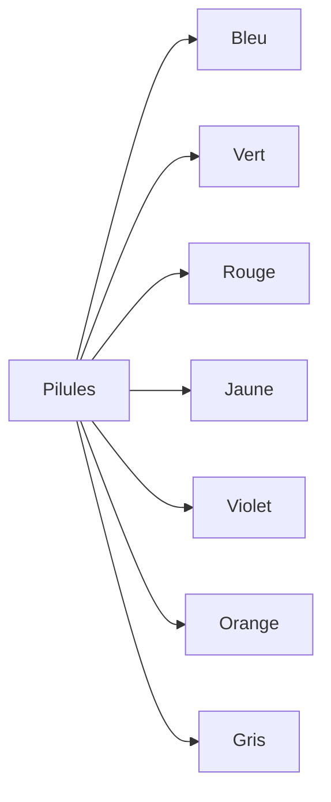

# Guide des Couleurs de Pilules : Signification et Utilisation

Les couleurs de pilules sont un élément important de la documentation et de l'interface utilisateur. Ce guide complet vous aide à les utiliser efficacement.

## Fondamentaux des Couleurs de Pilules

### 1. Définition et Objectifs

#### A. Qu'est-ce qu'une Pilule Colorée ?

- Élément visuel
- Indicateur de statut
- Catégorisation
- Hiérarchie visuelle

#### B. Objectifs

- Communication visuelle
- Organisation
- Navigation
- Compréhension

### 2. Système de Couleurs

#### A. Palette Standard



#### B. Signification

- Bleu : Information, Documentation
- Vert : Succès, Validation
- Rouge : Erreur, Attention
- Jaune : Avertissement, En cours
- Violet : Premium, Avancé
- Orange : Beta, Expérimental
- Gris : Inactif, Archivé

## Utilisation et Applications

### 1. Documentation

#### A. Catégorisation

- Types de contenu
- Niveaux de difficulté
- Statuts
- Versions

#### B. Navigation

- Filtres
- Tags
- Sections
- Hiérarchie

### 2. Interface Utilisateur

#### A. Éléments

- Boutons
- Badges
- Indicateurs
- Labels

#### B. États

- Actif
- Inactif
- En cours
- Terminé

## Bonnes Pratiques

### 1. Design

#### A. Cohérence

- Palette
- Utilisation
- Placement
- Style

#### B. Accessibilité

- Contraste
- Lisibilité
- Signification
- Alternatives

### 2. Implémentation

#### A. Code

```css
.pill {
  padding: 4px 12px;
  border-radius: 16px;
  font-size: 14px;
  font-weight: 500;
}

.pill-blue {
  background-color: #e3f2fd;
  color: #1976d2;
}

.pill-green {
  background-color: #e8f5e9;
  color: #2e7d32;
}

.pill-red {
  background-color: #ffebee;
  color: #c62828;
}
```

#### B. Responsive

- Adaptation
- Taille
- Espacement
- Alignement

## Cas d'Utilisation

### 1. Documentation Technique

#### A. Statuts

- En cours
- Terminé
- En révision
- Archivé

#### B. Versions

- Stable
- Beta
- Alpha
- Déprécié

### 2. Interface Utilisateur

#### A. Actions

- Nouveau
- Populaire
- Limité
- Premium

#### B. États

- Disponible
- Indisponible
- En maintenance
- Bientôt disponible

## Intégration

### 1. Design System

#### A. Composants

- Styles
- Variants
- Props
- Documentation

#### B. Utilisation

- Guidelines
- Exemples
- Cas d'usage
- Best practices

### 2. Maintenance

#### A. Mise à Jour

- Versions
- Changements
- Migration
- Support

#### B. Évolution

- Nouvelles couleurs
- Nouvelles utilisations
- Améliorations
- Feedback

## Accessibilité

### 1. Contraste

#### A. Standards

- WCAG
- Ratios
- Tests
- Validation

#### B. Implémentation

- Couleurs
- Textes
- Fond
- États

### 2. Alternatives

#### A. Textes

- Labels
- Descriptions
- Tooltips
- Aria-labels

#### B. Icônes

- Symboles
- Indicateurs
- Signification
- Cohérence

## Conclusion

Les couleurs de pilules sont un outil puissant pour améliorer la communication visuelle et l'organisation de votre documentation.

## Ressources Complémentaires

- Palettes de couleurs
- Outils de test
- Exemples
- Templates

## Prochaines Étapes

1. Définir votre palette
2. Établir vos guidelines
3. Implémenter le système
4. Tester et améliorer
