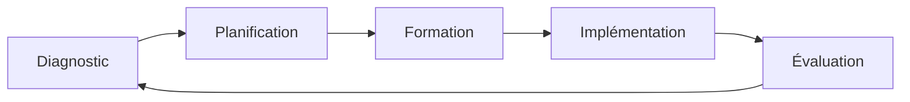

# Qualité des Processus en Entreprise : Guide pour l'Excellence Opérationnelle

## Introduction

La qualité des processus est un élément fondamental de la réussite d'une entreprise. Cet article vous guide à travers les meilleures pratiques pour mettre en place, maintenir et améliorer la qualité de vos processus opérationnels.

## Fondements de la Qualité des Processus

### Définition et Importance

La qualité des processus se définit par leur capacité à :

- Produire des résultats conformes aux attentes
- Être efficaces et efficients
- Être reproductibles et mesurables
- S'améliorer continuellement

### Bénéfices Clés

1. **Opérationnels**

   - Réduction des erreurs
   - Amélioration de la productivité
   - Optimisation des ressources

2. **Business**
   - Satisfaction client accrue
   - Réduction des coûts
   - Avantage concurrentiel

## Méthodologies de Qualité

### Approches Majeures

1. **ISO 9001**

   - Système de management
   - Amélioration continue
   - Satisfaction client

2. **Six Sigma**

   - Réduction des défauts
   - Optimisation des processus
   - Approche DMAIC

3. **Lean Management**
   - Élimination des gaspillages
   - Flux optimisés
   - Valeur client

### Outils Essentiels

| Outil  | Objectif              | Application               |
| ------ | --------------------- | ------------------------- |
| PDCA   | Amélioration continue | Cycle de qualité          |
| 5S     | Organisation          | Efficacité opérationnelle |
| Kaizen | Amélioration continue | Changement progressif     |
| SMED   | Réduction des temps   | Changement rapide         |

## Mise en Œuvre

### Étapes Clés

1. **Analyse Initiale**

   - Cartographie des processus
   - Identification des points critiques
   - Mesure des performances

2. **Planification**

   - Objectifs qualité
   - Indicateurs de suivi
   - Plan d'action

3. **Implémentation**
   - Formation des équipes
   - Mise en place des contrôles
   - Documentation

### Gestion du Changement

## Mesure et Suivi

### Indicateurs de Performance

1. **Qualité**

   - Taux de conformité
   - Taux de défauts
   - Coût de la non-qualité

2. **Efficacité**

   - Temps de cycle
   - Productivité
   - Utilisation des ressources

3. **Satisfaction**
   - Client interne
   - Client externe
   - Employés

## Amélioration Continue

### Méthodologie

1. **Identification**

   - Analyse des données
   - Feedback clients
   - Audit interne

2. **Priorisation**

   - Impact
   - Faisabilité
   - Ressources

3. **Implémentation**
   - Plan d'action
   - Suivi
   - Ajustements

### Outils d'Amélioration

- Brainstorming
- Diagramme de Pareto
- Analyse des causes racines
- Plan d'action 5W2H

## Gestion des Risques

### Identification

1. **Risques Processus**

   - Défaillances
   - Erreurs
   - Délais

2. **Risques Qualité**
   - Non-conformités
   - Impact client
   - Coûts

### Mitigation

- Contrôles préventifs
- Procédures de secours
- Formation continue
- Documentation

## Technologies et Innovation

### Solutions Digitales

1. **QMS (Quality Management System)**

   - Gestion documentaire
   - Suivi des non-conformités
   - Analytics

2. **Automatisation**

   - Contrôles automatiques
   - Alertes
   - Rapports

3. **IA et Machine Learning**
   - Prédiction
   - Optimisation
   - Décision

## Conclusion

La qualité des processus est un investissement stratégique qui génère des retours significatifs :

- Amélioration de la performance
- Réduction des coûts
- Satisfaction client accrue
- Compétitivité renforcée

### Prochaines Étapes

1. Évaluer vos processus actuels
2. Identifier les priorités d'amélioration
3. Mettre en place les indicateurs
4. Former les équipes
5. Implémenter les améliorations

## Ressources Complémentaires

- [International Organization for Standardization](https://www.iso.org/)
- [American Society for Quality](https://asq.org/)
- [European Organization for Quality](https://www.eoq.org/)

## FAQ

**Q: Combien de temps faut-il pour mettre en place un système de qualité ?**
R: La mise en place complète prend généralement 6 à 12 mois, selon la taille de l'entreprise et la complexité des processus.

**Q: Quel est le coût moyen d'une certification ISO 9001 ?**
R: Les coûts varient selon la taille de l'entreprise, mais comptez entre 5 000€ et 20 000€ pour une PME.

**Q: Comment mesurer le ROI de la qualité ?**
R: Le ROI peut être mesuré à travers la réduction des coûts de non-qualité, l'amélioration de la productivité et l'augmentation de la satisfaction client.
