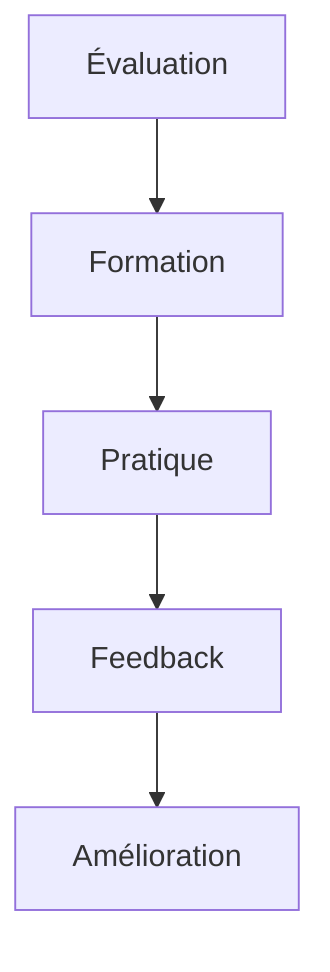

# Excellence du Service Client : Guide Complet pour une Expérience Client Exceptionnelle

## Introduction

L'excellence du service client est devenue un avantage concurrentiel majeur dans un environnement commercial où les clients sont plus exigeants que jamais. Dans cet article, nous explorerons en profondeur les stratégies et pratiques qui permettent de créer et de maintenir une expérience client véritablement exceptionnelle.

## Fondamentaux du Service Client d'Excellence

### Définition et Importance

Un service client d'excellence se caractérise par une réponse rapide et efficace aux besoins des clients, une personnalisation approfondie des interactions, une résolution proactive des problèmes et une expérience client cohérente à travers tous les points de contact. Cette approche holistique permet de créer une relation durable avec les clients.

### Statistiques Clés

Les chiffres soulignent l'importance cruciale d'un service client d'excellence : 86% des clients sont prêts à payer davantage pour une meilleure expérience, 73% des clients restent fidèles grâce à un service de qualité, et 89% des clients changent de marque après une mauvaise expérience. Ces statistiques démontrent l'impact direct du service client sur la performance commerciale.

## Stratégies d'Excellence

### 1. Compréhension du Client

La création de personas clients détaillés constitue une première étape essentielle. Ces profils complets incluent les parcours clients, les points de contact critiques et les attentes spécifiques. Cette compréhension approfondie permet d'anticiper les besoins et de personnaliser l'expérience.

L'analyse des besoins clients s'appuie sur des enquêtes de satisfaction régulières, des retours clients systématiques, une analyse comportementale approfondie et des études de marché ciblées. Cette approche multidimensionnelle permet d'identifier les opportunités d'amélioration.

### 2. Communication Efficace

La communication efficace repose sur une stratégie omnicanale bien structurée, comme l'illustre le tableau suivant :

| Canal           | Avantages      | Bonnes Pratiques          |
| --------------- | -------------- | ------------------------- |
| Téléphone       | Contact direct | Empathie, clarté          |
| Email           | Traçabilité    | Réponse rapide, précision |
| Chat            | Immédiateté    | Disponibilité, concision  |
| Réseaux sociaux | Visibilité     | Réactivité, transparence  |

## Formation et Développement

### Compétences Clés

Les compétences essentielles pour un service client d'excellence se répartissent en deux catégories principales. Les soft skills, incluant l'empathie, la communication, la résolution de problèmes et la gestion du stress, constituent le fondement des interactions de qualité. Les hard skills, comprenant la maîtrise des outils, la connaissance des produits, la compréhension des processus internes et l'application des normes de service, permettent d'assurer un service technique irréprochable.

### Programme de Formation

Le développement des compétences suit un cycle continu d'amélioration, illustré par le diagramme suivant :

## Technologies et Outils

### Solutions Digitales

Les solutions digitales modernes jouent un rôle crucial dans la prestation d'un service client d'excellence. Les systèmes CRM avancés offrent une vue complète de l'historique client, permettent un suivi précis des interactions, facilitent l'automatisation des tâches routinières et fournissent des analyses détaillées.

Les outils de communication omnicanale, incluant les chatbots intelligents et les bases de connaissances, permettent d'assurer une disponibilité 24/7 et une cohérence des réponses. Les solutions d'analytics permettent d'analyser le sentiment client, de prédire les comportements et de mesurer la performance du service.

## Mesure et Amélioration

### Indicateurs de Performance

L'évaluation de la performance du service client s'appuie sur trois catégories d'indicateurs clés. Les métriques de satisfaction, comme le NPS, le CSAT et le CES, mesurent la perception client. Les indicateurs d'efficacité, incluant le temps de réponse et le taux de résolution, évaluent la performance opérationnelle. Enfin, les métriques de qualité, telles que la précision et la cohérence des réponses, mesurent l'excellence du service.

## Gestion des Situations Difficiles

### Types de Situations

La gestion des réclamations nécessite une approche structurée basée sur l'écoute active, l'empathie, la résolution rapide et un suivi rigoureux. Cette approche permet de transformer les situations difficiles en opportunités de renforcement de la relation client.

La gestion des crises requiert un protocole d'urgence bien défini, une communication claire et transparente, une résolution prioritaire des problèmes et un apprentissage systématique des incidents. Cette approche permet de maintenir la confiance client même dans les situations les plus critiques.

### Bonnes Pratiques

Les bonnes pratiques de gestion des situations difficiles incluent le maintien d'un calme professionnel, l'écoute active des préoccupations client, la proposition de solutions concrètes et un suivi rigoureux jusqu'à la résolution complète. Ces pratiques permettent d'assurer une gestion efficace des situations complexes.

## Innovation et Amélioration Continue

### Tendances Émergentes

L'intelligence artificielle et l'automatisation transforment profondément le service client. Les chatbots intelligents, la prédiction des besoins, la personnalisation avancée et l'optimisation des processus permettent d'offrir un service plus efficace et personnalisé.

L'expérience omnicanale représente une autre tendance majeure, avec une attention particulière portée à la cohérence cross-canal, la continuité du service, l'unification des données et la personnalisation de l'expérience. Cette approche intégrée permet de créer une expérience client fluide et cohérente.

Le self-service constitue la troisième tendance émergente, avec le développement de portails clients sophistiqués, de FAQ intelligentes, de communautés d'entraide et de ressources en ligne complètes. Cette approche permet d'autonomiser les clients tout en optimisant les ressources du service client.

## Conclusion

L'excellence du service client représente un voyage continu qui nécessite une vision client-centrique, des équipes bien formées, des outils performants et une culture d'amélioration continue. Cette approche holistique permet de créer une expérience client véritablement exceptionnelle.

### Prochaines Étapes

Pour réussir dans cette transformation, les entreprises doivent d'abord évaluer leur niveau de service actuel, identifier les points d'amélioration prioritaires, former leurs équipes aux nouvelles pratiques, implémenter les outils appropriés et mettre en place un système de mesure et d'ajustement continu.

## Ressources Complémentaires

Pour approfondir vos connaissances sur l'excellence du service client, nous vous recommandons de consulter les ressources suivantes :

- [Customer Experience Professionals Association](https://www.cxpa.org)
- [Customer Service Institute](https://www.icsi.com)
- [Customer Experience Management](https://www.cxmanagement.com)

## FAQ

**Q: Comment mesurer la satisfaction client ?**
R: La satisfaction client se mesure à travers une combinaison d'indicateurs quantitatifs comme le NPS, le CSAT et le CES, complétés par des retours qualitatifs réguliers. Cette approche multidimensionnelle permet d'obtenir une vision complète de la satisfaction client.

**Q: Quel est le coût d'un service client d'excellence ?**
R: L'investissement dans un service client d'excellence varie selon la taille de l'entreprise et la complexité des besoins. Cependant, le retour sur investissement est généralement de 300 à 400% sur une période de 12 mois, grâce à l'augmentation de la fidélisation et des ventes.

**Q: Comment gérer les pics d'activité ?**
R: La gestion efficace des pics d'activité repose sur une planification proactive, l'utilisation d'outils d'automatisation appropriés et la mise en place d'une équipe flexible capable de s'adapter aux variations de volume. Cette approche permet de maintenir la qualité du service même en période de forte demande.
