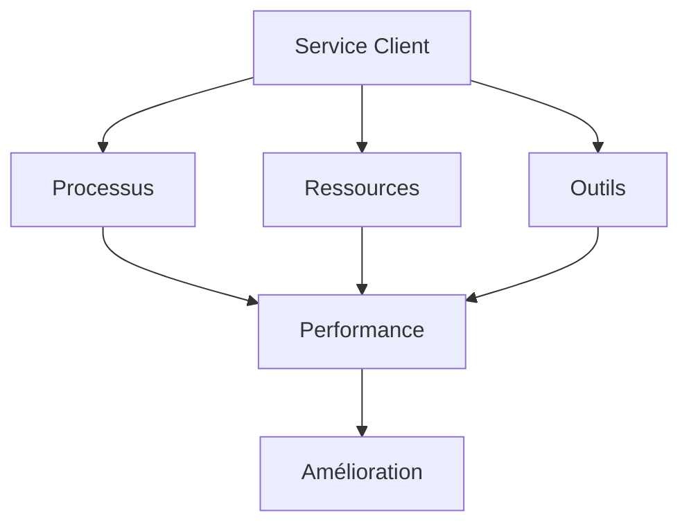

# Performance du Service Client : Guide Stratégique

La performance du service client est un enjeu stratégique pour les organisations. Ce guide complet vous accompagne dans l'optimisation de votre service client.

## Fondamentaux du Service Client

### 1. Définition et Enjeux

#### A. Qu'est-ce que la Performance Client ?

- Qualité du service
- Satisfaction client
- Efficacité
- Résolution

#### B. Enjeux

- Fidélisation
- Réputation
- Croissance
- Compétitivité

### 2. Éléments Clés

#### A. Qualité

- Réactivité
- Précision
- Empathie
- Proactivité

#### B. Efficacité

- Délais
- Résolution
- Ressources
- Processus

## Stratégies de Performance

### 1. Organisation

#### A. Structure

#### B. Processus

- Réception
- Traitement
- Résolution
- Suivi

### 2. Ressources

#### A. Personnel

- Recrutement
- Formation
- Motivation
- Support

#### B. Outils

- CRM
- Communication
- Analytics
- Automatisation

## Mesure et Suivi

### 1. KPIs

#### A. Performance

- Taux de résolution
- Délai de réponse
- Satisfaction
- Qualité

#### B. Efficacité

- Productivité
- Coûts
- Ressources
- ROI

### 2. Analyse

#### A. Données

- Métriques
- Tendances
- Insights
- Actions

#### B. Amélioration

- Identification
- Planification
- Implémentation
- Suivi

## Qualité de Service

### 1. Standards

#### A. Définition

- Critères
- Niveaux
- Mesures
- Objectifs

#### B. Application

- Processus
- Formation
- Contrôle
- Amélioration

### 2. Satisfaction

#### A. Mesure

- Enquêtes
- Feedback
- NPS
- CSAT

#### B. Amélioration

- Analyse
- Actions
- Suivi
- Communication

## Technologies et Outils

### 1. Solutions

#### A. CRM

- Gestion
- Analytics
- Automatisation
- Intégration

#### B. Communication

- Canaux
- Outils
- Support
- Collaboration

### 2. Innovation

#### A. Digital

- Self-service
- Chatbots
- IA
- Analytics

#### B. Expérience

- Personnalisation
- Omnicanal
- Proactivité
- Innovation

## Aspects Humains

### 1. Équipe

#### A. Management

- Leadership
- Motivation
- Support
- Développement

#### B. Compétences

- Techniques
- Soft skills
- Formation
- Évolution

### 2. Culture

#### A. Service

- Valeurs
- Attitude
- Engagement
- Excellence

#### B. Organisation

- Structure
- Processus
- Communication
- Collaboration

## Défis et Solutions

### 1. Volume

#### A. Gestion

- Priorisation
- Ressources
- Automatisation
- Efficacité

#### B. Qualité

- Standards
- Formation
- Support
- Contrôle

### 2. Complexité

#### A. Identification

- Types
- Niveaux
- Impacts
- Solutions

#### B. Gestion

- Processus
- Outils
- Formation
- Support

## Bonnes Pratiques

### 1. Service

#### A. Excellence

- Standards
- Processus
- Formation
- Suivi

#### B. Innovation

- Méthodes
- Outils
- Technologies
- Amélioration

### 2. Management

#### A. Leadership

- Vision
- Direction
- Support
- Engagement

#### B. Organisation

- Structure
- Processus
- Ressources
- Culture

## Conclusion

La performance du service client est un équilibre entre qualité, efficacité et innovation, nécessitant une approche structurée et continue.

## Ressources Complémentaires

- Outils
- Formations
- Études de cas
- Communautés

## Prochaines Étapes

1. Évaluer votre service
2. Identifier les axes d'amélioration
3. Mettre en œuvre les actions
4. Mesurer et optimiser
