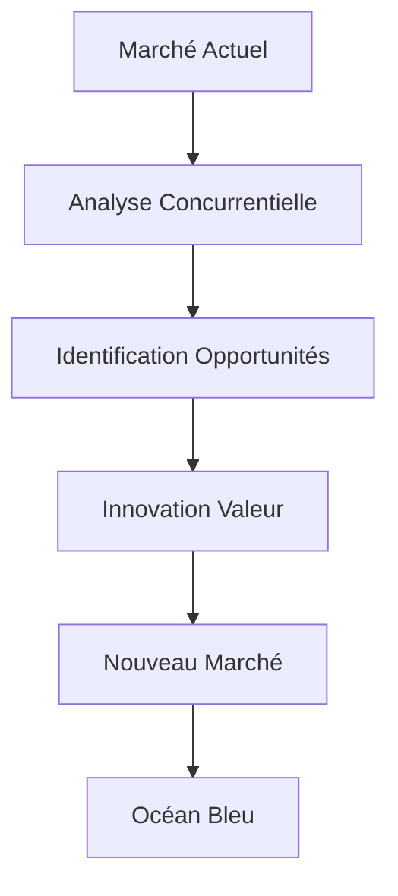
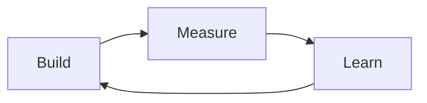
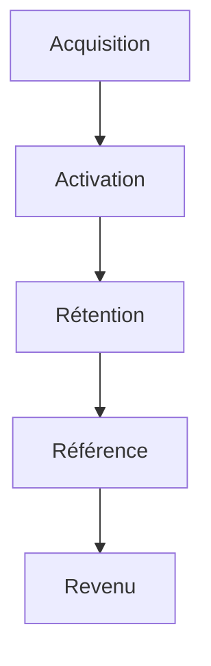
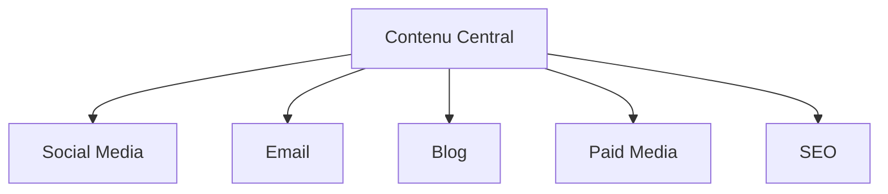

# Innovez en Marketing Digital : Guide Pratique

Pour rendre le marketing digital plus accessible, imaginons-le comme la gestion d'un grand restaurant moderne. Chaque aspect du marketing correspond à une partie de l'expérience restauration :

## 🎯 Concepts Fondamentaux Expliqués

### 1. L'Océan Bleu Digital

Imaginez le marché comme une mer :

- L'**océan rouge** est comme un marché bondé où tous les restaurants servent la même cuisine
- L'**océan bleu** est comme créer un nouveau concept de restaurant unique
- La **stratégie** consiste à trouver votre spécialité unique plutôt que de copier les autres

### 2. Le Lean Marketing

Pensez à un chef qui teste de nouvelles recettes :

- **Build** : Créer une nouvelle recette
- **Measure** : Faire goûter aux clients
- **Learn** : Améliorer selon les retours
- **Repeat** : Recommencer jusqu'à la perfection

### 3. L'Engagement Client (Hooked Model)

Comme fidéliser les clients d'un restaurant :

- **Trigger** : L'odeur qui attire les passants
- **Action** : L'expérience du repas
- **Récompense** : Le plaisir gustatif
- **Investissement** : Les avis et recommandations

## 🌊 Créez votre Océan Bleu Digital

Avant de nous plonger dans les tactiques spécifiques, commençons par une approche stratégique qui peut révolutionner votre positionnement sur le marché. Le concept d'Océan Bleu, appliqué au digital, nous offre un cadre puissant pour créer de nouveaux espaces de marché inexploités.

### Framework d'Innovation (Blue Ocean Strategy)



**Comprendre le Schéma :**
Imaginez le marché comme un océan. L'océan rouge représente les marchés existants, saturés de concurrence, où tout le monde se bat pour la même clientèle. Le processus ci-dessus montre comment créer votre "océan bleu" - un espace de marché inexploité. Vous commencez par analyser le marché actuel, identifiez ce que personne ne fait encore, innovez pour créer de la valeur unique, et ainsi créez votre propre marché où vous êtes le premier.

**Exemple Concret :**
Prenez Netflix : au lieu de concurrencer les vidéoclubs traditionnels (océan rouge), ils ont créé un nouveau marché (océan bleu) avec le streaming à la demande. Ils n'ont pas cherché à être meilleurs que Blockbuster, ils ont créé quelque chose de complètement nouveau.

### Matrice ERRC (Eliminate-Reduce-Raise-Create)

```markdown
Éliminer
├── Pratiques obsolètes
├── Coûts inutiles
└── Friction utilisateur

Réduire
├── Complexité
├── Délais de réponse
└── Coûts d'acquisition

Augmenter
├── Personnalisation
├── Engagement
└── Valeur client

Créer
├── Nouvelles expériences
├── Services innovants
└── Marchés inexploités
```

**Application Pratique :**
Prenons l'exemple d'une agence marketing digitale :

- **Éliminer** : Les rapports mensuels complexes que personne ne lit
- **Réduire** : Le temps passé sur des réunions improductives
- **Augmenter** : La transparence des résultats en temps réel
- **Créer** : Un dashboard client personnalisé et interactif

## 🚀 Lean Marketing Framework

Après avoir défini notre positionnement stratégique, passons à la mise en œuvre concrète. Le Lean Marketing Framework nous permet d'expérimenter rapidement et d'apprendre de nos actions, tout en minimisant les risques et les coûts.

### 1. Build-Measure-Learn Loop



**Décryptage du Cycle :**
Pensez à ce cycle comme à une recette de cuisine que vous améliorez constamment :

1. **Build (Créer)** : Vous préparez une première version de votre plat
2. **Measure (Mesurer)** : Vous recueillez les avis des goûteurs
3. **Learn (Apprendre)** : Vous notez ce qui fonctionne et ce qui doit être amélioré
4. Puis vous recommencez avec une version améliorée

**Exemple Marketing :**

- **Build** : Créez une landing page simple
- **Measure** : Suivez les taux de conversion
- **Learn** : Identifiez pourquoi certains visiteurs convertissent et d'autres non

### 2. MVP Marketing

```markdown
Minimum Viable Product
├── Landing Page Test
│ ├── Value Proposition
│ └── Call-to-Action
├── A/B Testing
│ ├── Headlines
│ └── Visuals
└── Analytics
├── User Behavior
└── Conversion Metrics
```

## 💡 Le Modèle Hooked appliqué au Digital

L'engagement client est au cœur du succès en marketing digital. Le modèle Hooked nous offre une approche scientifique pour créer des produits et services qui génèrent des habitudes positives chez nos utilisateurs.

### 1. Framework d'Engagement

```markdown
Trigger
├── Externe
│ ├── Notifications
│ └── Emails
└── Interne
├── Besoins
└── Émotions

Action
├── Simplicité
└── Motivation

Récompense Variable
├── Sociale
├── Chasse
└── Personnelle

Investissement
├── Data
├── Réputation
└── Habitudes
```

### 2. Exemple d'Application

```typescript
// Hook Implementation
interface HookStrategy {
  trigger: {
    external: string[];
    internal: string[];
  };
  action: {
    effort: number;
    motivation: string;
  };
  reward: {
    type: string;
    value: any;
  };
  investment: string[];
}

const socialMediaHook: HookStrategy = {
  trigger: {
    external: ["notifications", "emails"],
    internal: ["FOMO", "connexion sociale"],
  },
  action: {
    effort: 1, // 1-5 scale
    motivation: "Rester connecté",
  },
  reward: {
    type: "social",
    value: "likes, commentaires, partages",
  },
  investment: [
    "création de contenu",
    "construction réseau",
    "engagement régulier",
  ],
};
```

## 🌟 Le Modèle "Good to Great" Appliqué

La transformation d'une entreprise de "bonne" à "exceptionnelle" est un voyage qui demande vision, discipline et persévérance. Jim Collins et son équipe ont étudié pendant cinq ans les entreprises qui ont réussi cette transformation remarquable, identifiant les principes clés qui distinguent les entreprises exceptionnelles des autres.

Imaginez cette transformation comme l'évolution d'un athlète amateur en champion olympique. Ce n'est pas un changement soudain, mais une accumulation disciplinée d'améliorations quotidiennes, chacune construisant sur la précédente jusqu'à atteindre l'excellence.

### Les Trois Piliers de la Transformation

1. **La Discipline des Personnes**

   - Recrutement méticuleux avant la stratégie
   - Leadership humble mais déterminé
   - Culture d'excellence et de responsabilité

2. **La Discipline de la Pensée**

   - Affronter les réalités brutales
   - Simplicité dans la complexité
   - Clarté dans la vision

3. **La Discipline de l'Action**
   - Exécution méthodique
   - Persévérance inébranlable
   - Amélioration continue

## 📊 Analytics et Growth Hacking

Les données sont le nouveau pétrole du marketing digital. Apprenons maintenant à les exploiter efficacement pour alimenter notre croissance et optimiser nos actions marketing.

### 1. Entonnoir de Conversion AARRR



**L'Entonnoir Simplifié :**
Imaginez un entonnoir comme celui que vous utilisez en cuisine. Au sommet, vous versez beaucoup de liquide (visiteurs), mais seule une partie atteint le fond (clients). Chaque étape filtre naturellement :

1. **Acquisition** : Comment les gens découvrent votre marque (comme trouver un nouveau restaurant)
2. **Activation** : Leur première expérience positive (goûter un plat et l'apprécier)
3. **Rétention** : Ils reviennent (devenir un client régulier)
4. **Référence** : Ils en parlent à leurs amis (recommander le restaurant)
5. **Revenu** : Ils dépensent plus (commander des plats plus chers, venir plus souvent)

### 2. Framework de Test

```markdown
Hypothèse
├── Problème identifié
└── Solution proposée

Test
├── Durée
├── Métriques
└── Audience cible

Analyse
├── Données collectées
├── Insights
└── Décisions
```

## 🎯 Stratégie de Contenu Moderne

Le contenu est roi, mais sa distribution est reine. Découvrons ensemble comment créer et diffuser un contenu qui résonne avec votre audience et génère des résultats concrets.

### 1. Content Matrix

```markdown
Awareness
├── Blog posts
├── Infographies
└── Vidéos courts

Considération
├── Webinaires
├── Études de cas
└── Comparatifs

Décision
├── Démos
├── Témoignages
└── Offres spéciales

Fidélisation
├── Newsletter premium
├── Contenu exclusif
└── Programme VIP
```

### 2. Distribution Omnicanale



## 🔄 Automatisation Marketing

L'automatisation nous permet de passer à l'échelle tout en maintenant une personnalisation poussée. Explorons les outils et stratégies qui vous permettront d'automatiser intelligemment vos actions marketing.

### 1. Workflow d'Automatisation

```markdown
Lead Nurturing
├── Email Sequences
│ ├── Welcome Series
│ ├── Engagement Series
│ └── Conversion Series
├── Scoring
│ ├── Behavior Score
│ └── Demographic Score
└── Segmentation
├── Interest
└── Lifecycle Stage
```

### 2. Personnalisation Avancée

```typescript
interface PersonalizationStrategy {
  segment: string;
  triggers: string[];
  content: ContentType[];
  nextBestAction: string;
}

const personalization: PersonalizationStrategy = {
  segment: "high-value-prospect",
  triggers: ["site-visit", "content-download"],
  content: [
    { type: "case-study", industry: "tech" },
    { type: "webinar", topic: "innovation" },
    { type: "offer", discount: 20 },
  ],
  nextBestAction: "schedule-demo",
};
```

## 📱 Social Media 2.0

Les réseaux sociaux évoluent constamment, et avec eux, les stratégies pour y réussir. Plongeons dans les approches modernes qui vous permettront de tirer le meilleur parti de ces plateformes en constante évolution.

### 1. Stratégie de Contenu Social

```markdown
Format par Plateforme
├── LinkedIn
│ ├── Articles longs
│ ├── Slides
│ └── Lives pro
├── Instagram
│ ├── Reels
│ ├── Stories
│ └── Carrousels
└── TikTok
├── Trends
├── Challenges
└── Behind-the-scenes
```

### 2. Framework d'Engagement

```markdown
Création
├── Hook puissant
├── Storytelling
└── Call-to-action

Distribution
├── Timing optimal
├── Cross-posting
└── Boost stratégique

Analyse
├── Engagement rate
├── Reach
└── Conversion
```

## 🎓 Plan d'Action Marketing

### Phase 1 : Foundation (1-3 mois)

```markdown
Mois 1 : Analyse & Setup
├── Audit digital
├── Benchmark concurrentiel
└── Infrastructure analytics

Mois 2 : Contenu & Automation
├── Content strategy
├── Automation workflows
└── Social media planning

Mois 3 : Optimisation & Scale
├── A/B testing
├── Performance marketing
└── ROI analysis
```

### Phase 2 : Growth (3-6 mois)

```markdown
Trimestre 1
├── Market expansion
├── Channel optimization
└── Community building

Trimestre 2
├── Advanced automation
├── Predictive analytics
└── Revenue optimization
```

## Conclusion : Innovation Continue

Pour rendre ces concepts encore plus concrets, visualisez votre stratégie marketing comme la construction d'une maison :

- La **fondation** est votre compréhension du marché
- Les **murs** sont vos différents canaux marketing
- Le **toit** est votre proposition de valeur unique
- Les **pièces** sont vos différentes campagnes
- L'**isolation** est votre système d'analyse et d'optimisation

**Mini-Guide de Démarrage :**

1. Commencez petit : testez une nouvelle idée par semaine
2. Mesurez tout : utilisez des outils gratuits comme Google Analytics
3. Apprenez vite : analysez les données chaque semaine
4. Adaptez-vous : changez ce qui ne fonctionne pas
5. Répétez : l'amélioration est un processus continu

**Actions Prioritaires :**

1. Identifiez votre océan bleu
2. Implémentez le cycle Build-Measure-Learn
3. Créez des hooks d'engagement
4. Optimisez en continu

N'oubliez pas : "L'innovation systématique consiste à rechercher consciemment et délibérément les changements et à analyser les opportunités que ces changements peuvent offrir." - Peter Drucker

## 📚 Lexique du Marketing Digital

Pour faciliter la compréhension des concepts marketing modernes, voici un dictionnaire des termes essentiels :

### A

- **A/B Testing** : Comme tester deux recettes différentes pour voir laquelle plaît le plus
- **Acquisition** : L'art d'attirer de nouveaux clients, comme un aimant qui attire le fer
- **Analytics** : Les chiffres qui racontent l'histoire de votre marketing, comme un carnet de bord

### C

- **Call-to-Action (CTA)** : Le bouton ou texte qui invite à agir, comme la sonnette pour appeler le serveur
- **Conversion** : Quand un visiteur devient client, comme transformer un curieux en acheteur
- **Content Marketing** : Partager du contenu utile pour attirer les clients, comme un restaurant qui partage ses recettes

### E

- **Engagement** : L'interaction des utilisateurs avec votre contenu, comme l'ambiance animée d'un café
- **Entonnoir de conversion** : Le parcours du client, de la découverte à l'achat, comme un client qui entre dans un magasin jusqu'à la caisse

### G

- **Growth Hacking** : Techniques créatives pour grandir rapidement, comme trouver des raccourcis malins
- **Google Analytics** : L'outil qui compte vos visiteurs, comme un compteur à l'entrée d'un magasin

### K

- **KPI (Indicateur Clé de Performance)** : Les chiffres importants à surveiller, comme la température d'un four
- **Keyword (Mot-clé)** : Les mots que les gens cherchent sur Google, comme les ingrédients d'une recette

### L

- **Landing Page** : La page d'atterrissage de vos visiteurs, comme l'entrée d'un magasin
- **Lead** : Un contact potentiellement intéressé, comme un client qui demande le menu

### M

- **Marketing Automation** : Automatiser les tâches marketing, comme un robot cuisinier
- **MVP (Minimum Viable Product)** : Version minimale testable, comme un échantillon de parfum

### O

- **Océan Bleu** : Nouveau marché sans concurrence, comme un restaurant unique dans son genre
- **Omnicanal** : Présent sur tous les canaux de communication, comme un restaurant qui livre, fait sur place et vend à emporter

### P

- **Persona** : Portrait-robot de votre client idéal, comme la description du client type d'un restaurant
- **Paid Media** : Publicité payante, comme des affiches publicitaires en ville

### R

- **ROI (Retour sur Investissement)** : L'argent gagné par rapport à l'argent investi, comme le bénéfice d'une recette
- **Rétention** : Garder ses clients, comme un restaurant qui fidélise ses habitués

### S

- **SEO (Référencement Naturel)** : L'art d'être bien classé sur Google, comme avoir la meilleure place au marché
- **Social Media** : Les réseaux sociaux, comme les différents cafés où les gens se retrouvent

### T

- **Taux de Conversion** : Pourcentage de visiteurs qui deviennent clients, comme le nombre de dégustations qui mènent à un achat
- **Trigger** : Élément déclencheur d'une action, comme l'odeur du pain qui attire dans une boulangerie

### U

- **UX (Expérience Utilisateur)** : Comment les gens se sentent en utilisant votre service, comme l'ambiance d'un restaurant
- **User Journey** : Le parcours de l'utilisateur, comme le circuit d'un client dans un magasin

### V

- **Viral** : Contenu qui se partage rapidement, comme une recette qui fait le tour du quartier
- **Value Proposition** : Ce qui rend votre offre unique, comme la spécialité d'un chef

Ce lexique évoluera avec les nouvelles tendances du marketing digital.
