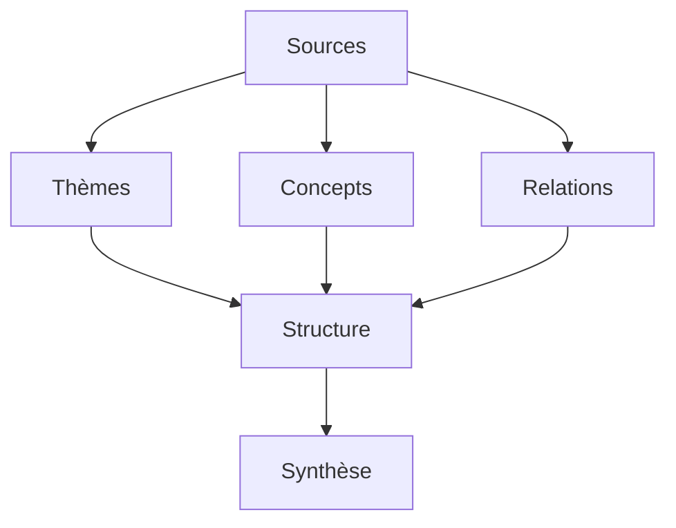

# Synthèse Thématique : Guide Méthodologique

La synthèse thématique est un outil essentiel pour organiser et structurer l'information de manière cohérente et efficace.

## Fondamentaux de la Synthèse

### 1. Définition et Objectifs

#### A. Qu'est-ce que la Synthèse Thématique ?

- Organisation
- Structuration
- Analyse
- Communication

#### B. Objectifs

- Clarté
- Cohérence
- Accessibilité
- Efficacité

### 2. Principes Clés

#### A. Structure

- Hiérarchie
- Logique
- Progression
- Cohérence

#### B. Contenu

- Pertinence
- Exhaustivité
- Précision
- Concision

## Méthodologie

### 1. Préparation

#### A. Analyse

#### B. Organisation

- Thèmes
- Sous-thèmes
- Relations
- Hiérarchie

### 2. Réalisation

#### A. Structure

- Introduction
- Développement
- Conclusion
- Annexes

#### B. Contenu

- Analyse
- Synthèse
- Exemples
- Applications

## Techniques d'Analyse

### 1. Méthodes

#### A. Qualitative

- Observation
- Description
- Interprétation
- Validation

#### B. Quantitative

- Mesure
- Statistique
- Comparaison
- Évaluation

### 2. Outils

#### A. Analyse

- Matrices
- Diagrammes
- Tableaux
- Graphiques

#### B. Présentation

- Formats
- Styles
- Supports
- Diffusion

## Organisation du Contenu

### 1. Structure

#### A. Hiérarchie

- Niveaux
- Relations
- Progression
- Cohérence

#### B. Navigation

- Index
- Sommaire
- Références
- Liens

### 2. Format

#### A. Présentation

- Style
- Mise en page
- Typographie
- Visuel

#### B. Accessibilité

- Clarté
- Lisibilité
- Compréhension
- Utilisation

## Applications

### 1. Domaines

#### A. Professionnel

- Documentation
- Formation
- Communication
- Management

#### B. Académique

- Recherche
- Enseignement
- Publication
- Diffusion

### 2. Contextes

#### A. Projet

- Planification
- Suivi
- Évaluation
- Amélioration

#### B. Organisation

- Structure
- Processus
- Communication
- Développement

## Bonnes Pratiques

### 1. Méthodologie

#### A. Approche

- Systématique
- Rigoureuse
- Adaptative
- Améliorative

#### B. Processus

- Planification
- Réalisation
- Vérification
- Amélioration

### 2. Communication

#### A. Clarté

- Messages
- Structure
- Format
- Support

#### B. Efficacité

- Pertinence
- Concision
- Cohérence
- Impact

## Défis et Solutions

### 1. Complexité

#### A. Gestion

- Organisation
- Structure
- Simplification
- Clarification

#### B. Communication

- Adaptation
- Médiation
- Support
- Formation

### 2. Évolution

#### A. Adaptation

- Flexibilité
- Réactivité
- Innovation
- Amélioration

#### B. Maintenance

- Mise à jour
- Révision
- Optimisation
- Développement

## Conclusion

La synthèse thématique est un outil puissant pour organiser et communiquer l'information de manière efficace et structurée.

## Ressources Complémentaires

- Méthodes
- Outils
- Exemples
- Formations

## Prochaines Étapes

1. Identifier vos besoins
2. Choisir votre approche
3. Mettre en œuvre
4. Évaluer et améliorer
