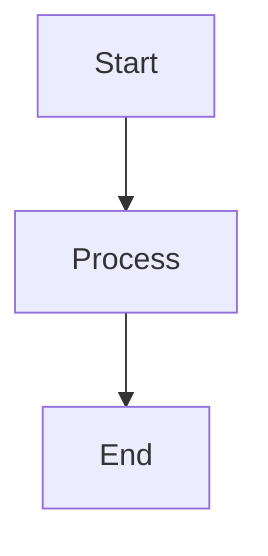

# Template d'Article : Guide de Structure

Ce template sert de guide pour créer des articles techniques bien structurés et professionnels. Il fournit une structure claire et des exemples pour différents types de contenu.

## Structure de Base

### 1. En-tête

#### A. Frontmatter

```yaml
---
date: 'YYYY-MM-DD'
description: "Description concise de l'article"
draft: false
title: "Titre de l'Article"
type: 'article'
author: "Nom de l'Auteur"
tags: ['tag1', 'tag2', 'tag3']
featured: false
readingTime: 15
skills: ['skill1', 'skill2']
hasMermaid: true/false
targetAudience: 'Public cible'
domain: 'Domaine'
pillColor: 'couleur'
relatedArticles: ['article1', 'article2']
---
```

#### B. Introduction

- Contexte
- Objectifs
- Public cible
- Structure

### 2. Corps de l'Article

#### A. Sections Principales

- Titres clairs
- Sous-sections
- Hiérarchie logique
- Transitions

#### B. Contenu

- Texte explicatif
- Exemples de code
- Diagrammes
- Listes

## Éléments de Contenu

### 1. Texte

#### A. Paragraphes

- Structure claire
- Phrases concises
- Vocabulaire approprié
- Ton professionnel

#### B. Listes

- Points clés
- Étapes
- Caractéristiques
- Avantages

### 2. Code

#### A. Blocs de Code

```javascript
// Exemple de code
function example() {
  console.log('Hello World');
}
```

#### B. Syntaxe

- Langage approprié
- Indentation
- Commentaires
- Formatage

### 3. Diagrammes

#### A. Mermaid



#### B. Autres Formats

- Images
- Schémas
- Graphiques
- Tableaux

## Bonnes Pratiques

### 1. Rédaction

#### A. Style

- Clarté
- Cohérence
- Précision
- Concis

#### B. Format

- Espacement
- Alignement
- Hiérarchie
- Lisibilité

### 2. Organisation

#### A. Structure

- Logique
- Progression
- Équilibre
- Complétude

#### B. Navigation

- Liens internes
- Sommaire
- Références
- Ressources

## Exemples de Sections

### 1. Guide Pratique

#### A. Prérequis

- Matériel nécessaire
- Compétences requises
- Environnement
- Configuration

#### B. Étapes

1. Première étape
2. Deuxième étape
3. Troisième étape
4. Conclusion

### 2. Documentation Technique

#### A. API

- Endpoints
- Paramètres
- Réponses
- Exemples

#### B. Architecture

- Composants
- Interactions
- Flux de données
- Dépendances

## Conclusion

Ce template fournit une base solide pour créer des articles techniques de qualité. Adaptez-le selon vos besoins spécifiques tout en maintenant une structure claire et professionnelle.

## Ressources Complémentaires

- Guides de style
- Outils de rédaction
- Templates additionnels
- Exemples

## Prochaines Étapes

1. Personnaliser le template
2. Ajouter vos sections
3. Intégrer vos exemples
4. Réviser et améliorer
