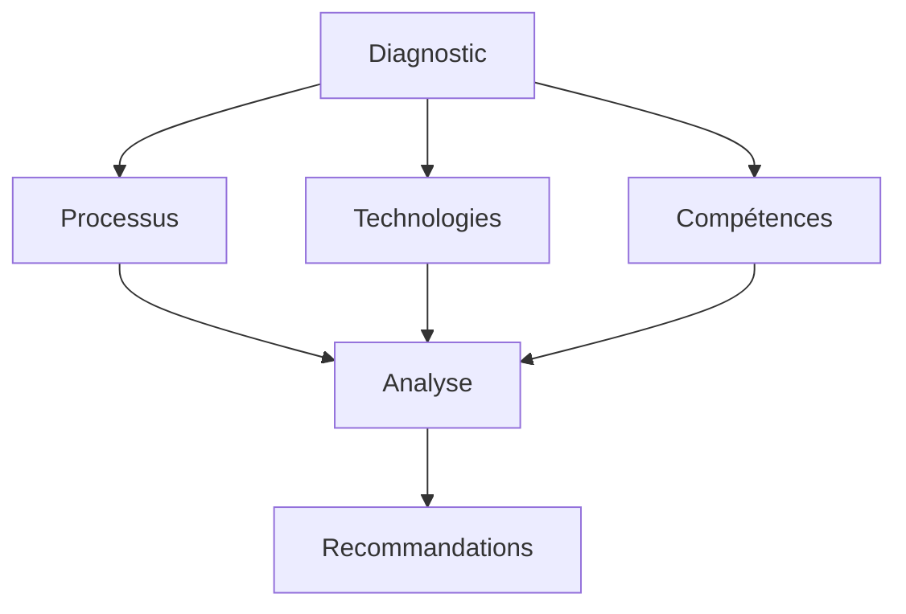

# Transformation Numérique en Entreprise : Guide Stratégique

La transformation numérique est devenue un impératif pour les entreprises modernes. Ce guide complet vous accompagne dans votre transition digitale.

## Fondamentaux de la Transformation Numérique

### 1. Définition et Enjeux

#### A. Qu'est-ce que la Transformation Numérique ?

- Évolution des processus métier
- Adoption des technologies digitales
- Changement culturel
- Innovation continue

#### B. Enjeux Principaux

- Compétitivité
- Efficacité opérationnelle
- Expérience client
- Agilité organisationnelle

### 2. Éléments Clés

#### A. Technologies

- Cloud Computing
- Intelligence Artificielle
- Internet des Objets
- Big Data

#### B. Processus

- Automatisation
- Numérisation
- Optimisation
- Innovation

## Stratégie de Transformation

### 1. Diagnostic

#### A. État des Lieux

#### B. Analyse des Besoins

- Évaluation des processus
- Identification des opportunités
- Analyse des risques
- Définition des priorités

### 2. Plan d'Action

#### A. Objectifs

- Vision stratégique
- KPIs
- Jalons
- Ressources

#### B. Feuille de Route

- Phases de transformation
- Planning
- Budget
- Ressources

## Mise en Œuvre

### 1. Gestion du Changement

#### A. Communication

- Messages clés
- Canaux
- Fréquence
- Feedback

#### B. Formation

- Programmes
- Supports
- Évaluation
- Suivi

### 2. Technologies

#### A. Sélection

- Critères
- Évaluation
- Tests
- Choix

#### B. Intégration

- Planification
- Exécution
- Tests
- Déploiement

## Aspects Humains

### 1. Culture d'Entreprise

#### A. Évolution

- Valeurs
- Comportements
- Pratiques
- Rituels

#### B. Engagement

- Motivation
- Participation
- Reconnaissance
- Feedback

### 2. Compétences

#### A. Développement

- Formation
- Coaching
- Mentorat
- Auto-apprentissage

#### B. Recrutement

- Profils
- Processus
- Intégration
- Rétention

## Mesure et Suivi

### 1. KPIs

#### A. Performance

- Efficacité
- Productivité
- Qualité
- Coûts

#### B. Transformation

- Adoption
- Satisfaction
- Innovation
- Agilité

### 2. Ajustements

#### A. Analyse

- Données
- Tendances
- Insights
- Actions

#### B. Amélioration

- Optimisation
- Innovation
- Adaptation
- Évolution

## Défis et Solutions

### 1. Résistance au Changement

#### A. Identification

- Sources
- Manifestations
- Impacts
- Solutions

#### B. Gestion

- Communication
- Formation
- Support
- Accompagnement

### 2. Sécurité

#### A. Protection

- Données
- Systèmes
- Processus
- Conformité

#### B. Gestion des Risques

- Identification
- Évaluation
- Mitigation
- Monitoring

## Bonnes Pratiques

### 1. Leadership

#### A. Vision

- Direction
- Inspiration
- Cohérence
- Engagement

#### B. Management

- Style
- Communication
- Décision
- Action

### 2. Innovation

#### A. Culture

- Créativité
- Expérimentation
- Apprentissage
- Partage

#### B. Processus

- Idéation
- Validation
- Développement
- Déploiement

## Conclusion

La transformation numérique est un voyage continu qui nécessite une approche structurée et un engagement fort de toute l'organisation.

## Ressources Complémentaires

- Études de cas
- Outils
- Formations
- Communautés

## Prochaines Étapes

1. Évaluer votre maturité digitale
2. Définir votre stratégie
3. Élaborer votre feuille de route
4. Engager le changement
