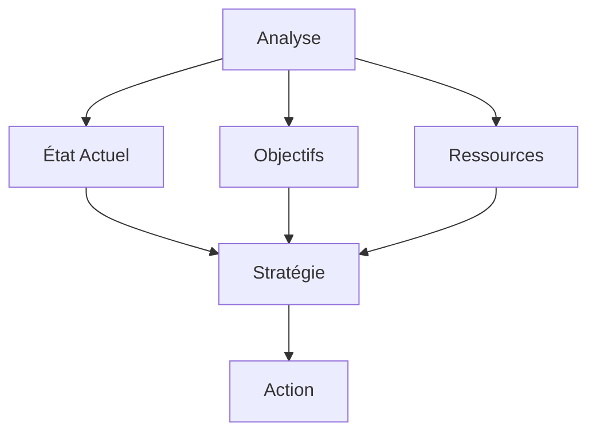

# Transformation Numérique et Gestion des Talents : Guide Stratégique

La transformation numérique impacte profondément la gestion des talents. Ce guide complet vous accompagne dans l'adaptation de vos processus RH à l'ère digitale.

## Fondamentaux

### 1. Définition

#### A. Transformation Numérique

- Digitalisation
- Innovation
- Changement
- Adaptation

#### B. Gestion des Talents

- Acquisition
- Développement
- Rétention
- Évolution

### 2. Enjeux

#### A. Organisationnels

- Compétitivité
- Efficacité
- Innovation
- Agilité

#### B. Individuels

- Compétences
- Adaptation
- Développement
- Engagement

## Processus de Transformation

### 1. Planification

#### A. Analyse

#### B. Stratégie

- Vision
- Objectifs
- Ressources
- Planning

### 2. Implémentation

#### A. Changement

- Communication
- Formation
- Accompagnement
- Suivi

#### B. Adaptation

- Processus
- Outils
- Méthodes
- Culture

## Méthodes et Outils

### 1. Solutions

#### A. Digital

- SIRH
- LMS
- Analytics
- Collaboration

#### B. Innovation

- IA
- Big Data
- Cloud
- Mobile

### 2. Applications

#### A. Recrutement

- Sourcing
- Évaluation
- Onboarding
- Suivi

#### B. Développement

- Formation
- Coaching
- Feedback
- Évaluation

## Compétences Digitales

### 1. Identification

#### A. Techniques

- Outils
- Plateformes
- Méthodes
- Pratiques

#### B. Transversales

- Adaptation
- Innovation
- Collaboration
- Apprentissage

### 2. Développement

#### A. Formation

- Programmes
- Méthodes
- Supports
- Évaluation

#### B. Accompagnement

- Coaching
- Mentorat
- Feedback
- Suivi

## Mesure et Analyse

### 1. Indicateurs

#### A. Transformation

- Progression
- Adoption
- Impact
- ROI

#### B. Talents

- Compétences
- Performance
- Engagement
- Satisfaction

### 2. Analyse

#### A. Données

- Collecte
- Traitement
- Analyse
- Insights

#### B. Actions

- Décisions
- Plans
- Implémentation
- Suivi

## Aspects Organisationnels

### 1. Culture

#### A. Digital

- Valeurs
- Pratiques
- Environnement
- Innovation

#### B. Changement

- Adaptation
- Agilité
- Collaboration
- Excellence

### 2. Management

#### A. Leadership

- Vision
- Direction
- Support
- Exemple

#### B. Organisation

- Structure
- Processus
- Ressources
- Communication

## Outils et Technologies

### 1. Solutions

#### A. Gestion

- SIRH
- Analytics
- Collaboration
- Reporting

#### B. Développement

- LMS
- Coaching
- Feedback
- Suivi

### 2. Innovation

#### A. Digital

- IA
- Analytics
- Mobile
- Cloud

#### B. Expérience

- UX
- Personnalisation
- Interactivité
- Gamification

## Défis et Solutions

### 1. Changement

#### A. Résistance

- Identification
- Communication
- Accompagnement
- Engagement

#### B. Adaptation

- Flexibilité
- Agilité
- Innovation
- Support

### 2. Ressources

#### A. Budget

- Planification
- Optimisation
- ROI
- Priorisation

#### B. Temps

- Organisation
- Efficacité
- Priorités
- Équilibre

## Bonnes Pratiques

### 1. Stratégie

#### A. Vision

- Objectifs
- Planification
- Ressources
- Mesure

#### B. Implémentation

- Phases
- Pilotes
- Déploiement
- Suivi

### 2. Management

#### A. Leadership

- Engagement
- Communication
- Support
- Exemple

#### B. Organisation

- Structure
- Processus
- Ressources
- Culture

## Conclusion

La transformation numérique et la gestion des talents sont des processus stratégiques qui nécessitent une approche structurée et continue.

## Ressources Complémentaires

- Outils
- Formations
- Études de cas
- Communautés

## Prochaines Étapes

1. Évaluer vos processus
2. Développer votre stratégie
3. Mettre en œuvre les actions
4. Mesurer et améliorer
