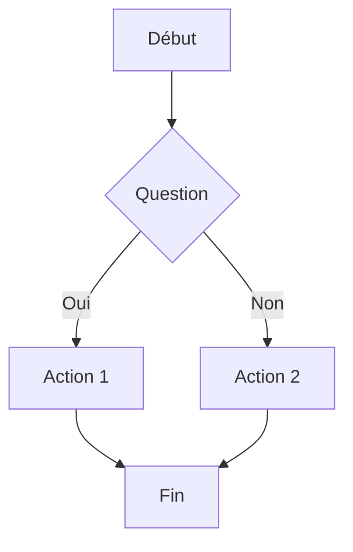
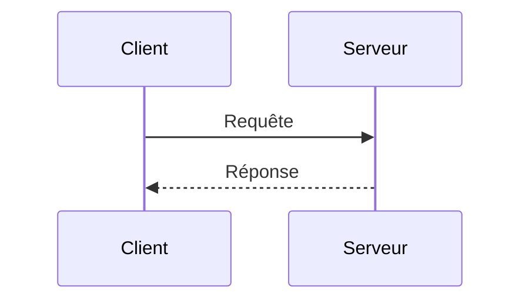
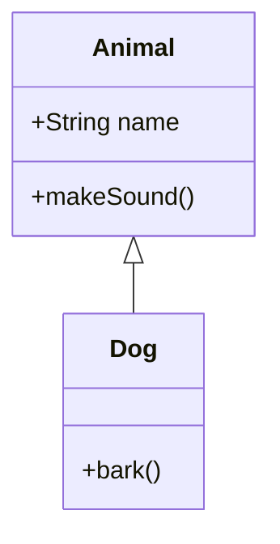
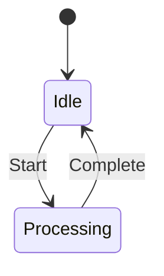
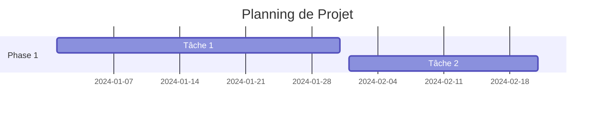

# Visualisations avec Mermaid : Guide Complet

Mermaid est un outil puissant pour créer des diagrammes et des visualisations directement dans vos documents Markdown. Ce guide complet vous aidera à maîtriser cet outil essentiel pour la documentation technique.

## Introduction à Mermaid

### 1. Qu'est-ce que Mermaid ?

Mermaid est une bibliothèque JavaScript qui permet de créer des diagrammes et des visualisations à partir de texte. Ses principaux avantages sont :

- Syntaxe simple et intuitive
- Intégration native avec Markdown
- Large gamme de diagrammes supportés
- Versionnement facile

### 2. Types de Diagrammes Supportés

#### A. Diagrammes de Flux

#### B. Diagrammes de Séquence

## Syntaxe de Base

### 1. Structure Générale

#### A. Déclaration du Type

- `graph` pour les diagrammes de flux
- `sequenceDiagram` pour les diagrammes de séquence
- `classDiagram` pour les diagrammes de classes
- `stateDiagram` pour les diagrammes d'états

#### B. Éléments et Relations

- Nœuds et connexions
- Styles et couleurs
- Sous-graphes
- Directions

### 2. Bonnes Pratiques

#### A. Organisation

- Structure claire
- Nommage explicite
- Commentaires
- Modularité

#### B. Style

- Cohérence visuelle
- Utilisation des couleurs
- Espacement
- Légendes

## Types de Diagrammes Avancés

### 1. Diagrammes de Classes

### 2. Diagrammes d'États

### 3. Diagrammes Gantt

## Intégration et Utilisation

### 1. Dans la Documentation

#### A. Markdown

- Intégration native
- Prévisualisation
- Export

#### B. Sites Web

- Génération statique
- Mise à jour dynamique
- Responsive design

### 2. Outils et Extensions

#### A. Éditeurs

- VS Code
- JetBrains
- GitHub
- GitLab

#### B. Extensions

- Mermaid Preview
- Markdown Preview
- Live Server

## Cas d'Utilisation

### 1. Documentation Technique

- Architecture système
- Flux de données
- Processus métier
- API

### 2. Présentations

- Slides
- Rapports
- Wikis
- Blogs

## Bonnes Pratiques Avancées

### 1. Optimisation

#### A. Performance

- Taille des diagrammes
- Complexité
- Chargement
- Mise en cache

#### B. Maintenance

- Versionnement
- Documentation
- Tests
- Révision

### 2. Collaboration

#### A. Travail d'Équipe

- Partage
- Révision
- Commentaires
- Intégration

#### B. Workflow

- Git
- CI/CD
- Déploiement
- Monitoring

## Conclusion

Mermaid est un outil puissant et flexible pour la création de diagrammes. Sa simplicité d'utilisation et sa large adoption en font un choix idéal pour la documentation technique.

## Ressources Complémentaires

- Documentation officielle
- Exemples et templates
- Communautés
- Tutoriels

## Prochaines Étapes

1. Explorer les différents types de diagrammes
2. Pratiquer avec des exemples simples
3. Intégrer dans vos projets
4. Partager vos créations
5. Contribuer à la communauté
